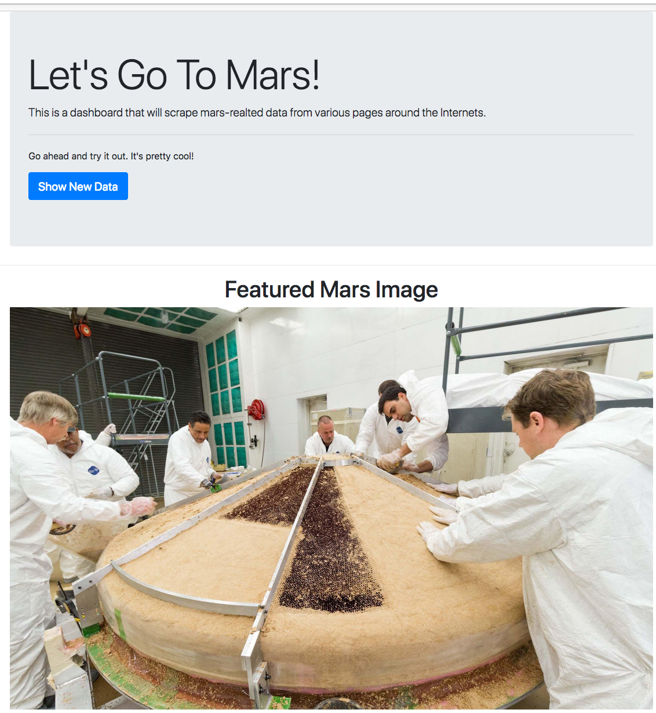
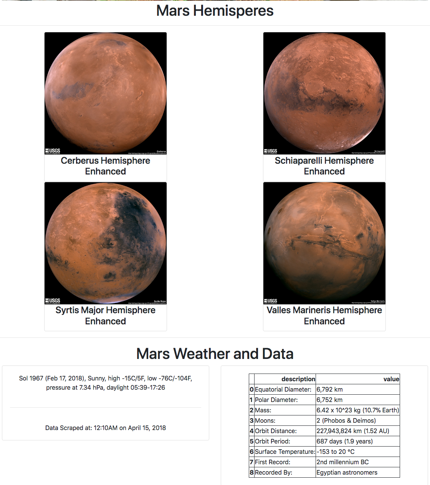

# Project Mars

In this project, I built a web scraping application to scrape various pieces of information related to Mars, and piece them together in a single web app.

### Tech Stack
* Beautiful Soup
* Pandas
* MongoDB
* Flask
* Python

Pictures of the final app are shown below.

***

