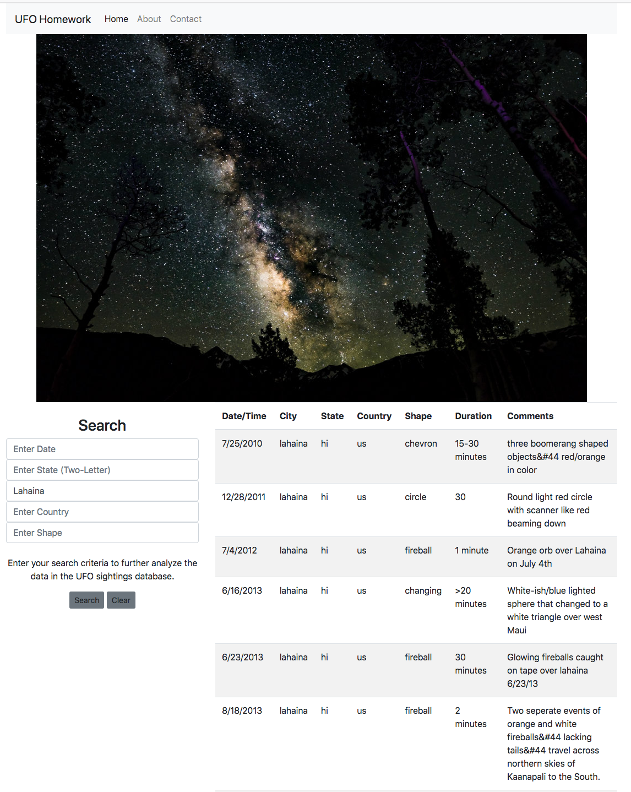

# Interactive Dashboard of UFO Data

In this project, I created an interactive dashboard of UFO sightings. Data of the UFO sightings was provided in a JSON format and then I built out the necessary functionality to respond to user input and return append the responses back to the DOM.

### Tech Stack

* HTML/CSS/Bootstrap
* JavaScript (ES6)

A screenshot of the final dashboard is shown below.

***