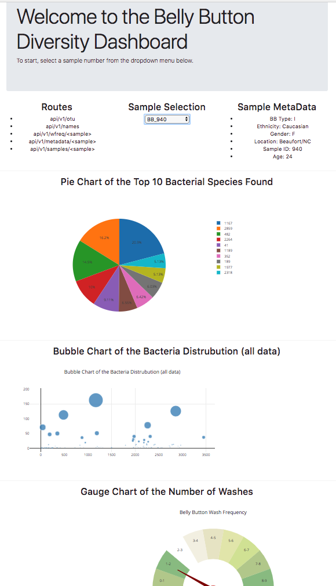

# Homework 13:  Full Stack Web App to Visualize Data


In this project, I built an app to explore the data collected from the [Belly Button Biodiversity DataSet](http://robdunnlab.com/projects/belly-button-biodiversity/).

***

## Step 1: Create Four Flask APIs

I first started by created four API routes using Flask.

```python
@app.route("/")
    """Return the dashboard homepage using render_templates."""
```
```python
@app.route('/names')
    """List of sample names.

    Returns a list of sample names in the format
    [
        "BB_940",
        "BB_941",
        "BB_943",
        ...
    ]

    """
```
```python
@app.route('/otu')
    """List of OTU descriptions.

    Returns a list of OTU descriptions in the following format

    [
        "Archaea;Euryarchaeota;Halobacteria;Halobacteriales;Halobacteriaceae;Halococcus",
        "Archaea;Euryarchaeota;Halobacteria;Halobacteriales;Halobacteriaceae;Halococcus",
        "Bacteria",
        "Bacteria",
        ...
    ]
    """
```
```python
@app.route('/metadata/<sample>')
    """MetaData for a given sample.

    Args: Sample in the format: `BB_940`

    Returns a json dictionary of sample metadata in the format

    {
        AGE: 24,
        BBTYPE: "I",
        ETHNICITY: "Caucasian",
        GENDER: "F",
        LOCATION: "Beaufort/NC",
        SAMPLEID: 940
    }
    """
```
```python
@app.route('/wfreq/<sample>')
    """Weekly Washing Frequency as a number.

    Args: Sample in the format: `BB_940`

    Returns an integer value for the weekly washing frequency `WFREQ`
    """
```
```python
@app.route('/samples/<sample>')
    """OTU IDs and Sample Values for a given sample.

    Return a list of dictionaries containing sorted lists  for the `otu_ids` values as well as the `sample_values`

    [
        {
            otu_ids: [
                1166,
                2858,
                481,
                ...
            ],
            sample_values: [
                163,
                126,
                113,
                ...
            ]
        }
    ]
    """
```

***

## Step 2: Create Plotly Charts

In this step, I created three charts that visualizes the data for a given sample, when the sample is selected from the dropdown menu. 

I created a pie chart, a bubble chart and a gauge chart using the Plotly.js library.

## Step 3: Deploy App to Heroku

In the thrid and final step of this project, I deployed the app to the Heroku platform.  

You can check out the live app by clicking [here](https://grant-aguinaldo-hw13.herokuapp.com/)

Here is a picture of the finished product.

The repo that has the actual code that is being hosted in Heroku is [here](https://github.com/grantaguinaldo/hw-13).  The repo that you are reading is a copy of what is actually being hosted so that I could include this write up of the project.



***


