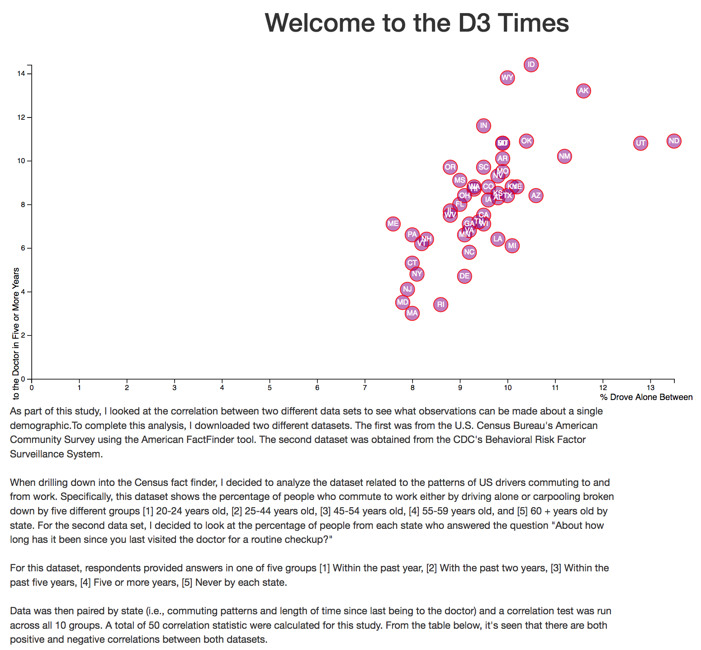

# Data-Driven Journalism

For this project, I found correlation between two data variables from two different data sets.

I then visualized the correlation with a scatter plot and embedded the chart into an HTML file. 

The two datasets that I used included [1] the 2014 one-year estimates from the U.S. Census Bureau's American Community Survey and [2] 2014 survey data from the Behavioral Risk Factor Surveillance System. 

A more detailed summary of the study is provided below.  This block-quote is the same summary that is in the final scatter plot.

> As part of this study, I looked at the correlation between two different data sets to see what observations can be made about a single demographic.To complete this analysis, I downloaded two different datasets. The first was from the U.S. Census Bureau's American Community Survey using the American FactFinder tool. The second dataset was obtained from the CDC's Behavioral Risk Factor Surveillance System.
> 
> When drilling down into the Census fact finder, I decided to analyze the dataset related to the patterns of US drivers commuting to and from work. Specifically, this dataset shows the percentage of people who commute to work either by driving alone or carpooling broken down by five different groups [1] 20-24 years old, [2] 25-44 years old, [3] 45-54 years old, [4] 55-59 years old, and [5] 60 + years old by state. For the second data set, I decided to look at the percentage of people from each state who answered the question "About how long has it been since you last visited the doctor for a routine checkup?"
> 
> For this dataset, respondents provided answers in one of five groups [1] Within the past year, [2] With the past two years, [3] Within the past five years, [4] Five or more years, [5] Never by each state.
> 
> Data was then paired by state (i.e., commuting patterns and length of time since last being to the doctor) and a correlation test was run across all 10 groups. A total of 50 correlation statistic were calculated for this study. From the table below, it's seen that there are both positive and negative correlations between both datasets. 

A summary chart of the correlations is shown below.

### Tech Stack
* Excel
* JavaScript (ES6)
* d3
* HTML

A screenshot of the final scatter chart is shown below.

***