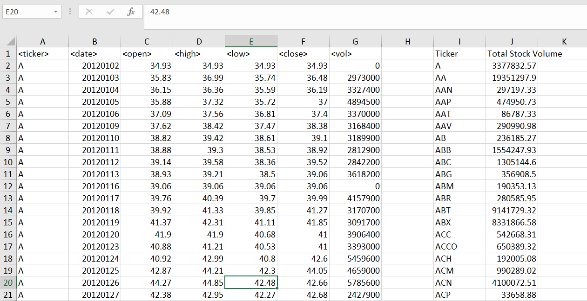
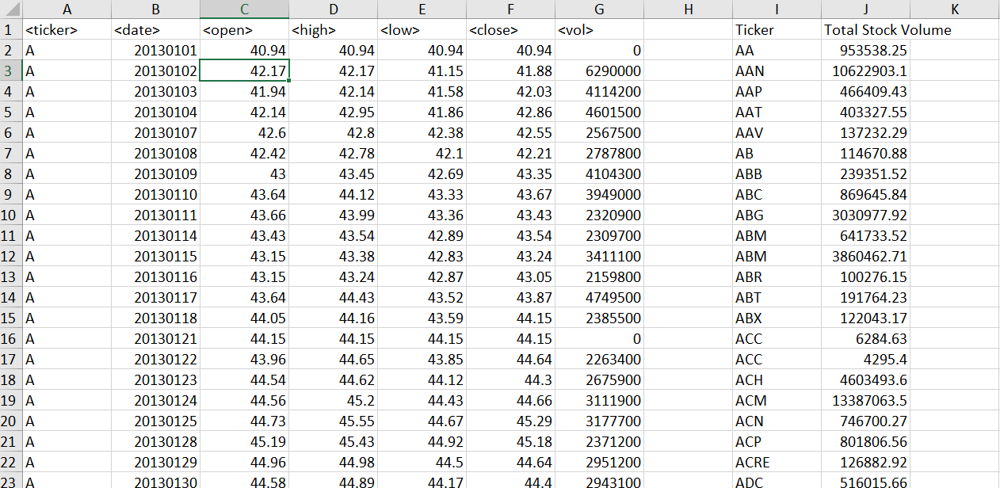
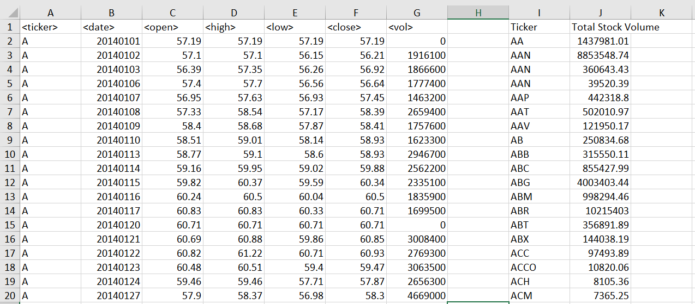
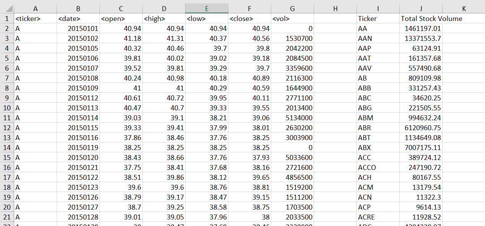
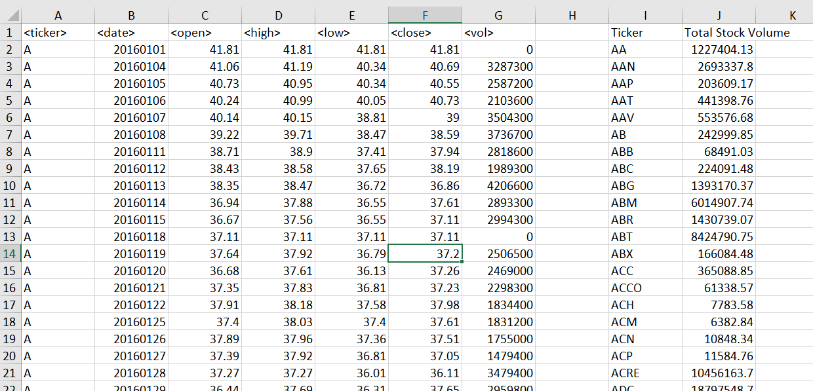

# Analyzing Nearly 1MM Rows of Data Using Excel VBA

In this project, I used Excel VBA to summarize a dataset containing stock data.

Screen shots of the final tables are shown below.

***

# Approach

My approach to this assignment was to first solve the problem using pure Excel ([file](https://enveraconsulting-my.sharepoint.com/:x:/p/grant_aguinaldo/EfwLvy0NKt1PrFu6GmttiQMBIj0sJjuYkVjw-wm8xAQ4-A?e=z8KvWI)), and document the steps that I took to do so.  By breaking down the problem into smaller chucks, solving the entire problem becomes a task of solving each chunk on its own.

1.	Create list of unique ticker symbols by looping through the entire master list and store the unique tickers in a separate column.
    * Use exiting VBA code to return the unique tickers to a new table. 
    * Use VBA code to insert the headers into a new table. 

2.	Loop through list of unique tickers and calculate the total volume of shares moved during the year.  Return the sum, into a new column. One risk is that there are close to 1 MM rows. 
    * This is like a sub total function or a sumif statement in Excel. 

3.	For each unique ticker, find the max (close date) and min (open date) date and return the value in the unique table of tickers.
    * Using the same approach for part 2, you can use the max and min functions to return the dates based on the ticker.  

4.	Look up the open and close share price based on the open/close date and the ticker symbol and return the value to the unique table of tickers.
    * This is like an index/match, vlookup and can use the lotto example from class last night as a template.  

5.	Determine the change in the open/close price for each unique ticker and store the value in the new column of the unique table.
    * Once the values are in the table, this is straight forward subtraction. 

6.	Calculate the percent change of the total change and format as a percent.  Store the value in a column of the unique table. 
    * This is a straight forward division using the value calculated in item 5. 

7.	Find the max % change from all the values in the table of and return the ticker.
    * Enter text into a new part of the sheet and use the max function to find the max change.
    * With the max change identified, we need to use a lookup function (lotto exercise) to return the ticker. 

8.	Find the min % change from all the values in the table of and return the ticker.
    * Enter text into a new part of the sheet and use the min function to find the min change.
    * With the min change identified, we need to use a lookup function (lotto exercise) to return the ticker. 

9.	Find the max volume from all the values in the table of and return the ticker.
    * Enter text into a new part of the sheet and use the max function to find the max volume.
    * With the max volume identified, we need to use a lookup function (lotto exercise) to return the ticker.

***

