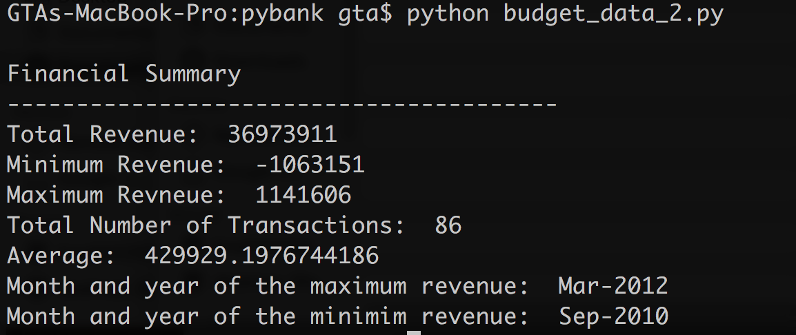
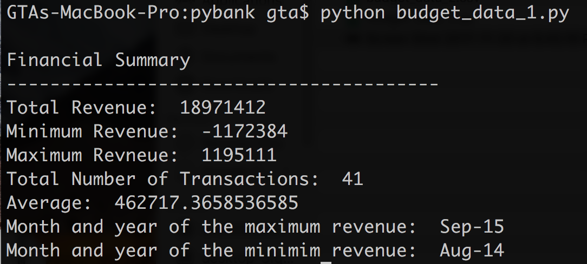
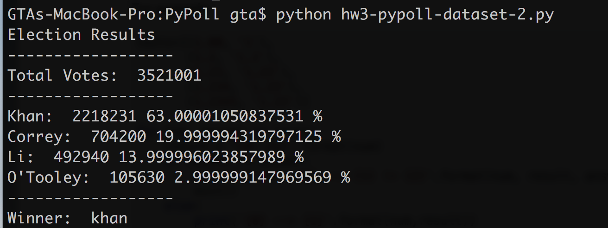
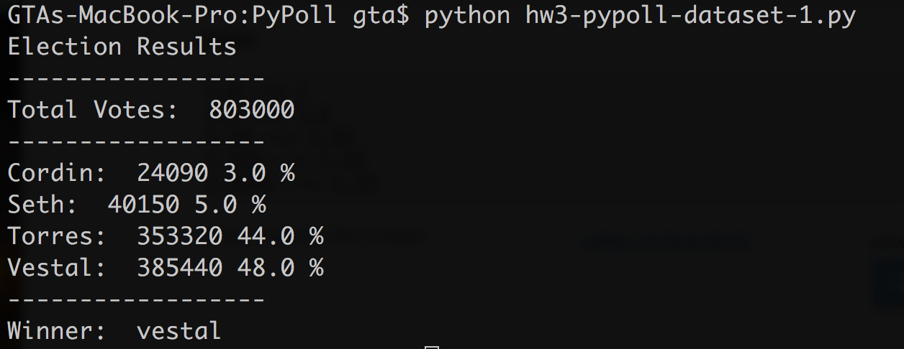

# Data Analysis Using Pure Python

For this project, I decided will analyze two different datasets (PyBank and PyPoll) using pure python.

### PyBank

For PyBank, the summary tables for `budget_data_1.csv` and `budget_data_2.csv` are below.





The code used to analyze the **PyBank** data is shown below.

```
#PyBank
import os, csv, sys
csvpath = os.path.join('budget_data_1.csv')

with open(csvpath) as f:
    readcsv = csv.reader(f, delimiter=',')

    next(readcsv)
    revenue_list = [int(row[1]) for row in readcsv]
    revtotal = sum(revenue_list)

    f.seek(0)
    next(readcsv)
    transaction_list = [row[0] for row in readcsv]

    #From reveiewing the data in Excel, the max value was on Sep-15 and min value was on 08-14
    print(" ")
    print("Financial Summary")
    print("----------------------------------------")
    print("Total Revenue: ", revtotal)
    print("Minimum Revenue: ", min(revenue_list))
    print("Maximum Revneue: ", max(revenue_list))
    print("Total Number of Transactions: ", len(transaction_list))
    print("Average: ", float(int(revtotal)/int(len(transaction_list))))
    print("Month and year of the maximum revenue: ", transaction_list[revenue_list.index(max(revenue_list))])
    print("Month and year of the minimim revenue: ", transaction_list[revenue_list.index(min(revenue_list))])

    orig_stdout = sys.stdout
    fileoutput = open("budget_data_1_summary.txt", "w")
    sys.stdout = fileoutput

    print(" ")
    print("Financial Summary")
    print("----------------------------------------")
    print("Total Revenue: ", revtotal)
    print("Minimum Revenue: ", min(revenue_list))
    print("Maximum Revneue: ", max(revenue_list))
    print("Total Number of Transactions: ", len(transaction_list))
    print("Average: ", float(int(revtotal)/int(len(transaction_list))))
    print("Month and year of the maximum revenue: ", transaction_list[revenue_list.index(max(revenue_list))])
    print("Month and year of the minimim revenue: ", transaction_list[revenue_list.index(min(revenue_list))])

    sys.stdout = orig_stdout
    fileoutput.close()

```

Thet text file exports and code can be found in the [folder]( https://github.com/grantaguinaldo/python-challenge/tree/master/PyBank) for the assignment and include the following scripts:

+ `budget_data_1.py`
+ `budget_data_2.py`
+ `budget_data_1_summary.txt`
+ `budget_data_2_summary.txt`

***

### PyPoll

For PyPoll, the summary tables for `election_data_1.csv`and `election_data_2`.csv` are below.





The code used to analyze the PyPoll data is shown below.

```
#Standard Imports
import os, csv, sys

#Directory of the CSV file.
filepath = os.path.join("data", "election_data_1.csv")

#Open the CSV file and read the data while skipping the first row (that contains the headers)
with open(filepath) as f:
    readcsv = csv.reader(f,delimiter=",")

    next(readcsv)
    #Count the number of voters that cast votes.
    total_votes_cast = sum(tuple([1 for row in readcsv]))
    #print("Number of votes casted: ", total_votes_cast)

    f.seek(0)
    next(readcsv)
    #Return a list of unique canidates.
    canidate_list_all = tuple([row[2] for row in readcsv])
    canidate_list_unique = []
    for i in canidate_list_all:
        if i not in canidate_list_unique:
            canidate_list_unique.append(i)
    #print(canidate_list_unique) #['Vestal', 'Torres', 'Seth', 'Cordin']

    f.seek(0)
    next(readcsv)
    #Determine the number of votes for each canidate by summing.
    votes_vestal = 0
    votes_torres = 0
    votes_seth = 0
    votes_cordin = 0

    for row in readcsv:
        if row[2] == "Vestal":
            votes_vestal += 1

        elif row[2] == "Torres":
            votes_torres += 1

        elif row[2] == "Seth":
            votes_seth += 1
        else:
            votes_cordin += 1

    #Determine the percentages for each canidate.
    pct_votes_vestal = (float(votes_vestal/total_votes_cast)) * 100
    pct_votes_torres = (float(votes_torres/total_votes_cast)) * 100
    pct_votes_seth = (float(votes_seth/total_votes_cast)) * 100
    pct_votes_cordin = (float(votes_cordin/total_votes_cast)) * 100

    results_dict = {'cordin': votes_cordin, 'seth': votes_seth, 'torres': votes_torres, 'vestal': votes_vestal}
    canidate_w_most_votes = max(results_dict, key=results_dict.get)

    orig_stdout = sys.stdout
    fileoutput = open("election_data_1_summary.txt", "w")
    sys.stdout = fileoutput

    #Print summary results to text file.
    print("Election Results")
    print("------------------")
    print("Total Votes: ", total_votes_cast)
    print("------------------")
    print("Cordin: ", votes_cordin, pct_votes_cordin, "%")
    print("Seth: ", votes_seth, pct_votes_seth, "%")
    print("Torres: ", votes_torres, pct_votes_torres, "%")
    print("Vestal: ", votes_vestal, pct_votes_vestal, "%")
    print("------------------")
    print("Winner: ", canidate_w_most_votes)

    sys.stdout = orig_stdout
    fileoutput.close()

    #Print summary results to terminal.
    print("Election Results")
    print("------------------")
    print("Total Votes: ", total_votes_cast)
    print("------------------")
    print("Cordin: ", votes_cordin, pct_votes_cordin, "%")
    print("Seth: ", votes_seth, pct_votes_seth, "%")
    print("Torres: ", votes_torres, pct_votes_torres, "%")
    print("Vestal: ", votes_vestal, pct_votes_vestal, "%")
    print("------------------")
    print("Winner: ", canidate_w_most_votes)
```

The text file exports and code can be found in the [folder]( https://github.com/grantaguinaldo/python-challenge/tree/master/PyPoll) for the assignment and contain the following scripts. 

+ `hw3-pypoll-dataset1.py`
+ `hw3-pypoll-dataset2.py`
+ `election_data_1_summary.txt`
+ `election_data_2_summary.txt`

***
