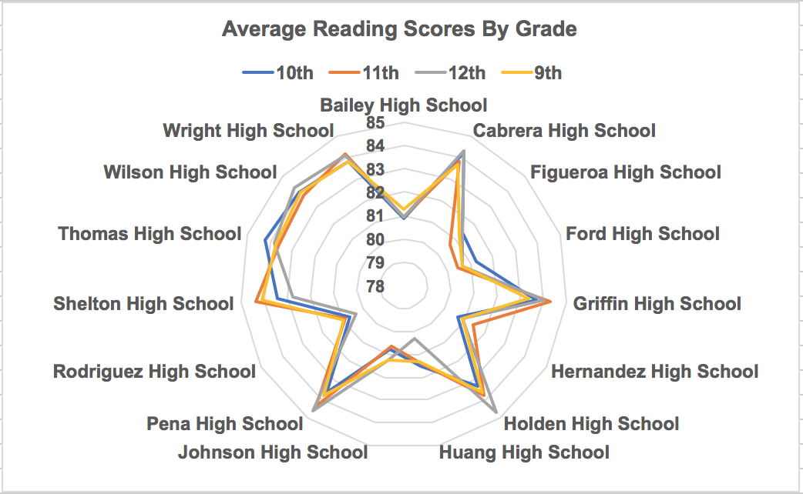
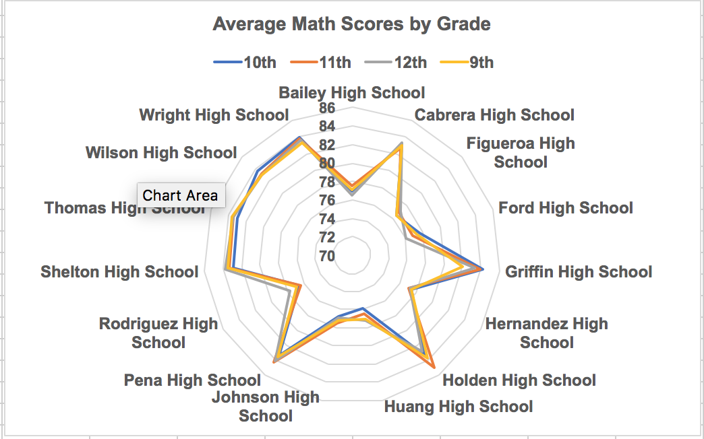

# Data Analysis Using Pandas & Python


This markdown file is my submission of homework 4 (Pandas). You can find a list to the homework assignment [here](http://usc.bootcampcontent.com/usc-boot-camp/USCLOS201710DATA5-Class-Repository-DATA/tree/master/Pandas/Homework%20Instructions/Instructions).

The entire folder containing all of the files for this homework assignment is contained in my github folder [link](https://github.com/grantaguinaldo/uscdatabootcamp/tree/master/hw-4)

### Tech Stack
* Python
* Pandas
* Numpy

***

### List of observations From Analysis

**First.** Based on the table presented at "Scores by School Type Data Frame (Deliverable 9)", while District school have a higher budget per students (normalized budget), the overall reading or math passing rate is about 22% lower than the charter schools.  This observation is interesting since it challenges the notion that 'throwing' more money at any problem can solve the problem. One [NYT Article](https://www.nytimes.com/2016/12/12/nyregion/it-turns-out-spending-more-probably-does-improve-education.html) suggest that spending more can improve education.

**Second.** Math scores between District and charter schools see about a 27% gap with their students (see "Scores by School Type Data Frame (Deliverable 9)"), whereas the reading scores see about a 16% gap.  These data suggest that students at District schools, even with their higher per student budgets, have a harder time achieving passing math scores. In addition, the scores seem to be constant across each grade level which suggest that the lower math scores seen for District schools are consistently lower across all grade levels (see "Average Math Scores by Grade (Deliverable 5)" and "Average Reading Scores by Grade (Deliverable 6)").

#### Average Math Scores by Grade by School (Deliverable 5)


#### Average Reading Scores by Grade by School (Deliverable 6)


**Third.** The size of school also seems to have an impact on the outcome of test scores which is also observed by folks at [UC Davis](https://poverty.ucdavis.edu/policy-brief/small-class-sizes-yield-higher-test-scores-among-young-children).  From the data shown in the data frame named "Scores by School Size Data Frame (Deliverable 8)", smaller schools shows 20% increase in the amount of students who pass math or reading when compared to larger schools.

***

```python
#Standard imports

import pandas as pd
import numpy as np
```


```python
#Refernce paths for data files

file1 = '/Users/gta/dev/hw-4/schools_complete.csv'
file2 = '/Users/gta/dev/hw-4/students_complete.csv'
```


```python
#Read in csv file into two dataframes

df_schools = pd.read_csv(file1)
df_students = pd.read_csv(file2)
```


```python
#Display head of df_schools

df_schools.head()
```


<div>

<table border="1" class="dataframe">
  <thead>
    <tr style="text-align: right;">
      <th></th>
      <th>School ID</th>
      <th>name</th>
      <th>type</th>
      <th>size</th>
      <th>budget</th>
    </tr>
  </thead>
  <tbody>
    <tr>
      <th>0</th>
      <td>0</td>
      <td>Huang High School</td>
      <td>District</td>
      <td>2917</td>
      <td>1910635</td>
    </tr>
    <tr>
      <th>1</th>
      <td>1</td>
      <td>Figueroa High School</td>
      <td>District</td>
      <td>2949</td>
      <td>1884411</td>
    </tr>
    <tr>
      <th>2</th>
      <td>2</td>
      <td>Shelton High School</td>
      <td>Charter</td>
      <td>1761</td>
      <td>1056600</td>
    </tr>
    <tr>
      <th>3</th>
      <td>3</td>
      <td>Hernandez High School</td>
      <td>District</td>
      <td>4635</td>
      <td>3022020</td>
    </tr>
    <tr>
      <th>4</th>
      <td>4</td>
      <td>Griffin High School</td>
      <td>Charter</td>
      <td>1468</td>
      <td>917500</td>
    </tr>
  </tbody>
</table>
</div>


```python
#Return a list of all of the columns in the dataframe as a list

df_schools.columns.tolist()
```


    ['School ID', 'name', 'type', 'size', 'budget']


```python
#Display shape of df_schools

df_schools.shape
```


    (15, 5)


```python
#Review summary stats for the data set

df_schools.describe()
```


<div>

<table border="1" class="dataframe">
  <thead>
    <tr style="text-align: right;">
      <th></th>
      <th>School ID</th>
      <th>size</th>
      <th>budget</th>
    </tr>
  </thead>
  <tbody>
    <tr>
      <th>count</th>
      <td>15.000000</td>
      <td>15.000000</td>
      <td>1.500000e+01</td>
    </tr>
    <tr>
      <th>mean</th>
      <td>7.000000</td>
      <td>2611.333333</td>
      <td>1.643295e+06</td>
    </tr>
    <tr>
      <th>std</th>
      <td>4.472136</td>
      <td>1420.915282</td>
      <td>9.347763e+05</td>
    </tr>
    <tr>
      <th>min</th>
      <td>0.000000</td>
      <td>427.000000</td>
      <td>2.480870e+05</td>
    </tr>
    <tr>
      <th>25%</th>
      <td>3.500000</td>
      <td>1698.000000</td>
      <td>1.046265e+06</td>
    </tr>
    <tr>
      <th>50%</th>
      <td>7.000000</td>
      <td>2283.000000</td>
      <td>1.319574e+06</td>
    </tr>
    <tr>
      <th>75%</th>
      <td>10.500000</td>
      <td>3474.000000</td>
      <td>2.228999e+06</td>
    </tr>
    <tr>
      <th>max</th>
      <td>14.000000</td>
      <td>4976.000000</td>
      <td>3.124928e+06</td>
    </tr>
  </tbody>
</table>
</div>


```python
#Display head of df_students

df_students.head()
```


<div>

<table border="1" class="dataframe">
  <thead>
    <tr style="text-align: right;">
      <th></th>
      <th>Student ID</th>
      <th>name</th>
      <th>gender</th>
      <th>grade</th>
      <th>school</th>
      <th>reading_score</th>
      <th>math_score</th>
    </tr>
  </thead>
  <tbody>
    <tr>
      <th>0</th>
      <td>0</td>
      <td>Paul Bradley</td>
      <td>M</td>
      <td>9th</td>
      <td>Huang High School</td>
      <td>66</td>
      <td>79</td>
    </tr>
    <tr>
      <th>1</th>
      <td>1</td>
      <td>Victor Smith</td>
      <td>M</td>
      <td>12th</td>
      <td>Huang High School</td>
      <td>94</td>
      <td>61</td>
    </tr>
    <tr>
      <th>2</th>
      <td>2</td>
      <td>Kevin Rodriguez</td>
      <td>M</td>
      <td>12th</td>
      <td>Huang High School</td>
      <td>90</td>
      <td>60</td>
    </tr>
    <tr>
      <th>3</th>
      <td>3</td>
      <td>Dr. Richard Scott</td>
      <td>M</td>
      <td>12th</td>
      <td>Huang High School</td>
      <td>67</td>
      <td>58</td>
    </tr>
    <tr>
      <th>4</th>
      <td>4</td>
      <td>Bonnie Ray</td>
      <td>F</td>
      <td>9th</td>
      <td>Huang High School</td>
      <td>97</td>
      <td>84</td>
    </tr>
  </tbody>
</table>
</div>


```python
#Return a list of all of the columns in the dataframe as a list

df_students.columns.tolist()
```


    ['Student ID',
     'name',
     'gender',
     'grade',
     'school',
     'reading_score',
     'math_score']


```python
#Display shape of df_students

df_students.shape
```


    (39170, 7)


```python
#Define functions that determine if the student received a passing score

def passing_reading(c):
    if c['reading_score'] > 69:
        return 1
    else:
        return 0

def passing_math(c):
    if c['math_score'] > 69:
        return 1
    else:
        return 0
```


```python
#Apply functions to create new columns in dataframe 

df_students['passing_reading'] = df_students.apply(passing_reading, axis = 1) 
df_students['passing_math'] = df_students.apply(passing_math, axis=1)
df_students.head()
```


<div>

<table border="1" class="dataframe">
  <thead>
    <tr style="text-align: right;">
      <th></th>
      <th>Student ID</th>
      <th>name</th>
      <th>gender</th>
      <th>grade</th>
      <th>school</th>
      <th>reading_score</th>
      <th>math_score</th>
      <th>passing_reading</th>
      <th>passing_math</th>
    </tr>
  </thead>
  <tbody>
    <tr>
      <th>0</th>
      <td>0</td>
      <td>Paul Bradley</td>
      <td>M</td>
      <td>9th</td>
      <td>Huang High School</td>
      <td>66</td>
      <td>79</td>
      <td>0</td>
      <td>1</td>
    </tr>
    <tr>
      <th>1</th>
      <td>1</td>
      <td>Victor Smith</td>
      <td>M</td>
      <td>12th</td>
      <td>Huang High School</td>
      <td>94</td>
      <td>61</td>
      <td>1</td>
      <td>0</td>
    </tr>
    <tr>
      <th>2</th>
      <td>2</td>
      <td>Kevin Rodriguez</td>
      <td>M</td>
      <td>12th</td>
      <td>Huang High School</td>
      <td>90</td>
      <td>60</td>
      <td>1</td>
      <td>0</td>
    </tr>
    <tr>
      <th>3</th>
      <td>3</td>
      <td>Dr. Richard Scott</td>
      <td>M</td>
      <td>12th</td>
      <td>Huang High School</td>
      <td>67</td>
      <td>58</td>
      <td>0</td>
      <td>0</td>
    </tr>
    <tr>
      <th>4</th>
      <td>4</td>
      <td>Bonnie Ray</td>
      <td>F</td>
      <td>9th</td>
      <td>Huang High School</td>
      <td>97</td>
      <td>84</td>
      <td>1</td>
      <td>1</td>
    </tr>
  </tbody>
</table>
</div>


```python
#Display shape of df_students

df_students.shape
```


    (39170, 9)


```python
#Review column names in dataframe

df_students.columns
```


    Index(['Student ID', 'name', 'gender', 'grade', 'school', 'reading_score',
           'math_score', 'passing_reading', 'passing_math'],
          dtype='object')


```python
#Review summary stats for the data set

df_students.describe()
```


<div>

<table border="1" class="dataframe">
  <thead>
    <tr style="text-align: right;">
      <th></th>
      <th>Student ID</th>
      <th>reading_score</th>
      <th>math_score</th>
      <th>passing_reading</th>
      <th>passing_math</th>
    </tr>
  </thead>
  <tbody>
    <tr>
      <th>count</th>
      <td>39170.000000</td>
      <td>39170.00000</td>
      <td>39170.000000</td>
      <td>39170.000000</td>
      <td>39170.000000</td>
    </tr>
    <tr>
      <th>mean</th>
      <td>19584.500000</td>
      <td>81.87784</td>
      <td>78.985371</td>
      <td>0.858055</td>
      <td>0.749809</td>
    </tr>
    <tr>
      <th>std</th>
      <td>11307.549359</td>
      <td>10.23958</td>
      <td>12.309968</td>
      <td>0.348999</td>
      <td>0.433129</td>
    </tr>
    <tr>
      <th>min</th>
      <td>0.000000</td>
      <td>63.00000</td>
      <td>55.000000</td>
      <td>0.000000</td>
      <td>0.000000</td>
    </tr>
    <tr>
      <th>25%</th>
      <td>9792.250000</td>
      <td>73.00000</td>
      <td>69.000000</td>
      <td>1.000000</td>
      <td>0.000000</td>
    </tr>
    <tr>
      <th>50%</th>
      <td>19584.500000</td>
      <td>82.00000</td>
      <td>79.000000</td>
      <td>1.000000</td>
      <td>1.000000</td>
    </tr>
    <tr>
      <th>75%</th>
      <td>29376.750000</td>
      <td>91.00000</td>
      <td>89.000000</td>
      <td>1.000000</td>
      <td>1.000000</td>
    </tr>
    <tr>
      <th>max</th>
      <td>39169.000000</td>
      <td>99.00000</td>
      <td>99.000000</td>
      <td>1.000000</td>
      <td>1.000000</td>
    </tr>
  </tbody>
</table>
</div>


### District Summary Data Frame Approach (Deliverable 1)


```python
#Calculate total number of schools

total_schools = len(df_schools['name'])
total_schools
```


    15


```python
#Calculate total number of students

total_students = sum(df_schools['size'])
total_students
```


    39170


```python
#Calculate total budget

total_budget = sum(df_schools['budget'])
total_budget
```


    24649428


```python
#Calculate average math score

average_math_score = df_students['math_score'].mean()
average_math_score
```


    78.98537145774827


```python
#Calculate average reading score

average_reading_score = df_students['reading_score'].mean()
average_reading_score
```


    81.87784018381414


```python
#Determine number of students with a passing math score (assume that a passing math score is >69)

total_students_with_passing_math_score = len(df_students.loc[df_students['math_score'] > 69])
total_students_with_passing_math_score
```


    29370


```python
#Determine percent of students with a passing math score (assume that a passing math score is >69)

pct_passing_math_score = 100 * (total_students_with_passing_math_score / total_students)
pct_passing_math_score
```


    74.980852693387803


```python
#Determine number of students with a passing reading score (assume that a passing reading score is >69)

total_students_with_passing_reading_score = len(df_students.loc[df_students['reading_score'] > 69])
total_students_with_passing_reading_score
```


    33610


```python
#Determine percent of students with a passing reading score (assume that a passing reading score is >69)

pct_passing_reading_score = 100 * (total_students_with_passing_reading_score / total_students)
pct_passing_reading_score
```


    85.805463364820014


```python
#Determine overall percentage of students who received a passing score (assume passing score is > 69)

overall_pct_passing = (pct_passing_math_score + pct_passing_reading_score) / 2
overall_pct_passing
```


    80.393158029103915


### District Summary Data Frame (Deliverable 1)


```python
#Take calculated values and send them to a dataframe

summary_df1 = pd.DataFrame([{   'Total Schools':total_schools,
                                'Total Students':total_students,
                                'Total Budget': total_budget,
                                'Average Math Score': average_math_score,
                                'Average Reading Score': average_reading_score,
                                '% Passing Math': pct_passing_math_score,
                                '% Passing Reading': pct_passing_reading_score,
                                '% Overall Passing Rate': overall_pct_passing
                            
                           }])
summary_df1 
```


<div>

<table border="1" class="dataframe">
  <thead>
    <tr style="text-align: right;">
      <th></th>
      <th>% Overall Passing Rate</th>
      <th>% Passing Math</th>
      <th>% Passing Reading</th>
      <th>Average Math Score</th>
      <th>Average Reading Score</th>
      <th>Total Budget</th>
      <th>Total Schools</th>
      <th>Total Students</th>
    </tr>
  </thead>
  <tbody>
    <tr>
      <th>0</th>
      <td>80.393158</td>
      <td>74.980853</td>
      <td>85.805463</td>
      <td>78.985371</td>
      <td>81.87784</td>
      <td>24649428</td>
      <td>15</td>
      <td>39170</td>
    </tr>
  </tbody>
</table>
</div>


### School Summary

Create an overview table that summarizes key metrics about each school, including:


```python
#In order to do an inner join, there must be a common key in both datasets.  Base the common key off of the school name.
#This cell changes the name of the school column so that the inner join can be completed 

df_students1 = df_students.rename(columns={'school':'school_name'})
df_students1.head()
```


<div>

<table border="1" class="dataframe">
  <thead>
    <tr style="text-align: right;">
      <th></th>
      <th>Student ID</th>
      <th>name</th>
      <th>gender</th>
      <th>grade</th>
      <th>school_name</th>
      <th>reading_score</th>
      <th>math_score</th>
      <th>passing_reading</th>
      <th>passing_math</th>
    </tr>
  </thead>
  <tbody>
    <tr>
      <th>0</th>
      <td>0</td>
      <td>Paul Bradley</td>
      <td>M</td>
      <td>9th</td>
      <td>Huang High School</td>
      <td>66</td>
      <td>79</td>
      <td>0</td>
      <td>1</td>
    </tr>
    <tr>
      <th>1</th>
      <td>1</td>
      <td>Victor Smith</td>
      <td>M</td>
      <td>12th</td>
      <td>Huang High School</td>
      <td>94</td>
      <td>61</td>
      <td>1</td>
      <td>0</td>
    </tr>
    <tr>
      <th>2</th>
      <td>2</td>
      <td>Kevin Rodriguez</td>
      <td>M</td>
      <td>12th</td>
      <td>Huang High School</td>
      <td>90</td>
      <td>60</td>
      <td>1</td>
      <td>0</td>
    </tr>
    <tr>
      <th>3</th>
      <td>3</td>
      <td>Dr. Richard Scott</td>
      <td>M</td>
      <td>12th</td>
      <td>Huang High School</td>
      <td>67</td>
      <td>58</td>
      <td>0</td>
      <td>0</td>
    </tr>
    <tr>
      <th>4</th>
      <td>4</td>
      <td>Bonnie Ray</td>
      <td>F</td>
      <td>9th</td>
      <td>Huang High School</td>
      <td>97</td>
      <td>84</td>
      <td>1</td>
      <td>1</td>
    </tr>
  </tbody>
</table>
</div>


```python
#In order to do an inner join, there must be a common key in both datasets.  Base the common key off of the school name.
#This cell changes the name of the school column so that the inner join can be completed .

df_schoo11 = df_schools.rename(columns={'name':'school_name'})
df_schoo11.head()
```


<div>

<table border="1" class="dataframe">
  <thead>
    <tr style="text-align: right;">
      <th></th>
      <th>School ID</th>
      <th>school_name</th>
      <th>type</th>
      <th>size</th>
      <th>budget</th>
    </tr>
  </thead>
  <tbody>
    <tr>
      <th>0</th>
      <td>0</td>
      <td>Huang High School</td>
      <td>District</td>
      <td>2917</td>
      <td>1910635</td>
    </tr>
    <tr>
      <th>1</th>
      <td>1</td>
      <td>Figueroa High School</td>
      <td>District</td>
      <td>2949</td>
      <td>1884411</td>
    </tr>
    <tr>
      <th>2</th>
      <td>2</td>
      <td>Shelton High School</td>
      <td>Charter</td>
      <td>1761</td>
      <td>1056600</td>
    </tr>
    <tr>
      <th>3</th>
      <td>3</td>
      <td>Hernandez High School</td>
      <td>District</td>
      <td>4635</td>
      <td>3022020</td>
    </tr>
    <tr>
      <th>4</th>
      <td>4</td>
      <td>Griffin High School</td>
      <td>Charter</td>
      <td>1468</td>
      <td>917500</td>
    </tr>
  </tbody>
</table>
</div>


```python
#Complete the inner join of the school and students dataframes to return a combined (merged) dataframe.
#Drop the School ID and Student ID columns to reduce the columns in the merged dataframe for readability

df_merge = pd.merge(df_schoo11, df_students1, on='school_name')
df_merge.drop(['School ID', 'Student ID'], axis = 1, inplace=True)
```


```python
#Review all column names from dataframe once the drop has occurred

df_merge.columns
```


    Index(['school_name', 'type', 'size', 'budget', 'name', 'gender', 'grade',
           'reading_score', 'math_score', 'passing_reading', 'passing_math'],
          dtype='object')


```python
#Review resulting dataframe without the additional columns

df_merge.head()
```


<div>

<table border="1" class="dataframe">
  <thead>
    <tr style="text-align: right;">
      <th></th>
      <th>school_name</th>
      <th>type</th>
      <th>size</th>
      <th>budget</th>
      <th>name</th>
      <th>gender</th>
      <th>grade</th>
      <th>reading_score</th>
      <th>math_score</th>
      <th>passing_reading</th>
      <th>passing_math</th>
    </tr>
  </thead>
  <tbody>
    <tr>
      <th>0</th>
      <td>Huang High School</td>
      <td>District</td>
      <td>2917</td>
      <td>1910635</td>
      <td>Paul Bradley</td>
      <td>M</td>
      <td>9th</td>
      <td>66</td>
      <td>79</td>
      <td>0</td>
      <td>1</td>
    </tr>
    <tr>
      <th>1</th>
      <td>Huang High School</td>
      <td>District</td>
      <td>2917</td>
      <td>1910635</td>
      <td>Victor Smith</td>
      <td>M</td>
      <td>12th</td>
      <td>94</td>
      <td>61</td>
      <td>1</td>
      <td>0</td>
    </tr>
    <tr>
      <th>2</th>
      <td>Huang High School</td>
      <td>District</td>
      <td>2917</td>
      <td>1910635</td>
      <td>Kevin Rodriguez</td>
      <td>M</td>
      <td>12th</td>
      <td>90</td>
      <td>60</td>
      <td>1</td>
      <td>0</td>
    </tr>
    <tr>
      <th>3</th>
      <td>Huang High School</td>
      <td>District</td>
      <td>2917</td>
      <td>1910635</td>
      <td>Dr. Richard Scott</td>
      <td>M</td>
      <td>12th</td>
      <td>67</td>
      <td>58</td>
      <td>0</td>
      <td>0</td>
    </tr>
    <tr>
      <th>4</th>
      <td>Huang High School</td>
      <td>District</td>
      <td>2917</td>
      <td>1910635</td>
      <td>Bonnie Ray</td>
      <td>F</td>
      <td>9th</td>
      <td>97</td>
      <td>84</td>
      <td>1</td>
      <td>1</td>
    </tr>
  </tbody>
</table>
</div>


```python
#Define a dictionary with the numpy functions needed for the groupby that will be completed in the next step.

agg_function = {'budget':np.mean, 'reading_score':np.mean, 'math_score': np.mean, 'size': np.mean, 'passing_reading': np.sum, 'passing_math': np.sum}
```


```python
#Join the data frames and create a new column that determines the amount of money allocated per student

#Complete a groupby of the merged dataframe and apply certain (different) numpy functions to the columns
df_grouped = df_merge.groupby(df_merge['school_name'], as_index=False).agg(agg_function)

#Define the budget per student column based on the budget of each school and the number of students at each school.
df_grouped['Per_Student_Budget'] = df_grouped['budget'] / df_grouped['size']

#Define the column that calculates the percent of students that pass math at each school.
df_grouped['Pct_Passing_Math'] = 100 * (df_grouped['passing_math'] / df_grouped['size']) 

#Define the column that calculates the percent of students that pass reading at each school.
df_grouped['Pct_Passing_Reading'] = 100 * (df_grouped['passing_reading'] / df_grouped['size']) 

#Define the column that calculates the percent of students that pass math and reading at each school.
df_grouped['Pct_Passing_Overall'] = (df_grouped['Pct_Passing_Reading'] + df_grouped['Pct_Passing_Math']) / 2

#Return the new dataframe.
df_grouped
```


<div>

<table border="1" class="dataframe">
  <thead>
    <tr style="text-align: right;">
      <th></th>
      <th>school_name</th>
      <th>budget</th>
      <th>reading_score</th>
      <th>math_score</th>
      <th>size</th>
      <th>passing_reading</th>
      <th>passing_math</th>
      <th>Per_Student_Budget</th>
      <th>Pct_Passing_Math</th>
      <th>Pct_Passing_Reading</th>
      <th>Pct_Passing_Overall</th>
    </tr>
  </thead>
  <tbody>
    <tr>
      <th>0</th>
      <td>Bailey High School</td>
      <td>3124928</td>
      <td>81.033963</td>
      <td>77.048432</td>
      <td>4976</td>
      <td>4077</td>
      <td>3318</td>
      <td>628.0</td>
      <td>66.680064</td>
      <td>81.933280</td>
      <td>74.306672</td>
    </tr>
    <tr>
      <th>1</th>
      <td>Cabrera High School</td>
      <td>1081356</td>
      <td>83.975780</td>
      <td>83.061895</td>
      <td>1858</td>
      <td>1803</td>
      <td>1749</td>
      <td>582.0</td>
      <td>94.133477</td>
      <td>97.039828</td>
      <td>95.586652</td>
    </tr>
    <tr>
      <th>2</th>
      <td>Figueroa High School</td>
      <td>1884411</td>
      <td>81.158020</td>
      <td>76.711767</td>
      <td>2949</td>
      <td>2381</td>
      <td>1946</td>
      <td>639.0</td>
      <td>65.988471</td>
      <td>80.739234</td>
      <td>73.363852</td>
    </tr>
    <tr>
      <th>3</th>
      <td>Ford High School</td>
      <td>1763916</td>
      <td>80.746258</td>
      <td>77.102592</td>
      <td>2739</td>
      <td>2172</td>
      <td>1871</td>
      <td>644.0</td>
      <td>68.309602</td>
      <td>79.299014</td>
      <td>73.804308</td>
    </tr>
    <tr>
      <th>4</th>
      <td>Griffin High School</td>
      <td>917500</td>
      <td>83.816757</td>
      <td>83.351499</td>
      <td>1468</td>
      <td>1426</td>
      <td>1371</td>
      <td>625.0</td>
      <td>93.392371</td>
      <td>97.138965</td>
      <td>95.265668</td>
    </tr>
    <tr>
      <th>5</th>
      <td>Hernandez High School</td>
      <td>3022020</td>
      <td>80.934412</td>
      <td>77.289752</td>
      <td>4635</td>
      <td>3748</td>
      <td>3094</td>
      <td>652.0</td>
      <td>66.752967</td>
      <td>80.862999</td>
      <td>73.807983</td>
    </tr>
    <tr>
      <th>6</th>
      <td>Holden High School</td>
      <td>248087</td>
      <td>83.814988</td>
      <td>83.803279</td>
      <td>427</td>
      <td>411</td>
      <td>395</td>
      <td>581.0</td>
      <td>92.505855</td>
      <td>96.252927</td>
      <td>94.379391</td>
    </tr>
    <tr>
      <th>7</th>
      <td>Huang High School</td>
      <td>1910635</td>
      <td>81.182722</td>
      <td>76.629414</td>
      <td>2917</td>
      <td>2372</td>
      <td>1916</td>
      <td>655.0</td>
      <td>65.683922</td>
      <td>81.316421</td>
      <td>73.500171</td>
    </tr>
    <tr>
      <th>8</th>
      <td>Johnson High School</td>
      <td>3094650</td>
      <td>80.966394</td>
      <td>77.072464</td>
      <td>4761</td>
      <td>3867</td>
      <td>3145</td>
      <td>650.0</td>
      <td>66.057551</td>
      <td>81.222432</td>
      <td>73.639992</td>
    </tr>
    <tr>
      <th>9</th>
      <td>Pena High School</td>
      <td>585858</td>
      <td>84.044699</td>
      <td>83.839917</td>
      <td>962</td>
      <td>923</td>
      <td>910</td>
      <td>609.0</td>
      <td>94.594595</td>
      <td>95.945946</td>
      <td>95.270270</td>
    </tr>
    <tr>
      <th>10</th>
      <td>Rodriguez High School</td>
      <td>2547363</td>
      <td>80.744686</td>
      <td>76.842711</td>
      <td>3999</td>
      <td>3208</td>
      <td>2654</td>
      <td>637.0</td>
      <td>66.366592</td>
      <td>80.220055</td>
      <td>73.293323</td>
    </tr>
    <tr>
      <th>11</th>
      <td>Shelton High School</td>
      <td>1056600</td>
      <td>83.725724</td>
      <td>83.359455</td>
      <td>1761</td>
      <td>1688</td>
      <td>1653</td>
      <td>600.0</td>
      <td>93.867121</td>
      <td>95.854628</td>
      <td>94.860875</td>
    </tr>
    <tr>
      <th>12</th>
      <td>Thomas High School</td>
      <td>1043130</td>
      <td>83.848930</td>
      <td>83.418349</td>
      <td>1635</td>
      <td>1591</td>
      <td>1525</td>
      <td>638.0</td>
      <td>93.272171</td>
      <td>97.308869</td>
      <td>95.290520</td>
    </tr>
    <tr>
      <th>13</th>
      <td>Wilson High School</td>
      <td>1319574</td>
      <td>83.989488</td>
      <td>83.274201</td>
      <td>2283</td>
      <td>2204</td>
      <td>2143</td>
      <td>578.0</td>
      <td>93.867718</td>
      <td>96.539641</td>
      <td>95.203679</td>
    </tr>
    <tr>
      <th>14</th>
      <td>Wright High School</td>
      <td>1049400</td>
      <td>83.955000</td>
      <td>83.682222</td>
      <td>1800</td>
      <td>1739</td>
      <td>1680</td>
      <td>583.0</td>
      <td>93.333333</td>
      <td>96.611111</td>
      <td>94.972222</td>
    </tr>
  </tbody>
</table>
</div>


```python
#Return a list of all of the columns in the new dataframe.

df_grouped.columns.tolist()
```


    ['school_name',
     'budget',
     'reading_score',
     'math_score',
     'size',
     'passing_reading',
     'passing_math',
     'Per_Student_Budget',
     'Pct_Passing_Math',
     'Pct_Passing_Reading',
     'Pct_Passing_Overall']


```python
#Drop two columns in the dataframe that shows the number of students that pass either math or reading for readability

df_grouped.drop(['passing_reading', 'passing_math'], axis = 1, inplace = True)
df_grouped.columns
```


    Index(['school_name', 'budget', 'reading_score', 'math_score', 'size',
           'Per_Student_Budget', 'Pct_Passing_Math', 'Pct_Passing_Reading',
           'Pct_Passing_Overall'],
          dtype='object')


### School Summary Data Frame (Deliverable 2)


```python
#Complete a merge of the grouped dataframe and the schools to bring in the type of school (District or Charter) that
#each school belongs to.

#Presents the final dataframe.

df_final = df_grouped.merge(df_schoo11, on='school_name', how='left')
df_final.drop(['budget_x', 'size_x', 'School ID','size_y', 'budget_y'], axis = 1, inplace=True)
df_final
```


<div>

<table border="1" class="dataframe">
  <thead>
    <tr style="text-align: right;">
      <th></th>
      <th>school_name</th>
      <th>reading_score</th>
      <th>math_score</th>
      <th>Per_Student_Budget</th>
      <th>Pct_Passing_Math</th>
      <th>Pct_Passing_Reading</th>
      <th>Pct_Passing_Overall</th>
      <th>type</th>
    </tr>
  </thead>
  <tbody>
    <tr>
      <th>0</th>
      <td>Bailey High School</td>
      <td>81.033963</td>
      <td>77.048432</td>
      <td>628.0</td>
      <td>66.680064</td>
      <td>81.933280</td>
      <td>74.306672</td>
      <td>District</td>
    </tr>
    <tr>
      <th>1</th>
      <td>Cabrera High School</td>
      <td>83.975780</td>
      <td>83.061895</td>
      <td>582.0</td>
      <td>94.133477</td>
      <td>97.039828</td>
      <td>95.586652</td>
      <td>Charter</td>
    </tr>
    <tr>
      <th>2</th>
      <td>Figueroa High School</td>
      <td>81.158020</td>
      <td>76.711767</td>
      <td>639.0</td>
      <td>65.988471</td>
      <td>80.739234</td>
      <td>73.363852</td>
      <td>District</td>
    </tr>
    <tr>
      <th>3</th>
      <td>Ford High School</td>
      <td>80.746258</td>
      <td>77.102592</td>
      <td>644.0</td>
      <td>68.309602</td>
      <td>79.299014</td>
      <td>73.804308</td>
      <td>District</td>
    </tr>
    <tr>
      <th>4</th>
      <td>Griffin High School</td>
      <td>83.816757</td>
      <td>83.351499</td>
      <td>625.0</td>
      <td>93.392371</td>
      <td>97.138965</td>
      <td>95.265668</td>
      <td>Charter</td>
    </tr>
    <tr>
      <th>5</th>
      <td>Hernandez High School</td>
      <td>80.934412</td>
      <td>77.289752</td>
      <td>652.0</td>
      <td>66.752967</td>
      <td>80.862999</td>
      <td>73.807983</td>
      <td>District</td>
    </tr>
    <tr>
      <th>6</th>
      <td>Holden High School</td>
      <td>83.814988</td>
      <td>83.803279</td>
      <td>581.0</td>
      <td>92.505855</td>
      <td>96.252927</td>
      <td>94.379391</td>
      <td>Charter</td>
    </tr>
    <tr>
      <th>7</th>
      <td>Huang High School</td>
      <td>81.182722</td>
      <td>76.629414</td>
      <td>655.0</td>
      <td>65.683922</td>
      <td>81.316421</td>
      <td>73.500171</td>
      <td>District</td>
    </tr>
    <tr>
      <th>8</th>
      <td>Johnson High School</td>
      <td>80.966394</td>
      <td>77.072464</td>
      <td>650.0</td>
      <td>66.057551</td>
      <td>81.222432</td>
      <td>73.639992</td>
      <td>District</td>
    </tr>
    <tr>
      <th>9</th>
      <td>Pena High School</td>
      <td>84.044699</td>
      <td>83.839917</td>
      <td>609.0</td>
      <td>94.594595</td>
      <td>95.945946</td>
      <td>95.270270</td>
      <td>Charter</td>
    </tr>
    <tr>
      <th>10</th>
      <td>Rodriguez High School</td>
      <td>80.744686</td>
      <td>76.842711</td>
      <td>637.0</td>
      <td>66.366592</td>
      <td>80.220055</td>
      <td>73.293323</td>
      <td>District</td>
    </tr>
    <tr>
      <th>11</th>
      <td>Shelton High School</td>
      <td>83.725724</td>
      <td>83.359455</td>
      <td>600.0</td>
      <td>93.867121</td>
      <td>95.854628</td>
      <td>94.860875</td>
      <td>Charter</td>
    </tr>
    <tr>
      <th>12</th>
      <td>Thomas High School</td>
      <td>83.848930</td>
      <td>83.418349</td>
      <td>638.0</td>
      <td>93.272171</td>
      <td>97.308869</td>
      <td>95.290520</td>
      <td>Charter</td>
    </tr>
    <tr>
      <th>13</th>
      <td>Wilson High School</td>
      <td>83.989488</td>
      <td>83.274201</td>
      <td>578.0</td>
      <td>93.867718</td>
      <td>96.539641</td>
      <td>95.203679</td>
      <td>Charter</td>
    </tr>
    <tr>
      <th>14</th>
      <td>Wright High School</td>
      <td>83.955000</td>
      <td>83.682222</td>
      <td>583.0</td>
      <td>93.333333</td>
      <td>96.611111</td>
      <td>94.972222</td>
      <td>Charter</td>
    </tr>
  </tbody>
</table>
</div>


 

### Top Performing Schools (By Passing Rate)

Create a table that highlights the top 5 performing schools based on Overall Passing Rate. Include:

+ School Name
+ School Type
+ Total Students
+ Total School Budget
+ Per School Budget
+ Average Math Score
+ Average Reading Score
+ % Passing Math
+ % Passing Reading
+ Overall Passing Rate (Average of the above two)

### Top Performing Schools (By Passing Rate) Dataframe (Deliverable 3)


```python
#Determine the top five schools that have the highest percent of students passing math and reading (overall passing rate)

df_final.sort_values(by='Pct_Passing_Overall', ascending=False).head(5)
```


<div>

<table border="1" class="dataframe">
  <thead>
    <tr style="text-align: right;">
      <th></th>
      <th>school_name</th>
      <th>reading_score</th>
      <th>math_score</th>
      <th>Per_Student_Budget</th>
      <th>Pct_Passing_Math</th>
      <th>Pct_Passing_Reading</th>
      <th>Pct_Passing_Overall</th>
      <th>type</th>
    </tr>
  </thead>
  <tbody>
    <tr>
      <th>1</th>
      <td>Cabrera High School</td>
      <td>83.975780</td>
      <td>83.061895</td>
      <td>582.0</td>
      <td>94.133477</td>
      <td>97.039828</td>
      <td>95.586652</td>
      <td>Charter</td>
    </tr>
    <tr>
      <th>12</th>
      <td>Thomas High School</td>
      <td>83.848930</td>
      <td>83.418349</td>
      <td>638.0</td>
      <td>93.272171</td>
      <td>97.308869</td>
      <td>95.290520</td>
      <td>Charter</td>
    </tr>
    <tr>
      <th>9</th>
      <td>Pena High School</td>
      <td>84.044699</td>
      <td>83.839917</td>
      <td>609.0</td>
      <td>94.594595</td>
      <td>95.945946</td>
      <td>95.270270</td>
      <td>Charter</td>
    </tr>
    <tr>
      <th>4</th>
      <td>Griffin High School</td>
      <td>83.816757</td>
      <td>83.351499</td>
      <td>625.0</td>
      <td>93.392371</td>
      <td>97.138965</td>
      <td>95.265668</td>
      <td>Charter</td>
    </tr>
    <tr>
      <th>13</th>
      <td>Wilson High School</td>
      <td>83.989488</td>
      <td>83.274201</td>
      <td>578.0</td>
      <td>93.867718</td>
      <td>96.539641</td>
      <td>95.203679</td>
      <td>Charter</td>
    </tr>
  </tbody>
</table>
</div>


### Top Performing Schools (By Passing Rate)

Create a table that highlights the bottom 5 performing schools based on Overall Passing Rate. Include all of the same metrics as above.

### Lowest Performing Schools (By Passing Rate) Dataframe (Deliverable 4)


```python
#Determine the top five schools that have the lowest percent of students passing math and reading (overall passing rate)

df_final.sort_values(by='Pct_Passing_Overall', ascending=False).tail(5)
```


<div>

<table border="1" class="dataframe">
  <thead>
    <tr style="text-align: right;">
      <th></th>
      <th>school_name</th>
      <th>reading_score</th>
      <th>math_score</th>
      <th>Per_Student_Budget</th>
      <th>Pct_Passing_Math</th>
      <th>Pct_Passing_Reading</th>
      <th>Pct_Passing_Overall</th>
      <th>type</th>
    </tr>
  </thead>
  <tbody>
    <tr>
      <th>3</th>
      <td>Ford High School</td>
      <td>80.746258</td>
      <td>77.102592</td>
      <td>644.0</td>
      <td>68.309602</td>
      <td>79.299014</td>
      <td>73.804308</td>
      <td>District</td>
    </tr>
    <tr>
      <th>8</th>
      <td>Johnson High School</td>
      <td>80.966394</td>
      <td>77.072464</td>
      <td>650.0</td>
      <td>66.057551</td>
      <td>81.222432</td>
      <td>73.639992</td>
      <td>District</td>
    </tr>
    <tr>
      <th>7</th>
      <td>Huang High School</td>
      <td>81.182722</td>
      <td>76.629414</td>
      <td>655.0</td>
      <td>65.683922</td>
      <td>81.316421</td>
      <td>73.500171</td>
      <td>District</td>
    </tr>
    <tr>
      <th>2</th>
      <td>Figueroa High School</td>
      <td>81.158020</td>
      <td>76.711767</td>
      <td>639.0</td>
      <td>65.988471</td>
      <td>80.739234</td>
      <td>73.363852</td>
      <td>District</td>
    </tr>
    <tr>
      <th>10</th>
      <td>Rodriguez High School</td>
      <td>80.744686</td>
      <td>76.842711</td>
      <td>637.0</td>
      <td>66.366592</td>
      <td>80.220055</td>
      <td>73.293323</td>
      <td>District</td>
    </tr>
  </tbody>
</table>
</div>


### Math Scores by Grade

Create a table that lists the average Math Score for students of each grade level (9th, 10th, 11th, 12th) at each school.

### Average Math Scores by Grade (Deliverable 5)


```python
#Complete a groupby to determine the average math score of each school by grade level.

df_merge.groupby(['school_name', 'grade']).math_score.mean().unstack()
```


<div>

<table border="1" class="dataframe">
  <thead>
    <tr style="text-align: right;">
      <th>grade</th>
      <th>10th</th>
      <th>11th</th>
      <th>12th</th>
      <th>9th</th>
    </tr>
    <tr>
      <th>school_name</th>
      <th></th>
      <th></th>
      <th></th>
      <th></th>
    </tr>
  </thead>
  <tbody>
    <tr>
      <th>Bailey High School</th>
      <td>76.996772</td>
      <td>77.515588</td>
      <td>76.492218</td>
      <td>77.083676</td>
    </tr>
    <tr>
      <th>Cabrera High School</th>
      <td>83.154506</td>
      <td>82.765560</td>
      <td>83.277487</td>
      <td>83.094697</td>
    </tr>
    <tr>
      <th>Figueroa High School</th>
      <td>76.539974</td>
      <td>76.884344</td>
      <td>77.151369</td>
      <td>76.403037</td>
    </tr>
    <tr>
      <th>Ford High School</th>
      <td>77.672316</td>
      <td>76.918058</td>
      <td>76.179963</td>
      <td>77.361345</td>
    </tr>
    <tr>
      <th>Griffin High School</th>
      <td>84.229064</td>
      <td>83.842105</td>
      <td>83.356164</td>
      <td>82.044010</td>
    </tr>
    <tr>
      <th>Hernandez High School</th>
      <td>77.337408</td>
      <td>77.136029</td>
      <td>77.186567</td>
      <td>77.438495</td>
    </tr>
    <tr>
      <th>Holden High School</th>
      <td>83.429825</td>
      <td>85.000000</td>
      <td>82.855422</td>
      <td>83.787402</td>
    </tr>
    <tr>
      <th>Huang High School</th>
      <td>75.908735</td>
      <td>76.446602</td>
      <td>77.225641</td>
      <td>77.027251</td>
    </tr>
    <tr>
      <th>Johnson High School</th>
      <td>76.691117</td>
      <td>77.491653</td>
      <td>76.863248</td>
      <td>77.187857</td>
    </tr>
    <tr>
      <th>Pena High School</th>
      <td>83.372000</td>
      <td>84.328125</td>
      <td>84.121547</td>
      <td>83.625455</td>
    </tr>
    <tr>
      <th>Rodriguez High School</th>
      <td>76.612500</td>
      <td>76.395626</td>
      <td>77.690748</td>
      <td>76.859966</td>
    </tr>
    <tr>
      <th>Shelton High School</th>
      <td>82.917411</td>
      <td>83.383495</td>
      <td>83.778976</td>
      <td>83.420755</td>
    </tr>
    <tr>
      <th>Thomas High School</th>
      <td>83.087886</td>
      <td>83.498795</td>
      <td>83.497041</td>
      <td>83.590022</td>
    </tr>
    <tr>
      <th>Wilson High School</th>
      <td>83.724422</td>
      <td>83.195326</td>
      <td>83.035794</td>
      <td>83.085578</td>
    </tr>
    <tr>
      <th>Wright High School</th>
      <td>84.010288</td>
      <td>83.836782</td>
      <td>83.644986</td>
      <td>83.264706</td>
    </tr>
  </tbody>
</table>
</div>


### Reading Scores by Grade

Create a table that lists the average Reading Score for students of each grade level (9th, 10th, 11th, 12th) at each school.

### Average Reading Scores by Grade (Deliverable 6)


```python
#Complete a groupby to determine the average reading score of each school by grade level.

df_merge.groupby(['school_name','grade']).reading_score.mean().unstack()
```


<div>

<table border="1" class="dataframe">
  <thead>
    <tr style="text-align: right;">
      <th>grade</th>
      <th>10th</th>
      <th>11th</th>
      <th>12th</th>
      <th>9th</th>
    </tr>
    <tr>
      <th>school_name</th>
      <th></th>
      <th></th>
      <th></th>
      <th></th>
    </tr>
  </thead>
  <tbody>
    <tr>
      <th>Bailey High School</th>
      <td>80.907183</td>
      <td>80.945643</td>
      <td>80.912451</td>
      <td>81.303155</td>
    </tr>
    <tr>
      <th>Cabrera High School</th>
      <td>84.253219</td>
      <td>83.788382</td>
      <td>84.287958</td>
      <td>83.676136</td>
    </tr>
    <tr>
      <th>Figueroa High School</th>
      <td>81.408912</td>
      <td>80.640339</td>
      <td>81.384863</td>
      <td>81.198598</td>
    </tr>
    <tr>
      <th>Ford High School</th>
      <td>81.262712</td>
      <td>80.403642</td>
      <td>80.662338</td>
      <td>80.632653</td>
    </tr>
    <tr>
      <th>Griffin High School</th>
      <td>83.706897</td>
      <td>84.288089</td>
      <td>84.013699</td>
      <td>83.369193</td>
    </tr>
    <tr>
      <th>Hernandez High School</th>
      <td>80.660147</td>
      <td>81.396140</td>
      <td>80.857143</td>
      <td>80.866860</td>
    </tr>
    <tr>
      <th>Holden High School</th>
      <td>83.324561</td>
      <td>83.815534</td>
      <td>84.698795</td>
      <td>83.677165</td>
    </tr>
    <tr>
      <th>Huang High School</th>
      <td>81.512386</td>
      <td>81.417476</td>
      <td>80.305983</td>
      <td>81.290284</td>
    </tr>
    <tr>
      <th>Johnson High School</th>
      <td>80.773431</td>
      <td>80.616027</td>
      <td>81.227564</td>
      <td>81.260714</td>
    </tr>
    <tr>
      <th>Pena High School</th>
      <td>83.612000</td>
      <td>84.335938</td>
      <td>84.591160</td>
      <td>83.807273</td>
    </tr>
    <tr>
      <th>Rodriguez High School</th>
      <td>80.629808</td>
      <td>80.864811</td>
      <td>80.376426</td>
      <td>80.993127</td>
    </tr>
    <tr>
      <th>Shelton High School</th>
      <td>83.441964</td>
      <td>84.373786</td>
      <td>82.781671</td>
      <td>84.122642</td>
    </tr>
    <tr>
      <th>Thomas High School</th>
      <td>84.254157</td>
      <td>83.585542</td>
      <td>83.831361</td>
      <td>83.728850</td>
    </tr>
    <tr>
      <th>Wilson High School</th>
      <td>84.021452</td>
      <td>83.764608</td>
      <td>84.317673</td>
      <td>83.939778</td>
    </tr>
    <tr>
      <th>Wright High School</th>
      <td>83.812757</td>
      <td>84.156322</td>
      <td>84.073171</td>
      <td>83.833333</td>
    </tr>
  </tbody>
</table>
</div>


### Scores by School Spending

Create a table that breaks down school performances based on average Spending Ranges (Per Student). Use 4 reasonable bins to group school spending. Include in the table each of the following:

+ Average Math Score
+ Average Reading Score
+ % Passing Math
+ % Passing Reading
+ Overall Passing Rate (Average of the above two)


```python
#Review the dataframe that has all of the merged data (schools and students)

df_merge.head()
```


<div>

<table border="1" class="dataframe">
  <thead>
    <tr style="text-align: right;">
      <th></th>
      <th>school_name</th>
      <th>type</th>
      <th>size</th>
      <th>budget</th>
      <th>name</th>
      <th>gender</th>
      <th>grade</th>
      <th>reading_score</th>
      <th>math_score</th>
      <th>passing_reading</th>
      <th>passing_math</th>
    </tr>
  </thead>
  <tbody>
    <tr>
      <th>0</th>
      <td>Huang High School</td>
      <td>District</td>
      <td>2917</td>
      <td>1910635</td>
      <td>Paul Bradley</td>
      <td>M</td>
      <td>9th</td>
      <td>66</td>
      <td>79</td>
      <td>0</td>
      <td>1</td>
    </tr>
    <tr>
      <th>1</th>
      <td>Huang High School</td>
      <td>District</td>
      <td>2917</td>
      <td>1910635</td>
      <td>Victor Smith</td>
      <td>M</td>
      <td>12th</td>
      <td>94</td>
      <td>61</td>
      <td>1</td>
      <td>0</td>
    </tr>
    <tr>
      <th>2</th>
      <td>Huang High School</td>
      <td>District</td>
      <td>2917</td>
      <td>1910635</td>
      <td>Kevin Rodriguez</td>
      <td>M</td>
      <td>12th</td>
      <td>90</td>
      <td>60</td>
      <td>1</td>
      <td>0</td>
    </tr>
    <tr>
      <th>3</th>
      <td>Huang High School</td>
      <td>District</td>
      <td>2917</td>
      <td>1910635</td>
      <td>Dr. Richard Scott</td>
      <td>M</td>
      <td>12th</td>
      <td>67</td>
      <td>58</td>
      <td>0</td>
      <td>0</td>
    </tr>
    <tr>
      <th>4</th>
      <td>Huang High School</td>
      <td>District</td>
      <td>2917</td>
      <td>1910635</td>
      <td>Bonnie Ray</td>
      <td>F</td>
      <td>9th</td>
      <td>97</td>
      <td>84</td>
      <td>1</td>
      <td>1</td>
    </tr>
  </tbody>
</table>
</div>


```python
#Add a new columns that calculates the money per student ratio.

df_merge['per_student_budget'] = df_merge['budget'] / df_merge['size']
df_merge.head()
```


<div>

<table border="1" class="dataframe">
  <thead>
    <tr style="text-align: right;">
      <th></th>
      <th>school_name</th>
      <th>type</th>
      <th>size</th>
      <th>budget</th>
      <th>name</th>
      <th>gender</th>
      <th>grade</th>
      <th>reading_score</th>
      <th>math_score</th>
      <th>passing_reading</th>
      <th>passing_math</th>
      <th>per_student_budget</th>
    </tr>
  </thead>
  <tbody>
    <tr>
      <th>0</th>
      <td>Huang High School</td>
      <td>District</td>
      <td>2917</td>
      <td>1910635</td>
      <td>Paul Bradley</td>
      <td>M</td>
      <td>9th</td>
      <td>66</td>
      <td>79</td>
      <td>0</td>
      <td>1</td>
      <td>655.0</td>
    </tr>
    <tr>
      <th>1</th>
      <td>Huang High School</td>
      <td>District</td>
      <td>2917</td>
      <td>1910635</td>
      <td>Victor Smith</td>
      <td>M</td>
      <td>12th</td>
      <td>94</td>
      <td>61</td>
      <td>1</td>
      <td>0</td>
      <td>655.0</td>
    </tr>
    <tr>
      <th>2</th>
      <td>Huang High School</td>
      <td>District</td>
      <td>2917</td>
      <td>1910635</td>
      <td>Kevin Rodriguez</td>
      <td>M</td>
      <td>12th</td>
      <td>90</td>
      <td>60</td>
      <td>1</td>
      <td>0</td>
      <td>655.0</td>
    </tr>
    <tr>
      <th>3</th>
      <td>Huang High School</td>
      <td>District</td>
      <td>2917</td>
      <td>1910635</td>
      <td>Dr. Richard Scott</td>
      <td>M</td>
      <td>12th</td>
      <td>67</td>
      <td>58</td>
      <td>0</td>
      <td>0</td>
      <td>655.0</td>
    </tr>
    <tr>
      <th>4</th>
      <td>Huang High School</td>
      <td>District</td>
      <td>2917</td>
      <td>1910635</td>
      <td>Bonnie Ray</td>
      <td>F</td>
      <td>9th</td>
      <td>97</td>
      <td>84</td>
      <td>1</td>
      <td>1</td>
      <td>655.0</td>
    </tr>
  </tbody>
</table>
</div>


```python
#Examine the summary stats of the per_student_budget column to create bins needed for next analysis. 

df_merge.per_student_budget.describe()
```


    count    39170.000000
    mean       629.293541
    std         25.034815
    min        578.000000
    25%        625.000000
    50%        638.000000
    75%        650.000000
    max        655.000000
    Name: per_student_budget, dtype: float64


```python
#Create bin names and numerical ranges for the binning.

bins = [578, 625, 638, 650 ,700]
bin_names = ['Low', 'Below Average', 'Above Average', 'High']
```


```python
#Bin (categorize) the data in the dataframe and return the head.

df_merge['budget_binned'] = pd.cut(df_merge['per_student_budget'], bins, labels = bin_names)
df_merge.head()
```


<div>

<table border="1" class="dataframe">
  <thead>
    <tr style="text-align: right;">
      <th></th>
      <th>school_name</th>
      <th>type</th>
      <th>size</th>
      <th>budget</th>
      <th>name</th>
      <th>gender</th>
      <th>grade</th>
      <th>reading_score</th>
      <th>math_score</th>
      <th>passing_reading</th>
      <th>passing_math</th>
      <th>per_student_budget</th>
      <th>budget_binned</th>
    </tr>
  </thead>
  <tbody>
    <tr>
      <th>0</th>
      <td>Huang High School</td>
      <td>District</td>
      <td>2917</td>
      <td>1910635</td>
      <td>Paul Bradley</td>
      <td>M</td>
      <td>9th</td>
      <td>66</td>
      <td>79</td>
      <td>0</td>
      <td>1</td>
      <td>655.0</td>
      <td>High</td>
    </tr>
    <tr>
      <th>1</th>
      <td>Huang High School</td>
      <td>District</td>
      <td>2917</td>
      <td>1910635</td>
      <td>Victor Smith</td>
      <td>M</td>
      <td>12th</td>
      <td>94</td>
      <td>61</td>
      <td>1</td>
      <td>0</td>
      <td>655.0</td>
      <td>High</td>
    </tr>
    <tr>
      <th>2</th>
      <td>Huang High School</td>
      <td>District</td>
      <td>2917</td>
      <td>1910635</td>
      <td>Kevin Rodriguez</td>
      <td>M</td>
      <td>12th</td>
      <td>90</td>
      <td>60</td>
      <td>1</td>
      <td>0</td>
      <td>655.0</td>
      <td>High</td>
    </tr>
    <tr>
      <th>3</th>
      <td>Huang High School</td>
      <td>District</td>
      <td>2917</td>
      <td>1910635</td>
      <td>Dr. Richard Scott</td>
      <td>M</td>
      <td>12th</td>
      <td>67</td>
      <td>58</td>
      <td>0</td>
      <td>0</td>
      <td>655.0</td>
      <td>High</td>
    </tr>
    <tr>
      <th>4</th>
      <td>Huang High School</td>
      <td>District</td>
      <td>2917</td>
      <td>1910635</td>
      <td>Bonnie Ray</td>
      <td>F</td>
      <td>9th</td>
      <td>97</td>
      <td>84</td>
      <td>1</td>
      <td>1</td>
      <td>655.0</td>
      <td>High</td>
    </tr>
  </tbody>
</table>
</div>


```python
#Define a dictionary with the numpy functions needed for the groupby that will be completed in the next step.

agg_function = {'budget':np.mean, 'reading_score':np.mean, 'math_score': np.mean, 'size': np.mean, 'passing_reading': np.sum, 'passing_math': np.sum}
```

### Scores by School Spending (Deliverable 7)


```python
#Join the data frames and create a new column that determines the size of the budget.

#Complete a groupby of the merged dataframe and apply certain (different) numpy functions to the columns
df_grouped = df_merge.groupby(['school_name', 'budget_binned'], as_index = False).agg(agg_function)

#Define the budget per student column based on the budget of each school and the number of students at each school.
df_grouped['Per_Student_Budget'] = df_grouped['budget'] / df_grouped['size']

#Define the column that calculates the percent of students that pass math at each school.
df_grouped['Pct_Passing_Math'] = 100 * (df_grouped['passing_math'] / df_grouped['size']) 

#Define the column that calculates the percent of students that pass reading at each school.
df_grouped['Pct_Passing_Reading'] = 100 * (df_grouped['passing_reading'] / df_grouped['size']) 

#Define the column that calculates the percent of students that pass math and reading at each school.
df_grouped['Pct_Passing_Overall'] = (df_grouped['Pct_Passing_Reading'] + df_grouped['Pct_Passing_Math']) / 2

#df_grouped.drop(['passing_reading', 'passing_math'], axis = 1, inplace = True)

#Return the new dataframe.
df_grouped
```


<div>

<table border="1" class="dataframe">
  <thead>
    <tr style="text-align: right;">
      <th></th>
      <th>school_name</th>
      <th>budget_binned</th>
      <th>budget</th>
      <th>reading_score</th>
      <th>math_score</th>
      <th>size</th>
      <th>passing_reading</th>
      <th>passing_math</th>
      <th>Per_Student_Budget</th>
      <th>Pct_Passing_Math</th>
      <th>Pct_Passing_Reading</th>
      <th>Pct_Passing_Overall</th>
    </tr>
  </thead>
  <tbody>
    <tr>
      <th>0</th>
      <td>Bailey High School</td>
      <td>Below Average</td>
      <td>3124928</td>
      <td>81.033963</td>
      <td>77.048432</td>
      <td>4976</td>
      <td>4077</td>
      <td>3318</td>
      <td>628.0</td>
      <td>66.680064</td>
      <td>81.933280</td>
      <td>74.306672</td>
    </tr>
    <tr>
      <th>1</th>
      <td>Cabrera High School</td>
      <td>Low</td>
      <td>1081356</td>
      <td>83.975780</td>
      <td>83.061895</td>
      <td>1858</td>
      <td>1803</td>
      <td>1749</td>
      <td>582.0</td>
      <td>94.133477</td>
      <td>97.039828</td>
      <td>95.586652</td>
    </tr>
    <tr>
      <th>2</th>
      <td>Figueroa High School</td>
      <td>Above Average</td>
      <td>1884411</td>
      <td>81.158020</td>
      <td>76.711767</td>
      <td>2949</td>
      <td>2381</td>
      <td>1946</td>
      <td>639.0</td>
      <td>65.988471</td>
      <td>80.739234</td>
      <td>73.363852</td>
    </tr>
    <tr>
      <th>3</th>
      <td>Ford High School</td>
      <td>Above Average</td>
      <td>1763916</td>
      <td>80.746258</td>
      <td>77.102592</td>
      <td>2739</td>
      <td>2172</td>
      <td>1871</td>
      <td>644.0</td>
      <td>68.309602</td>
      <td>79.299014</td>
      <td>73.804308</td>
    </tr>
    <tr>
      <th>4</th>
      <td>Griffin High School</td>
      <td>Low</td>
      <td>917500</td>
      <td>83.816757</td>
      <td>83.351499</td>
      <td>1468</td>
      <td>1426</td>
      <td>1371</td>
      <td>625.0</td>
      <td>93.392371</td>
      <td>97.138965</td>
      <td>95.265668</td>
    </tr>
    <tr>
      <th>5</th>
      <td>Hernandez High School</td>
      <td>High</td>
      <td>3022020</td>
      <td>80.934412</td>
      <td>77.289752</td>
      <td>4635</td>
      <td>3748</td>
      <td>3094</td>
      <td>652.0</td>
      <td>66.752967</td>
      <td>80.862999</td>
      <td>73.807983</td>
    </tr>
    <tr>
      <th>6</th>
      <td>Holden High School</td>
      <td>Low</td>
      <td>248087</td>
      <td>83.814988</td>
      <td>83.803279</td>
      <td>427</td>
      <td>411</td>
      <td>395</td>
      <td>581.0</td>
      <td>92.505855</td>
      <td>96.252927</td>
      <td>94.379391</td>
    </tr>
    <tr>
      <th>7</th>
      <td>Huang High School</td>
      <td>High</td>
      <td>1910635</td>
      <td>81.182722</td>
      <td>76.629414</td>
      <td>2917</td>
      <td>2372</td>
      <td>1916</td>
      <td>655.0</td>
      <td>65.683922</td>
      <td>81.316421</td>
      <td>73.500171</td>
    </tr>
    <tr>
      <th>8</th>
      <td>Johnson High School</td>
      <td>Above Average</td>
      <td>3094650</td>
      <td>80.966394</td>
      <td>77.072464</td>
      <td>4761</td>
      <td>3867</td>
      <td>3145</td>
      <td>650.0</td>
      <td>66.057551</td>
      <td>81.222432</td>
      <td>73.639992</td>
    </tr>
    <tr>
      <th>9</th>
      <td>Pena High School</td>
      <td>Low</td>
      <td>585858</td>
      <td>84.044699</td>
      <td>83.839917</td>
      <td>962</td>
      <td>923</td>
      <td>910</td>
      <td>609.0</td>
      <td>94.594595</td>
      <td>95.945946</td>
      <td>95.270270</td>
    </tr>
    <tr>
      <th>10</th>
      <td>Rodriguez High School</td>
      <td>Below Average</td>
      <td>2547363</td>
      <td>80.744686</td>
      <td>76.842711</td>
      <td>3999</td>
      <td>3208</td>
      <td>2654</td>
      <td>637.0</td>
      <td>66.366592</td>
      <td>80.220055</td>
      <td>73.293323</td>
    </tr>
    <tr>
      <th>11</th>
      <td>Shelton High School</td>
      <td>Low</td>
      <td>1056600</td>
      <td>83.725724</td>
      <td>83.359455</td>
      <td>1761</td>
      <td>1688</td>
      <td>1653</td>
      <td>600.0</td>
      <td>93.867121</td>
      <td>95.854628</td>
      <td>94.860875</td>
    </tr>
    <tr>
      <th>12</th>
      <td>Thomas High School</td>
      <td>Below Average</td>
      <td>1043130</td>
      <td>83.848930</td>
      <td>83.418349</td>
      <td>1635</td>
      <td>1591</td>
      <td>1525</td>
      <td>638.0</td>
      <td>93.272171</td>
      <td>97.308869</td>
      <td>95.290520</td>
    </tr>
    <tr>
      <th>13</th>
      <td>Wright High School</td>
      <td>Low</td>
      <td>1049400</td>
      <td>83.955000</td>
      <td>83.682222</td>
      <td>1800</td>
      <td>1739</td>
      <td>1680</td>
      <td>583.0</td>
      <td>93.333333</td>
      <td>96.611111</td>
      <td>94.972222</td>
    </tr>
  </tbody>
</table>
</div>


```python
#Complete a groupby of the merged dataframe and apply certain (different) numpy functions to the columns

#Define functions that will be used in the groupby method
agg_function = {'budget': np.mean, 'reading_score':np.mean, 'math_score': np.mean, 'size': np.sum, 'passing_reading': np.sum, 'passing_math': np.sum}

#Complete a groupby of the merged dataframe and apply certain (different) numpy functions to the columns
df_bin_grouped = df_grouped.groupby(['budget_binned'], as_index = False).agg(agg_function)

#Define the column that calculates the budget for each school, normalized to the number of students
df_bin_grouped['Per_Student_Budget'] = df_bin_grouped['budget'] / df_bin_grouped['size']

#Define the column that calculates the percent of students that pass reading at each school.
df_bin_grouped['Pct_Passing_Math'] = 100 * (df_bin_grouped['passing_math'] / df_bin_grouped['size'])

#Define the column that calculates the percent of students that pass reading at each school.
df_bin_grouped['Pct_Passing_Reading'] = 100 * (df_bin_grouped['passing_reading'] / df_bin_grouped['size']) 

#Define the column that calculates the percent of students that pass math or reading at each school.
df_bin_grouped['Pct_Passing_Overall'] = (df_bin_grouped['Pct_Passing_Reading'] + df_bin_grouped['Pct_Passing_Math']) / 2
df_bin_grouped.drop(['passing_reading', 'passing_math'], axis = 1, inplace = True)

#Return new dataframe.
df_bin_grouped
```


<div>

<table border="1" class="dataframe">
  <thead>
    <tr style="text-align: right;">
      <th></th>
      <th>budget_binned</th>
      <th>budget</th>
      <th>reading_score</th>
      <th>math_score</th>
      <th>size</th>
      <th>Per_Student_Budget</th>
      <th>Pct_Passing_Math</th>
      <th>Pct_Passing_Reading</th>
      <th>Pct_Passing_Overall</th>
    </tr>
  </thead>
  <tbody>
    <tr>
      <th>0</th>
      <td>Low</td>
      <td>8.231335e+05</td>
      <td>83.888825</td>
      <td>83.516378</td>
      <td>8276</td>
      <td>99.460307</td>
      <td>93.740938</td>
      <td>96.544224</td>
      <td>95.142581</td>
    </tr>
    <tr>
      <th>1</th>
      <td>Below Average</td>
      <td>2.238474e+06</td>
      <td>81.875860</td>
      <td>79.103164</td>
      <td>10610</td>
      <td>210.977725</td>
      <td>70.659755</td>
      <td>83.656927</td>
      <td>77.158341</td>
    </tr>
    <tr>
      <th>2</th>
      <td>Above Average</td>
      <td>2.247659e+06</td>
      <td>80.956890</td>
      <td>76.962274</td>
      <td>10449</td>
      <td>215.107570</td>
      <td>66.628385</td>
      <td>80.581874</td>
      <td>73.605130</td>
    </tr>
    <tr>
      <th>3</th>
      <td>High</td>
      <td>2.466328e+06</td>
      <td>81.058567</td>
      <td>76.959583</td>
      <td>7552</td>
      <td>326.579383</td>
      <td>66.340042</td>
      <td>81.038136</td>
      <td>73.689089</td>
    </tr>
  </tbody>
</table>
</div>


### Scores by School Size (Deliverable 8)

+ Repeat the above breakdown, but this time group schools based on a reasonable approximation of school size (Small, Medium, Large).


```python
#Determine summary statistics for the school dataframe

df_schools.describe()
```


<div>

<table border="1" class="dataframe">
  <thead>
    <tr style="text-align: right;">
      <th></th>
      <th>School ID</th>
      <th>size</th>
      <th>budget</th>
    </tr>
  </thead>
  <tbody>
    <tr>
      <th>count</th>
      <td>15.000000</td>
      <td>15.000000</td>
      <td>1.500000e+01</td>
    </tr>
    <tr>
      <th>mean</th>
      <td>7.000000</td>
      <td>2611.333333</td>
      <td>1.643295e+06</td>
    </tr>
    <tr>
      <th>std</th>
      <td>4.472136</td>
      <td>1420.915282</td>
      <td>9.347763e+05</td>
    </tr>
    <tr>
      <th>min</th>
      <td>0.000000</td>
      <td>427.000000</td>
      <td>2.480870e+05</td>
    </tr>
    <tr>
      <th>25%</th>
      <td>3.500000</td>
      <td>1698.000000</td>
      <td>1.046265e+06</td>
    </tr>
    <tr>
      <th>50%</th>
      <td>7.000000</td>
      <td>2283.000000</td>
      <td>1.319574e+06</td>
    </tr>
    <tr>
      <th>75%</th>
      <td>10.500000</td>
      <td>3474.000000</td>
      <td>2.228999e+06</td>
    </tr>
    <tr>
      <th>max</th>
      <td>14.000000</td>
      <td>4976.000000</td>
      <td>3.124928e+06</td>
    </tr>
  </tbody>
</table>
</div>


```python
#Define bin range and labels.

bins = [400, 2000, 3500, 5000]
bin_names = ['Small', 'Medium', 'Large']

#Bin the data in the dataframe and return the values to a new column.
df_grouped['size_bins'] = pd.cut(df_grouped['size'], bins, labels = bin_names)

#Return the first five rows in the dataframe.
df_grouped.head()
```


<div>

<table border="1" class="dataframe">
  <thead>
    <tr style="text-align: right;">
      <th></th>
      <th>school_name</th>
      <th>budget_binned</th>
      <th>budget</th>
      <th>reading_score</th>
      <th>math_score</th>
      <th>size</th>
      <th>passing_reading</th>
      <th>passing_math</th>
      <th>Per_Student_Budget</th>
      <th>Pct_Passing_Math</th>
      <th>Pct_Passing_Reading</th>
      <th>Pct_Passing_Overall</th>
      <th>size_bins</th>
    </tr>
  </thead>
  <tbody>
    <tr>
      <th>0</th>
      <td>Bailey High School</td>
      <td>Below Average</td>
      <td>3124928</td>
      <td>81.033963</td>
      <td>77.048432</td>
      <td>4976</td>
      <td>4077</td>
      <td>3318</td>
      <td>628.0</td>
      <td>66.680064</td>
      <td>81.933280</td>
      <td>74.306672</td>
      <td>Large</td>
    </tr>
    <tr>
      <th>1</th>
      <td>Cabrera High School</td>
      <td>Low</td>
      <td>1081356</td>
      <td>83.975780</td>
      <td>83.061895</td>
      <td>1858</td>
      <td>1803</td>
      <td>1749</td>
      <td>582.0</td>
      <td>94.133477</td>
      <td>97.039828</td>
      <td>95.586652</td>
      <td>Small</td>
    </tr>
    <tr>
      <th>2</th>
      <td>Figueroa High School</td>
      <td>Above Average</td>
      <td>1884411</td>
      <td>81.158020</td>
      <td>76.711767</td>
      <td>2949</td>
      <td>2381</td>
      <td>1946</td>
      <td>639.0</td>
      <td>65.988471</td>
      <td>80.739234</td>
      <td>73.363852</td>
      <td>Medium</td>
    </tr>
    <tr>
      <th>3</th>
      <td>Ford High School</td>
      <td>Above Average</td>
      <td>1763916</td>
      <td>80.746258</td>
      <td>77.102592</td>
      <td>2739</td>
      <td>2172</td>
      <td>1871</td>
      <td>644.0</td>
      <td>68.309602</td>
      <td>79.299014</td>
      <td>73.804308</td>
      <td>Medium</td>
    </tr>
    <tr>
      <th>4</th>
      <td>Griffin High School</td>
      <td>Low</td>
      <td>917500</td>
      <td>83.816757</td>
      <td>83.351499</td>
      <td>1468</td>
      <td>1426</td>
      <td>1371</td>
      <td>625.0</td>
      <td>93.392371</td>
      <td>97.138965</td>
      <td>95.265668</td>
      <td>Small</td>
    </tr>
  </tbody>
</table>
</div>


### Scores by School Size Data Frame (Deliverable 8)


```python
#Define the functions that will be used in the groupby method.
agg_function = {'budget': np.sum, 'reading_score':np.mean, 'math_score': np.mean, 'size': np.sum, 'passing_reading': np.sum, 'passing_math': np.sum}

#Perform the groupby and return the data as groups based on the bin labels.  The index is also reset.
df_bin_grouped = df_grouped.groupby(['size_bins'], as_index = False).agg(agg_function)

#Define a new column that is the spending per student based on the data in the new grouped dataframe.
df_bin_grouped['Per_Student_Budget'] = df_bin_grouped['budget'] / df_bin_grouped['size']

#Define a new column that calculates the percentage of students who pass math.
df_bin_grouped['Pct_Passing_Math'] = 100 * (df_bin_grouped['passing_math'] / df_bin_grouped['size']) 

#Define a new column that calculates the percentage of students who pass reading.
df_bin_grouped['Pct_Passing_Reading'] = 100 * (df_bin_grouped['passing_reading'] / df_bin_grouped['size']) 

#Define a new column that calculates the percentage of students who pass math or reading.
df_bin_grouped['Pct_Passing_Overall'] = (df_bin_grouped['Pct_Passing_Reading'] + df_bin_grouped['Pct_Passing_Math']) / 2
# df_bin_grouped.drop(['passing_reading', 'passing_math'], axis = 1, inplace = True)

#Return the new dataframe. 
df_bin_grouped
```


<div>

<table border="1" class="dataframe">
  <thead>
    <tr style="text-align: right;">
      <th></th>
      <th>size_bins</th>
      <th>budget</th>
      <th>reading_score</th>
      <th>math_score</th>
      <th>size</th>
      <th>passing_reading</th>
      <th>passing_math</th>
      <th>Per_Student_Budget</th>
      <th>Pct_Passing_Math</th>
      <th>Pct_Passing_Reading</th>
      <th>Pct_Passing_Overall</th>
    </tr>
  </thead>
  <tbody>
    <tr>
      <th>0</th>
      <td>Small</td>
      <td>5981931</td>
      <td>83.883125</td>
      <td>83.502373</td>
      <td>9911</td>
      <td>9581</td>
      <td>9283</td>
      <td>603.564827</td>
      <td>93.663606</td>
      <td>96.670366</td>
      <td>95.166986</td>
    </tr>
    <tr>
      <th>1</th>
      <td>Medium</td>
      <td>5558962</td>
      <td>81.029000</td>
      <td>76.814591</td>
      <td>8605</td>
      <td>6925</td>
      <td>5733</td>
      <td>646.015340</td>
      <td>66.624056</td>
      <td>80.476467</td>
      <td>73.550261</td>
    </tr>
    <tr>
      <th>2</th>
      <td>Large</td>
      <td>11788961</td>
      <td>80.919864</td>
      <td>77.063340</td>
      <td>18371</td>
      <td>14900</td>
      <td>12211</td>
      <td>641.715802</td>
      <td>66.468891</td>
      <td>81.106091</td>
      <td>73.787491</td>
    </tr>
  </tbody>
</table>
</div>


### Scores by School Type (Deliverable 9)

+ Repeat the above breakdown, but this time group schools based on school type (Charter vs. District).


```python
#Define the functions that will be used in the groupby method.
agg_function = {'budget': np.sum, 'reading_score': np.mean, 'math_score': np.mean, 'size': np.sum, 'passing_reading': np.sum, 'passing_math': np.sum}

#Perform the groupby and return the data as groups based on the type of school.  The index is also reset.
df_type = df_merge.groupby('type', as_index = False).agg(agg_function)

#Drop two columns for readability
df_type.drop(['budget', 'size'], axis = 1, inplace = True)

#Return the new dataframe
df_type
```


<div>

<table border="1" class="dataframe">
  <thead>
    <tr style="text-align: right;">
      <th></th>
      <th>type</th>
      <th>reading_score</th>
      <th>math_score</th>
      <th>passing_reading</th>
      <th>passing_math</th>
    </tr>
  </thead>
  <tbody>
    <tr>
      <th>0</th>
      <td>Charter</td>
      <td>83.902821</td>
      <td>83.406183</td>
      <td>11785</td>
      <td>11426</td>
    </tr>
    <tr>
      <th>1</th>
      <td>District</td>
      <td>80.962485</td>
      <td>76.987026</td>
      <td>21825</td>
      <td>17944</td>
    </tr>
  </tbody>
</table>
</div>


### Scores by School Type Data Frame (Deliverable 9)


```python
#Create final dataframe

#Select columns from an existing dataframe and send to a new dataframe
df3 = df_schools[['size', 'type', 'budget']]

#Perform a groupby on the new dataframe
df4 = df3.groupby('type', as_index=False).sum()

#Merge the new grouped dataframe with the dataframe previously created showing the stats by school type
final_df = pd.merge(df4, df_type, on='type', how='inner')

#Define a new column that calculates the budget per student based on the data in the data frame
final_df['Per_Student_Budget'] = final_df['budget'] / final_df['size']

#Define a new column that calculates the percent of students that passed math
final_df['Pct_Passing_Math'] = 100 * (final_df['passing_math'] / final_df['size']) 

#Define a new column that calculates the percent of students that passed reading
final_df['Pct_Passing_Reading'] = 100 * (final_df['passing_reading'] / final_df['size']) 

#Define a new column that calculates the percent of students that passed math or reading
final_df['Pct_Passing_Overall'] = (final_df['Pct_Passing_Reading'] + final_df['Pct_Passing_Math']) / 2

# df_bin_grouped.drop(['passing_reading', 'passing_math'], axis = 1, inplace = True)

#Return final dataframe.
final_df
```


<div>

<table border="1" class="dataframe">
  <thead>
    <tr style="text-align: right;">
      <th></th>
      <th>type</th>
      <th>size</th>
      <th>budget</th>
      <th>reading_score</th>
      <th>math_score</th>
      <th>passing_reading</th>
      <th>passing_math</th>
      <th>Per_Student_Budget</th>
      <th>Pct_Passing_Math</th>
      <th>Pct_Passing_Reading</th>
      <th>Pct_Passing_Overall</th>
    </tr>
  </thead>
  <tbody>
    <tr>
      <th>0</th>
      <td>Charter</td>
      <td>12194</td>
      <td>7301505</td>
      <td>83.902821</td>
      <td>83.406183</td>
      <td>11785</td>
      <td>11426</td>
      <td>598.778498</td>
      <td>93.701821</td>
      <td>96.645891</td>
      <td>95.173856</td>
    </tr>
    <tr>
      <th>1</th>
      <td>District</td>
      <td>26976</td>
      <td>17347923</td>
      <td>80.962485</td>
      <td>76.987026</td>
      <td>21825</td>
      <td>17944</td>
      <td>643.087300</td>
      <td>66.518387</td>
      <td>80.905249</td>
      <td>73.711818</td>
    </tr>
  </tbody>
</table>
</div>


*** 
