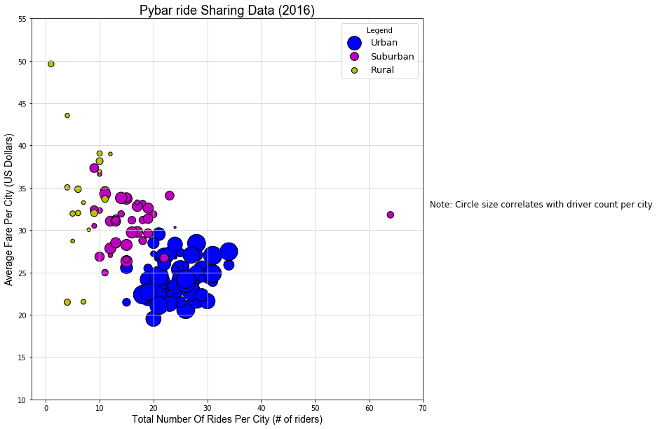
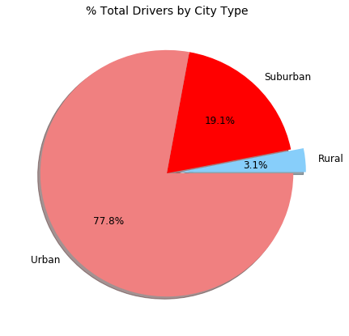
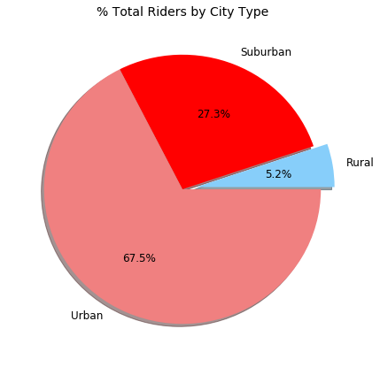
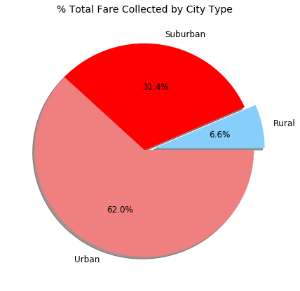

## Grant Aguinaldo, HW-5 Submission

### Analysis

Based on this preliminary analysis three observations have been made.

**First.** Most rides on the Pyber platform are in urban areas, followed by suburban and rural areas. One possible, and probably the most obvious reason for this is population, in that folks living in urban areas are more likely to use a ride-sharing platform like Pyber, and this has been observed by the Pew Research Center (see [On-demand: Ride-hailing apps](http://www.pewinternet.org/2016/05/19/on-demand-ride-hailing-apps/#fn-15814-2)). In addition, the data shows that there is more than a 10-fold difference in the amount of riders in urban areas compared to rural areas.

**Second.** Based on the general direction of the clustering, there seems to be a negative relationship between the average fare per city and the total number of riders per city.  One reason for this is purely based on supply-and-demand principles since more drivers and riders on the platform is expected to bring down the overall cost of a ride. There seems to be an estimated 20% increase in the average fare when comparing suburban and urban areas.  In addition, there seems to be an estimated 40% increase between the fares in rural and urban areas. 

**Thrid.**  Another reason for the difference in fare in urban and rural areas could be the distance  of the ride. Longer distances in rural areas could also lead to an increase in the average fare, however, the data set does not have any data related to the distance that each rider went on each ride. 
 
***

### Pyber Ride Sharing


The ride sharing bonanza continues! Seeing the success of notable players like Uber and Lyft, you've decided to join a fledgling ride sharing company of your own. In your latest capacity, you'll be acting as Chief Data Strategist for the company. In this role, you'll be expected to offer data-backed guidance on new opportunities for market differentiation.

You've since been given access to the company's complete recordset of rides. This contains information about every active driver and historic ride, including details like city, driver count, individual fares, and city type.

Your objective is to build a [Bubble Plot](https://en.wikipedia.org/wiki/Bubble_chart) that showcases the relationship between four key variables:

* Average Fare ($) Per City
* Total Number of Rides Per City
* Total Number of Drivers Per City
* City Type (Urban, Suburban, Rural)

In addition, you will be expected to produce the following three pie charts:

* % of Total Fares by City Type
* % of Total Rides by City Type
* % of Total Drivers by City Type

As final considerations:

* You must use the Pandas Library and the Jupyter Notebook.
* You must use the Matplotlib and Seaborn libraries.
* You must include a written description of three observable trends based on the data.
* You must use proper labeling of your plots, including aspects like: Plot Titles, Axes Labels, Legend Labels, Wedge Percentages, and Wedge Labels.
* Remember when making your plots to consider aesthetics!
  * You must stick to the Pyber color scheme (Gold, Light Sky Blue, and Light Coral) in producing your plot and pie charts.
  * When making your Bubble Plot, experiment with effects like `alpha`, `edgecolor`, and `linewidths`.
  * When making your Pie Chart, experiment with effects like `shadow`, `startangle`, and `explosion`.
* You must include an exported markdown version of your Notebook called  `README.md` in your GitHub repository.
* See [Example Solution](Pyber/Pyber_Example.pdf) for a reference on expected format.

***


```python
#Standard Imports

import pandas as pd
import matplotlib.pyplot as plt
import numpy as np
from scipy import stats
%matplotlib inline
```


```python
#Read in files and create dataframes.

#Read in rider data into a Pandas dataframe.
ride_file = '/Users/gta/dev/hw-5/ride_data.csv'
df_ride = pd.read_csv(ride_file)


#Read in city data into a Pandas dataframe.
city_file = '/Users/gta/dev/hw-5/city_data.csv'
df_city = pd.read_csv(city_file)
```


```python
#Inspect head from dataframe.

df_city.head()
```


<div>

<table border="1" class="dataframe">
  <thead>
    <tr style="text-align: right;">
      <th></th>
      <th>city</th>
      <th>driver_count</th>
      <th>type</th>
    </tr>
  </thead>
  <tbody>
    <tr>
      <th>0</th>
      <td>Kelseyland</td>
      <td>63</td>
      <td>Urban</td>
    </tr>
    <tr>
      <th>1</th>
      <td>Nguyenbury</td>
      <td>8</td>
      <td>Urban</td>
    </tr>
    <tr>
      <th>2</th>
      <td>East Douglas</td>
      <td>12</td>
      <td>Urban</td>
    </tr>
    <tr>
      <th>3</th>
      <td>West Dawnfurt</td>
      <td>34</td>
      <td>Urban</td>
    </tr>
    <tr>
      <th>4</th>
      <td>Rodriguezburgh</td>
      <td>52</td>
      <td>Urban</td>
    </tr>
  </tbody>
</table>
</div>


```python
#Inspect head from dataframe.

df_ride.head()
```


<div>

<table border="1" class="dataframe">
  <thead>
    <tr style="text-align: right;">
      <th></th>
      <th>city</th>
      <th>date</th>
      <th>fare</th>
      <th>ride_id</th>
    </tr>
  </thead>
  <tbody>
    <tr>
      <th>0</th>
      <td>Sarabury</td>
      <td>2016-01-16 13:49:27</td>
      <td>38.35</td>
      <td>5403689035038</td>
    </tr>
    <tr>
      <th>1</th>
      <td>South Roy</td>
      <td>2016-01-02 18:42:34</td>
      <td>17.49</td>
      <td>4036272335942</td>
    </tr>
    <tr>
      <th>2</th>
      <td>Wiseborough</td>
      <td>2016-01-21 17:35:29</td>
      <td>44.18</td>
      <td>3645042422587</td>
    </tr>
    <tr>
      <th>3</th>
      <td>Spencertown</td>
      <td>2016-07-31 14:53:22</td>
      <td>6.87</td>
      <td>2242596575892</td>
    </tr>
    <tr>
      <th>4</th>
      <td>Nguyenbury</td>
      <td>2016-07-09 04:42:44</td>
      <td>6.28</td>
      <td>1543057793673</td>
    </tr>
  </tbody>
</table>
</div>


```python
#Complete an outer join on 'city' to create one dataframe.

df_combined = pd.merge(df_ride, df_city, on='city', how='outer')
df_combined.head()
```


<div>

<table border="1" class="dataframe">
  <thead>
    <tr style="text-align: right;">
      <th></th>
      <th>city</th>
      <th>date</th>
      <th>fare</th>
      <th>ride_id</th>
      <th>driver_count</th>
      <th>type</th>
    </tr>
  </thead>
  <tbody>
    <tr>
      <th>0</th>
      <td>Sarabury</td>
      <td>2016-01-16 13:49:27</td>
      <td>38.35</td>
      <td>5403689035038</td>
      <td>46</td>
      <td>Urban</td>
    </tr>
    <tr>
      <th>1</th>
      <td>Sarabury</td>
      <td>2016-07-23 07:42:44</td>
      <td>21.76</td>
      <td>7546681945283</td>
      <td>46</td>
      <td>Urban</td>
    </tr>
    <tr>
      <th>2</th>
      <td>Sarabury</td>
      <td>2016-04-02 04:32:25</td>
      <td>38.03</td>
      <td>4932495851866</td>
      <td>46</td>
      <td>Urban</td>
    </tr>
    <tr>
      <th>3</th>
      <td>Sarabury</td>
      <td>2016-06-23 05:03:41</td>
      <td>26.82</td>
      <td>6711035373406</td>
      <td>46</td>
      <td>Urban</td>
    </tr>
    <tr>
      <th>4</th>
      <td>Sarabury</td>
      <td>2016-09-30 12:48:34</td>
      <td>30.30</td>
      <td>6388737278232</td>
      <td>46</td>
      <td>Urban</td>
    </tr>
  </tbody>
</table>
</div>


### Data needed for bubble plots (Deliverable 1)

* Average Fare ($) Per City
* Total Number of Rides Per City
* Total Number of Drivers Per City
* City Type (Urban, Suburban, Rural)


```python
#Create dataframes based on type of city.

df_urban = df_combined[df_combined['type'] == 'Urban']
df_suburban = df_combined[df_combined['type'] == 'Suburban']
df_rural = df_combined[df_combined['type'] == 'Rural']
```


```python
#Write function to process all data in dataframe and return the correct Pandas series

def scatter_data(c):
    total_rides_per_city = c.groupby('city').count()['date']
    average_fare_per_city = c.groupby('city').mean()['fare']
    total_drivers_per_city = c.groupby('city').mean()['driver_count']
    
    return total_drivers_per_city, total_rides_per_city, average_fare_per_city
```


```python
#Create scatter plot for the urban, suburban and rural data sets.

#Set plot size
plt.figure(figsize=(10,10))

#Set type of plot and name.

#Plot for urban data
Urban_Plot = plt.scatter(x = scatter_data(df_urban)[1], y = scatter_data(df_urban)[2], 
            s = [10 * num for num in scatter_data(df_urban)[0]],
            edgecolors='k', c='b')

#Plot for suburban data
Suburban_Plot = plt.scatter(x = scatter_data(df_suburban)[1], y = scatter_data(df_suburban)[2], 
            s = [10 * num for num in scatter_data(df_suburban)[0]], 
            edgecolors='k', c='m')

#Plot for rural data
Rural_Plot = plt.scatter(x = scatter_data(df_rural)[1], y = scatter_data(df_rural)[2], 
            s = [10 * num for num in scatter_data(df_rural)[0]],
           edgecolors='k', c='y')

#Set and define plot details
plt.xlabel('Total Number Of Rides Per City (# of riders)', fontname='Arial', fontsize=14)

plt.ylabel("Average Fare Per City (US Dollars)", fontname='Arial', fontsize=14)

plt.title("Pybar ride Sharing Data (2016)", fontname='Arial', fontsize=18)

plt.grid(color='lightgray')

plt.annotate('Note: Circle size correlates with driver count per city',
            xy=(1, 0.5), xytext=(10, 10), xycoords=('axes fraction', 'figure fraction'),
            textcoords='offset points', size=12)

plt.xticks(np.arange(0, 80, 10))

plt.yticks(np.arange(10, 60, 5))

plt.legend((Urban_Plot, Suburban_Plot, Rural_Plot),
           ('Urban', 'Suburban', 'Rural'),
           scatterpoints=1,
           loc='upper right',
           ncol=1,
           title='Legend',
           fontsize=13)

#Show plot
plt.show()
```





### Produce the following three pie charts (Deliverable 2)

* % of Total Fares by City Type
* % of Total Rides by City Type
* % of Total Drivers by City Type


```python
df_city_type_driver_count = df_city.groupby('type', as_index=False).sum()
df_city_type_driver_count
```


<div>

<table border="1" class="dataframe">
  <thead>
    <tr style="text-align: right;">
      <th></th>
      <th>type</th>
      <th>driver_count</th>
    </tr>
  </thead>
  <tbody>
    <tr>
      <th>0</th>
      <td>Rural</td>
      <td>104</td>
    </tr>
    <tr>
      <th>1</th>
      <td>Suburban</td>
      <td>638</td>
    </tr>
    <tr>
      <th>2</th>
      <td>Urban</td>
      <td>2607</td>
    </tr>
  </tbody>
</table>
</div>


```python
df_city_type_rider_count = df_combined.groupby('type', as_index=False).ride_id.count()
df_city_type_rider_count
```


<div>

<table border="1" class="dataframe">
  <thead>
    <tr style="text-align: right;">
      <th></th>
      <th>type</th>
      <th>ride_id</th>
    </tr>
  </thead>
  <tbody>
    <tr>
      <th>0</th>
      <td>Rural</td>
      <td>125</td>
    </tr>
    <tr>
      <th>1</th>
      <td>Suburban</td>
      <td>657</td>
    </tr>
    <tr>
      <th>2</th>
      <td>Urban</td>
      <td>1625</td>
    </tr>
  </tbody>
</table>
</div>


```python
df_city_type_total_fare = df_combined.groupby('type', as_index=False).fare.sum()
df_city_type_total_fare
```


<div>

<table border="1" class="dataframe">
  <thead>
    <tr style="text-align: right;">
      <th></th>
      <th>type</th>
      <th>fare</th>
    </tr>
  </thead>
  <tbody>
    <tr>
      <th>0</th>
      <td>Rural</td>
      <td>4255.09</td>
    </tr>
    <tr>
      <th>1</th>
      <td>Suburban</td>
      <td>20335.69</td>
    </tr>
    <tr>
      <th>2</th>
      <td>Urban</td>
      <td>40078.34</td>
    </tr>
  </tbody>
</table>
</div>


```python
#Total drivers by city type.

plt.figure(figsize=(7,7))
explode = (0.1, 0, 0)
colors = ["lightskyblue", "red", "lightcoral"]

list_of_types = df_city_type_driver_count['type'].tolist()
num_of_drivers = df_city_type_driver_count['driver_count'].tolist()

plt.pie(num_of_drivers, explode=explode, 
        labels=list_of_types, colors=colors,
        autopct="%1.1f%%", shadow=True, startangle=0, textprops={'fontsize':12})

plt.title('% Total Drivers by City Type', size=14)
plt.show()
```





```python
#Total riders by city type.

plt.figure(figsize=(7,7))
explode = (0.1, 0, 0)
colors = ["lightskyblue", "red", "lightcoral"]

list_of_types = df_city_type_driver_count['type'].tolist()
num_of_riders = df_city_type_rider_count['ride_id'].tolist()

plt.pie(num_of_riders, explode=explode, 
        labels=list_of_types, colors=colors,
        autopct="%1.1f%%", shadow=True, startangle=0, textprops={'fontsize':12})

plt.title('% Total Riders by City Type', size=14)
plt.show()
```





```python
#Total Fare Collected by City Type

plt.figure(figsize=(7,7))
explode = (0.1, 0, 0)
colors = ["lightskyblue", "red", "lightcoral"]

list_of_types = df_city_type_total_fare['type'].tolist()
num_of_riders = df_city_type_total_fare['fare'].tolist()
df_urban 
plt.pie(num_of_riders, explode=explode, 
        labels=list_of_types, colors=colors,
        autopct="%1.1f%%", shadow=True, startangle=0, textprops={'fontsize':12})

plt.title('% Total Fare Collected by City Type', size=14)
plt.show()
```





