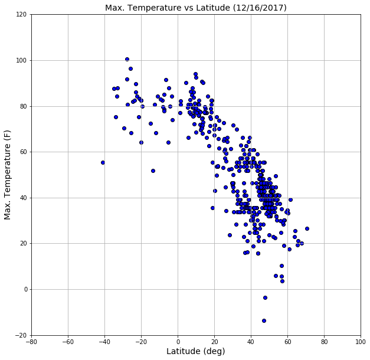
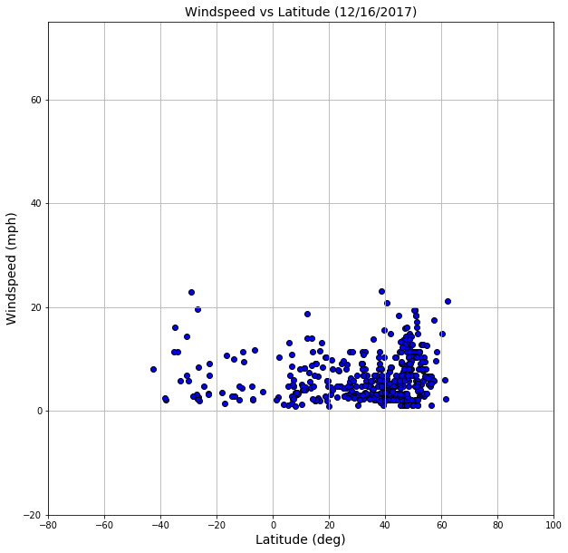
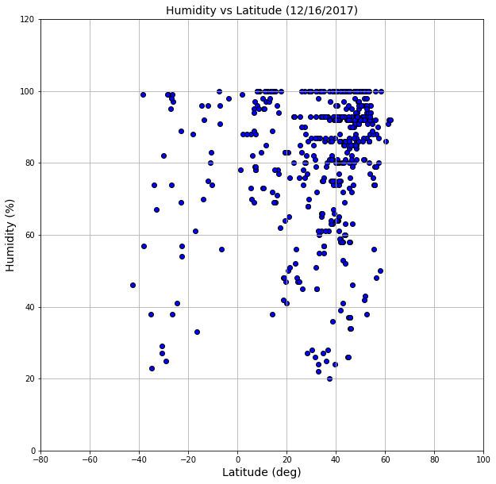
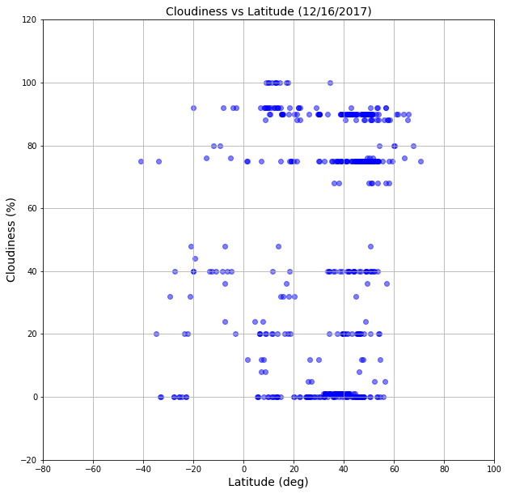

## Grant Aguinaldo, HW-6 Submission 

### Deliverables 

+ [CSV Export](https://github.com/grantaguinaldo/uscdatabootcamp/blob/master/hw-6/hw6_export.csv)
+ [iPython Notebook](https://github.com/grantaguinaldo/uscdatabootcamp/blob/master/hw-6/hw-6.ipynb)

### Observations

**Point 1.**  _The overall shape of the relationship between the maximum temperature and latitude is similar to “inverted U"._  When looking at at this curve, there is a cluster of points at the apex which is about **0 degrees** latitude (the equator).  This suggests that based on the 500 cities, the cities with the highest maximum temperature are those situated near the equator of the earth.  Indeed, given the tilt of the earth's axis, the highest temperatures on the earth should be between -20 and +20 degrees (tropic of Capricorn and Cancer, respectively) since the area between those parts of the earth receive the most sunlight as the earth rotates from the June to December solstice (more can be found [here](https://laulima.hawaii.edu/access/content/group/2c084cc1-8f08-442b-80e8-ed89faa22c33/book/chapter_3/temperature.htm).). Finally, as you move up in latitude, you can see a decrease in the maximum temperatures.  As shown in the figure between "Max. Temperature vs. Latitude (12/16/2017)," there is a cluster of data between 40 and 60 degrees that have maximum temperatures between 20 and 40 F.  Since these are higher up on the globe, it is expected to have lower temperatures compared to the areas that have a lower latitude on the globe.

**Point 2.**. *Humidity is much higher in higher latitude areas than those near the equator.*  From the graph "Humidity vs. Latitude (12/16/2017), the overall shape of the graph shows that humidity increases as latitude increases.  At first pass, this relationship also agrees with a description put out by Idaho State University ([link here](http://imnh.isu.edu/digitalatlas/clima/imaging/humid.htm)) where it notes (emphasis added):

> **In the polar regions**, temperatures are low, dew point temperatures are also low, and **relative humidity is high**. The air in polar regions is usually around 80% saturated. Even though the water vapor content of the air is low, the water vapor capacity is low as well. Saturation occurs in air that holds very little water vapor even when the air is relatively dry. As a consequence, the relative humidity is higher at polar regions than at 30o latitude, while the specific humidity is higher at 30o than at polar regions. Not all regions of the earth around 30o latitude are desert. As one traverses 30o of latitude across the continental United States, one notices a distinct difference between the climate of Arizona and that of Alabama. The air masses that prevail over the western deserts of the U.S. come from the Pacific Ocean. The Pacific Ocean is normally very cool. Air over the Pacific is also cool. As westerly winds move this air over land, its temperature increases but its water vapor content does not. Hence the air over the western deserts has a high temperature but a low dew point and very low relative humidity. The Gulf of Mexico, on the other hand, is quite a bit warmer as is the air over it. When this air moves over the southeastern U.S. it warms only a little while maintaining the same water vapor content. The air and dew point temperatures are very close and the relative humidity is consequently quite high. This is why the southwest U.S. is normally hot and dry while the southeast is hot and muggy.

**Point 3.**  Windspeed is higher in areas between -20 and 20 degrees latitude.  This could be due to the fact that areas in the tropics (-20 and 20 degrees) have the Tradewinds that 

### Approach to solving the problem. 

I started to solve this problem by deconstructing the overall problem into workable components. The thinking here was that if I was able to successfully solve each component, then the end result would be the solution to the homework problem.  

**Part 1:**  Pick one city, complete a `get` request and understand json structure to identify the parts of the json that are of interest for this project. 

**Part 2:** Randomly identifying 500 cities in the world.  To complete this, I started by searching for a list of city id's from `openweathermap.org`. After searching, I found a `txt` file of all about 70,000 cities that had the `openweathermap.org` city id's [link](http://openweathermap.org/help/city_list.txt). With this list of city id's, I copied the list into an Excel file and converted the file to a `csv`.  

**Part 3:** Build query url strings for each of the 500 cities in the world. Once the file was in `csv` format, I used the Pandas `sample` function to randomly select 500 city id's and I sent the data to a python list.  With this list of 500 city id's, I then used list comprehension to generate the query end points using the call structure provided in the documentation for `openweathermap.org`.  

**Part 4:** Complete API calls for each of the 500 cities in the world and return the needed data into a Pandas dataframe, based on the structure that was identified in Part 1. By using a for loop, I then did 500 API calls to obtain the data and I populated the data into an empty Pandas dataframe.

**Part 5:**  Complete the scatter plots for the four relationships that was requested using `matplotlib`.  Once the data was in the Pandas dataframe, I then created the lists needed to build the four scatter plots. 


*** 

## Unit 6 | Assignment - What's the Weather Like?

## Background

Whether financial, political, or social -- data's true power lies in its ability to answer questions definitively. So let's take what you've learned about Python requests, APIs, and JSON traversals to answer a fundamental question: "What's the weather like as we approach the equator?"

Now, we know what you may be thinking: _"Duh. It gets hotter..."_ 

But, if pressed, how would you **prove** it? 

## WeatherPy

In this example, you'll be creating a Python script to visualize the weather of 500+ cities across the world of varying distance from the equator. To accomplish this, you'll be utilizing a [simple Python library](https://pypi.python.org/pypi/citipy), the [OpenWeatherMap API](https://openweathermap.org/api), and a little common sense to create a representative model of weather across world cities.

Your objective is to build a series of scatter plots to showcase the following relationships:

* Temperature (F) vs. Latitude
* Humidity (%) vs. Latitude
* Cloudiness (%) vs. Latitude
* Wind Speed (mph) vs. Latitude

Your final notebook must:

* Randomly select **at least** 500 unique (non-repeat) cities based on latitude and longitude.
* Perform a weather check on each of the cities using a series of successive API calls. 
* Include a print log of each city as it's being processed with the city number, city name, and requested URL.
* Save both a CSV of all data retrieved and png images for each scatter plot.

As final considerations:

* You must use the Matplotlib and Seaborn libraries.
* You must include a written description of three observable trends based on the data. 
* You must use proper labeling of your plots, including aspects like: Plot Titles (with date of analysis) and Axes Labels.
* You must include an exported markdown version of your Notebook called  `README.md` in your GitHub repository.  
* See [Example Solution](WeatherPy_Example.pdf) for a reference on expected format. 

## Hints and Considerations

* You may want to start this assignment by refreshing yourself on 4th grade geography, in particular, the [geographic coordinate system](http://desktop.arcgis.com/en/arcmap/10.3/guide-books/map-projections/about-geographic-coordinate-systems.htm). 

* Next, spend the requisite time necessary to study the OpenWeatherMap API. Based on your initial study, you should be able to answer  basic questions about the API: Where do you request the API key? Which Weather API in particular will you need? What URL endpoints does it expect? What JSON structure does it respond with? Before you write a line of code, you should be aiming to have a crystal clear understanding of your intended outcome.

* Though we've never worked with the [citipy Python library](https://pypi.python.org/pypi/citipy), push yourself to decipher how it works, and why it might be relevant. Before you try to incorporate the library into your analysis, start by creating simple test cases outside your main script to confirm that you are using it correctly. Too often, when introduced to a new library, students get bogged down by the most minor of errors -- spending hours investigating their entire code -- when, in fact, a simple and focused test would have shown their basic utilization of the library was wrong from the start. Don't let this be you!

* Part of our expectation in this challenge is that you will use critical thinking skills to understand how and why we're recommending the tools we are. What is Citipy for? Why would you use it in conjunction with the OpenWeatherMap API? How would you do so?

* In building your script, pay attention to the cities you are using in your query pool. Are you getting coverage of the full gamut of latitudes and longitudes? Or are you simply choosing 500 cities concentrated in one region of the world? Even if you were a geographic genius, simply rattling 500 cities based on your human selection would create a biased dataset. Be thinking of how you should counter this. (Hint: Consider the full range of latitudes).

* Lastly, remember -- this is a challenging activity. Push yourself! If you complete this task, then you can safely say that you've gained a strong mastery of the core foundations of data analytics and it will only go better from here. Good luck!


```python
#Standard imports

import pandas as pd
import requests as r
import json
import matplotlib.pyplot as plt
import datetime
%matplotlib inline
```


```python
# Point to csv file containing city ID

file = 'cityid.csv'
```


```python
#Load in CSV file into Pandas

df = pd.read_csv(file, encoding='utf-8', low_memory=False)
```


```python
#Select a random sample of 500 cities into pandas and store values in a list. 
city_list = df.sample(500).reset_index()['id'].tolist()

#Set up API url using end point and key.
url = 'http://api.openweathermap.org/data/2.5/weather?id='
api_key = '&APPID=0c715aff73757bce5f32aba6da14fd45'
units = '&units=imperial'

#Generate list of all end points based on city id.
url_list = [(url + str(city) + units + api_key) for city in city_list]

#Genearte a dictionary of city ID and end point.
url_dict = {'city_id': city_list, 'url': url_list}

#Load resulting dictionary into Pandas
city_df = pd.DataFrame(url_dict)
```


```python
#Add columns to dataframe

city_df['city'] = ''
city_df['country'] = ''
city_df['lat'] = ''
city_df['lon'] = ''
city_df['temp'] = ''
city_df['wind'] = ''
city_df['clouds'] = ''
city_df['humidity'] = ''
```


```python
#Display head of dataframe

city_df.head()
```


<div>

<table border="1" class="dataframe">
  <thead>
    <tr style="text-align: right;">
      <th></th>
      <th>city_id</th>
      <th>url</th>
      <th>city</th>
      <th>country</th>
      <th>lat</th>
      <th>lon</th>
      <th>temp</th>
      <th>wind</th>
      <th>clouds</th>
      <th>humidity</th>
    </tr>
  </thead>
  <tbody>
    <tr>
      <th>0</th>
      <td>4481682</td>
      <td>http://api.openweathermap.org/data/2.5/weather...</td>
      <td></td>
      <td></td>
      <td></td>
      <td></td>
      <td></td>
      <td></td>
      <td></td>
      <td></td>
    </tr>
    <tr>
      <th>1</th>
      <td>1694158</td>
      <td>http://api.openweathermap.org/data/2.5/weather...</td>
      <td></td>
      <td></td>
      <td></td>
      <td></td>
      <td></td>
      <td></td>
      <td></td>
      <td></td>
    </tr>
    <tr>
      <th>2</th>
      <td>462522</td>
      <td>http://api.openweathermap.org/data/2.5/weather...</td>
      <td></td>
      <td></td>
      <td></td>
      <td></td>
      <td></td>
      <td></td>
      <td></td>
      <td></td>
    </tr>
    <tr>
      <th>3</th>
      <td>2646658</td>
      <td>http://api.openweathermap.org/data/2.5/weather...</td>
      <td></td>
      <td></td>
      <td></td>
      <td></td>
      <td></td>
      <td></td>
      <td></td>
      <td></td>
    </tr>
    <tr>
      <th>4</th>
      <td>2812036</td>
      <td>http://api.openweathermap.org/data/2.5/weather...</td>
      <td></td>
      <td></td>
      <td></td>
      <td></td>
      <td></td>
      <td></td>
      <td></td>
      <td></td>
    </tr>
  </tbody>
</table>
</div>


```python
#Confirm that city id in url matches the city id from dataframe

city_df['url'][4]
```


    'http://api.openweathermap.org/data/2.5/weather?id=2812036&units=imperial&APPID=0c715aff73757bce5f32aba6da14fd45'


```python
#Confirm that city id in url matches the city id from dataframe

city_df.iloc[4]
```


    city_id                                               2812036
    url         http://api.openweathermap.org/data/2.5/weather...
    city                                                         
    country                                                      
    lat                                                          
    lon                                                          
    temp                                                         
    wind                                                         
    clouds                                                       
    humidity                                                     
    Name: 4, dtype: object


```python
#Set up loop to ping end point and return values from json

#Set up for loop to loop through dataframe
i = 0
print('------Start Collecting Data------')
for index, row in city_df.iterrows():
    response = r.get(row['url']).json()    
#     print(response)
    date_time_now = datetime.datetime.now()
    #now.strftime("%Y-%m-%d %H:%M")
    print('Record ' + str(i+1) + ' ' + 'Collected at: ' + date_time_now.strftime("%Y-%m-%d %H:%M"))
    print('City Name: ' + response['name'] + ', ' + 'Country Name: ' + response['sys']['country'])
    print(row['url'])
    print('--------------')

#Set up try/except blocks to populate dataframe based on structure of json    
    try:
        city_df.set_value(index, "city", response['name'])
        city_df.set_value(index, 'country', response['sys']['country'])
        city_df.set_value(index, 'lat', response['coord']['lat'])
        city_df.set_value(index, 'lon', response['coord']['lon'])
        city_df.set_value(index, 'temp', response['main']['temp_max'])
        city_df.set_value(index, 'wind', response['wind']['speed'])
        city_df.set_value(index, 'clouds', response['clouds']['all'])
        city_df.set_value(index, 'humidity', response['main']['humidity'])
    except:
        print("Missing field... skipping.")
    i += 1
print('------End Collecting Data------')
```

    ------Start Collecting Data------
    Record 1 Collected at: 2017-12-17 16:51
    City Name: New Bern, Country Name: US
    http://api.openweathermap.org/data/2.5/weather?id=4481682&units=imperial&APPID=0c715aff73757bce5f32aba6da14fd45
    --------------
    Record 2 Collected at: 2017-12-17 16:51
    City Name: Paypay, Country Name: PH
    http://api.openweathermap.org/data/2.5/weather?id=1694158&units=imperial&APPID=0c715aff73757bce5f32aba6da14fd45
    --------------
    Record 3 Collected at: 2017-12-17 16:51
    City Name: Zimovniki, Country Name: RU
    http://api.openweathermap.org/data/2.5/weather?id=462522&units=imperial&APPID=0c715aff73757bce5f32aba6da14fd45
    --------------
    Record 4 Collected at: 2017-12-17 16:51
    City Name: Honiton, Country Name: GB
    http://api.openweathermap.org/data/2.5/weather?id=2646658&units=imperial&APPID=0c715aff73757bce5f32aba6da14fd45
    --------------
    Record 5 Collected at: 2017-12-17 16:51
    City Name: Weissbach, Country Name: DE
    http://api.openweathermap.org/data/2.5/weather?id=2812036&units=imperial&APPID=0c715aff73757bce5f32aba6da14fd45
    --------------
    Record 6 Collected at: 2017-12-17 16:51
    City Name: Aarle-Rixtel, Country Name: NL
    http://api.openweathermap.org/data/2.5/weather?id=6698718&units=imperial&APPID=0c715aff73757bce5f32aba6da14fd45
    --------------
    Record 7 Collected at: 2017-12-17 16:51
    City Name: Pagalungan, Country Name: PH
    http://api.openweathermap.org/data/2.5/weather?id=1696684&units=imperial&APPID=0c715aff73757bce5f32aba6da14fd45
    --------------
    Record 8 Collected at: 2017-12-17 16:51
    City Name: Serra San Quirico, Country Name: IT
    http://api.openweathermap.org/data/2.5/weather?id=3166655&units=imperial&APPID=0c715aff73757bce5f32aba6da14fd45
    --------------
    Record 9 Collected at: 2017-12-17 16:51
    City Name: Stansstad, Country Name: CH
    http://api.openweathermap.org/data/2.5/weather?id=2658502&units=imperial&APPID=0c715aff73757bce5f32aba6da14fd45
    --------------
    Record 10 Collected at: 2017-12-17 16:51
    City Name: Klenovyy, Country Name: UA
    http://api.openweathermap.org/data/2.5/weather?id=705673&units=imperial&APPID=0c715aff73757bce5f32aba6da14fd45
    --------------
    Record 11 Collected at: 2017-12-17 16:51
    City Name: Pittston, Country Name: US
    http://api.openweathermap.org/data/2.5/weather?id=5206397&units=imperial&APPID=0c715aff73757bce5f32aba6da14fd45
    --------------
    Record 12 Collected at: 2017-12-17 16:51
    City Name: Magog, Country Name: CA
    http://api.openweathermap.org/data/2.5/weather?id=6064180&units=imperial&APPID=0c715aff73757bce5f32aba6da14fd45
    --------------
    Record 13 Collected at: 2017-12-17 16:51
    City Name: Wohldorf-Ohlstedt, Country Name: DE
    http://api.openweathermap.org/data/2.5/weather?id=2807068&units=imperial&APPID=0c715aff73757bce5f32aba6da14fd45
    --------------
    Record 14 Collected at: 2017-12-17 16:51
    City Name: Mogadouro, Country Name: PT
    http://api.openweathermap.org/data/2.5/weather?id=2737599&units=imperial&APPID=0c715aff73757bce5f32aba6da14fd45
    --------------
    Record 15 Collected at: 2017-12-17 16:51
    City Name: Alges, Country Name: PT
    http://api.openweathermap.org/data/2.5/weather?id=2271985&units=imperial&APPID=0c715aff73757bce5f32aba6da14fd45
    --------------
    Record 16 Collected at: 2017-12-17 16:51
    City Name: Illerrieden, Country Name: DE
    http://api.openweathermap.org/data/2.5/weather?id=2896547&units=imperial&APPID=0c715aff73757bce5f32aba6da14fd45
    --------------
    Record 17 Collected at: 2017-12-17 16:51
    City Name: Mombercelli, Country Name: IT
    http://api.openweathermap.org/data/2.5/weather?id=6534330&units=imperial&APPID=0c715aff73757bce5f32aba6da14fd45
    --------------
    Record 18 Collected at: 2017-12-17 16:51
    City Name: Gallur, Country Name: ES
    http://api.openweathermap.org/data/2.5/weather?id=3121679&units=imperial&APPID=0c715aff73757bce5f32aba6da14fd45
    --------------
    Record 19 Collected at: 2017-12-17 16:51
    City Name: Bagarji, Country Name: PK
    http://api.openweathermap.org/data/2.5/weather?id=1184008&units=imperial&APPID=0c715aff73757bce5f32aba6da14fd45
    --------------
    Record 20 Collected at: 2017-12-17 16:51
    City Name: Mezokovesd, Country Name: HU
    http://api.openweathermap.org/data/2.5/weather?id=717652&units=imperial&APPID=0c715aff73757bce5f32aba6da14fd45
    --------------
    Record 21 Collected at: 2017-12-17 16:51
    City Name: Norwalk, Country Name: US
    http://api.openweathermap.org/data/2.5/weather?id=4839822&units=imperial&APPID=0c715aff73757bce5f32aba6da14fd45
    --------------
    Record 22 Collected at: 2017-12-17 16:51
    City Name: Rochester, Country Name: US
    http://api.openweathermap.org/data/2.5/weather?id=5208641&units=imperial&APPID=0c715aff73757bce5f32aba6da14fd45
    --------------
    Record 23 Collected at: 2017-12-17 16:51
    City Name: Bron, Country Name: FR
    http://api.openweathermap.org/data/2.5/weather?id=3029931&units=imperial&APPID=0c715aff73757bce5f32aba6da14fd45
    --------------
    Record 24 Collected at: 2017-12-17 16:51
    City Name: Algiers, Country Name: DZ
    http://api.openweathermap.org/data/2.5/weather?id=2507480&units=imperial&APPID=0c715aff73757bce5f32aba6da14fd45
    --------------
    Record 25 Collected at: 2017-12-17 16:51
    City Name: Charneca, Country Name: PT
    http://api.openweathermap.org/data/2.5/weather?id=2269282&units=imperial&APPID=0c715aff73757bce5f32aba6da14fd45
    --------------
    Record 26 Collected at: 2017-12-17 16:51
    City Name: Jaora, Country Name: IN
    http://api.openweathermap.org/data/2.5/weather?id=1269217&units=imperial&APPID=0c715aff73757bce5f32aba6da14fd45
    --------------
    Record 27 Collected at: 2017-12-17 16:51
    City Name: Cut Off, Country Name: US
    http://api.openweathermap.org/data/2.5/weather?id=4321399&units=imperial&APPID=0c715aff73757bce5f32aba6da14fd45
    --------------
    Record 28 Collected at: 2017-12-17 16:51
    City Name: Baie-Mahault, Country Name: GP
    http://api.openweathermap.org/data/2.5/weather?id=3579767&units=imperial&APPID=0c715aff73757bce5f32aba6da14fd45
    --------------
    Record 29 Collected at: 2017-12-17 16:51
    City Name: Sasayama, Country Name: JP
    http://api.openweathermap.org/data/2.5/weather?id=1852901&units=imperial&APPID=0c715aff73757bce5f32aba6da14fd45
    --------------
    Record 30 Collected at: 2017-12-17 16:51
    City Name: Gbely, Country Name: SK
    http://api.openweathermap.org/data/2.5/weather?id=3060208&units=imperial&APPID=0c715aff73757bce5f32aba6da14fd45
    --------------
    Record 31 Collected at: 2017-12-17 16:51
    City Name: Korgun, Country Name: TR
    http://api.openweathermap.org/data/2.5/weather?id=742657&units=imperial&APPID=0c715aff73757bce5f32aba6da14fd45
    --------------
    Record 32 Collected at: 2017-12-17 16:51
    City Name: Poynton, Country Name: GB
    http://api.openweathermap.org/data/2.5/weather?id=2639941&units=imperial&APPID=0c715aff73757bce5f32aba6da14fd45
    --------------
    Record 33 Collected at: 2017-12-17 16:51
    City Name: Asikkala, Country Name: FI
    http://api.openweathermap.org/data/2.5/weather?id=660949&units=imperial&APPID=0c715aff73757bce5f32aba6da14fd45
    --------------
    Record 34 Collected at: 2017-12-17 16:51
    City Name: Javalera, Country Name: PH
    http://api.openweathermap.org/data/2.5/weather?id=1710249&units=imperial&APPID=0c715aff73757bce5f32aba6da14fd45
    --------------
    Record 35 Collected at: 2017-12-17 16:51
    City Name: Zbe, Country Name: SA
    http://api.openweathermap.org/data/2.5/weather?id=106909&units=imperial&APPID=0c715aff73757bce5f32aba6da14fd45
    --------------
    Record 36 Collected at: 2017-12-17 16:51
    City Name: Oberlungwitz, Country Name: DE
    http://api.openweathermap.org/data/2.5/weather?id=2859843&units=imperial&APPID=0c715aff73757bce5f32aba6da14fd45
    --------------
    Record 37 Collected at: 2017-12-17 16:51
    City Name: Leiria, Country Name: PT
    http://api.openweathermap.org/data/2.5/weather?id=2267095&units=imperial&APPID=0c715aff73757bce5f32aba6da14fd45
    --------------
    Record 38 Collected at: 2017-12-17 16:51
    City Name: Albiate, Country Name: IT
    http://api.openweathermap.org/data/2.5/weather?id=3183321&units=imperial&APPID=0c715aff73757bce5f32aba6da14fd45
    --------------
    Record 39 Collected at: 2017-12-17 16:51
    City Name: Tapioszele, Country Name: HU
    http://api.openweathermap.org/data/2.5/weather?id=3044151&units=imperial&APPID=0c715aff73757bce5f32aba6da14fd45
    --------------
    Record 40 Collected at: 2017-12-17 16:51
    City Name: Mahayag, Country Name: PH
    http://api.openweathermap.org/data/2.5/weather?id=1703599&units=imperial&APPID=0c715aff73757bce5f32aba6da14fd45
    --------------
    Record 41 Collected at: 2017-12-17 16:51
    City Name: Nadarzyn, Country Name: PL
    http://api.openweathermap.org/data/2.5/weather?id=764194&units=imperial&APPID=0c715aff73757bce5f32aba6da14fd45
    --------------
    Record 42 Collected at: 2017-12-17 16:51
    City Name: Birine, Country Name: DZ
    http://api.openweathermap.org/data/2.5/weather?id=2503852&units=imperial&APPID=0c715aff73757bce5f32aba6da14fd45
    --------------
    Record 43 Collected at: 2017-12-17 16:51
    City Name: Shushi, Country Name: AZ
    http://api.openweathermap.org/data/2.5/weather?id=147105&units=imperial&APPID=0c715aff73757bce5f32aba6da14fd45
    --------------
    Record 44 Collected at: 2017-12-17 16:51
    City Name: Tolmezzo, Country Name: IT
    http://api.openweathermap.org/data/2.5/weather?id=3165584&units=imperial&APPID=0c715aff73757bce5f32aba6da14fd45
    --------------
    Record 45 Collected at: 2017-12-17 16:51
    City Name: Kapsan-up, Country Name: KP
    http://api.openweathermap.org/data/2.5/weather?id=2043531&units=imperial&APPID=0c715aff73757bce5f32aba6da14fd45
    --------------
    Record 46 Collected at: 2017-12-17 16:51
    City Name: Sullivan, Country Name: US
    http://api.openweathermap.org/data/2.5/weather?id=4250862&units=imperial&APPID=0c715aff73757bce5f32aba6da14fd45
    --------------
    Record 47 Collected at: 2017-12-17 16:51
    City Name: Varnsdorf, Country Name: CZ
    http://api.openweathermap.org/data/2.5/weather?id=3063375&units=imperial&APPID=0c715aff73757bce5f32aba6da14fd45
    --------------
    Record 48 Collected at: 2017-12-17 16:51
    City Name: Columbia Falls, Country Name: US
    http://api.openweathermap.org/data/2.5/weather?id=5645859&units=imperial&APPID=0c715aff73757bce5f32aba6da14fd45
    --------------
    Record 49 Collected at: 2017-12-17 16:51
    City Name: Godega di SantUrbano, Country Name: IT
    http://api.openweathermap.org/data/2.5/weather?id=3176023&units=imperial&APPID=0c715aff73757bce5f32aba6da14fd45
    --------------
    Record 50 Collected at: 2017-12-17 16:51
    City Name: Kobayashi, Country Name: JP
    http://api.openweathermap.org/data/2.5/weather?id=1859175&units=imperial&APPID=0c715aff73757bce5f32aba6da14fd45
    --------------
    Record 51 Collected at: 2017-12-17 16:51
    City Name: Cherykaw, Country Name: BY
    http://api.openweathermap.org/data/2.5/weather?id=629347&units=imperial&APPID=0c715aff73757bce5f32aba6da14fd45
    --------------
    Record 52 Collected at: 2017-12-17 16:51
    City Name: Tacherting, Country Name: DE
    http://api.openweathermap.org/data/2.5/weather?id=2824420&units=imperial&APPID=0c715aff73757bce5f32aba6da14fd45
    --------------
    Record 53 Collected at: 2017-12-17 16:51
    City Name: Fairport, Country Name: US
    http://api.openweathermap.org/data/2.5/weather?id=5116815&units=imperial&APPID=0c715aff73757bce5f32aba6da14fd45
    --------------
    Record 54 Collected at: 2017-12-17 16:51
    City Name: Yehualtepec, Country Name: MX
    http://api.openweathermap.org/data/2.5/weather?id=3514272&units=imperial&APPID=0c715aff73757bce5f32aba6da14fd45
    --------------
    Record 55 Collected at: 2017-12-17 16:51
    City Name: Wezembeek-Oppem, Country Name: BE
    http://api.openweathermap.org/data/2.5/weather?id=2783737&units=imperial&APPID=0c715aff73757bce5f32aba6da14fd45
    --------------
    Record 56 Collected at: 2017-12-17 16:51
    City Name: Appen, Country Name: DE
    http://api.openweathermap.org/data/2.5/weather?id=2955745&units=imperial&APPID=0c715aff73757bce5f32aba6da14fd45
    --------------
    Record 57 Collected at: 2017-12-17 16:51
    City Name: Tirat Karmel, Country Name: IL
    http://api.openweathermap.org/data/2.5/weather?id=293308&units=imperial&APPID=0c715aff73757bce5f32aba6da14fd45
    --------------
    Record 58 Collected at: 2017-12-17 16:51
    City Name: Aranzazu, Country Name: CO
    http://api.openweathermap.org/data/2.5/weather?id=3689740&units=imperial&APPID=0c715aff73757bce5f32aba6da14fd45
    --------------
    Record 59 Collected at: 2017-12-17 16:51
    City Name: Hardingstone, Country Name: GB
    http://api.openweathermap.org/data/2.5/weather?id=2647497&units=imperial&APPID=0c715aff73757bce5f32aba6da14fd45
    --------------
    Record 60 Collected at: 2017-12-17 16:51
    City Name: Howe, Country Name: US
    http://api.openweathermap.org/data/2.5/weather?id=4699204&units=imperial&APPID=0c715aff73757bce5f32aba6da14fd45
    --------------
    Record 61 Collected at: 2017-12-17 16:51
    City Name: Llanes, Country Name: ES
    http://api.openweathermap.org/data/2.5/weather?id=3118304&units=imperial&APPID=0c715aff73757bce5f32aba6da14fd45
    --------------
    Record 62 Collected at: 2017-12-17 16:51
    City Name: Tiszadob, Country Name: HU
    http://api.openweathermap.org/data/2.5/weather?id=714779&units=imperial&APPID=0c715aff73757bce5f32aba6da14fd45
    --------------
    Record 63 Collected at: 2017-12-17 16:51
    City Name: Siria, Country Name: RO
    http://api.openweathermap.org/data/2.5/weather?id=666821&units=imperial&APPID=0c715aff73757bce5f32aba6da14fd45
    --------------
    Record 64 Collected at: 2017-12-17 16:51
    City Name: Fadd, Country Name: HU
    http://api.openweathermap.org/data/2.5/weather?id=3053132&units=imperial&APPID=0c715aff73757bce5f32aba6da14fd45
    --------------
    Record 65 Collected at: 2017-12-17 16:51
    City Name: Praia da Vitoria, Country Name: PT
    http://api.openweathermap.org/data/2.5/weather?id=3372760&units=imperial&APPID=0c715aff73757bce5f32aba6da14fd45
    --------------
    Record 66 Collected at: 2017-12-17 16:51
    City Name: Bolintin Vale, Country Name: RO
    http://api.openweathermap.org/data/2.5/weather?id=684266&units=imperial&APPID=0c715aff73757bce5f32aba6da14fd45
    --------------
    Record 67 Collected at: 2017-12-17 16:51
    City Name: Norland, Country Name: US
    http://api.openweathermap.org/data/2.5/weather?id=4166066&units=imperial&APPID=0c715aff73757bce5f32aba6da14fd45
    --------------
    Record 68 Collected at: 2017-12-17 16:51
    City Name: Bagado, Country Name: CO
    http://api.openweathermap.org/data/2.5/weather?id=3689336&units=imperial&APPID=0c715aff73757bce5f32aba6da14fd45
    --------------
    Record 69 Collected at: 2017-12-17 16:51
    City Name: Kashiwazaki, Country Name: JP
    http://api.openweathermap.org/data/2.5/weather?id=1859908&units=imperial&APPID=0c715aff73757bce5f32aba6da14fd45
    --------------
    Record 70 Collected at: 2017-12-17 16:51
    City Name: Maco, Country Name: PH
    http://api.openweathermap.org/data/2.5/weather?id=1704271&units=imperial&APPID=0c715aff73757bce5f32aba6da14fd45
    --------------
    Record 71 Collected at: 2017-12-17 16:51
    City Name: Noyal-Muzillac, Country Name: FR
    http://api.openweathermap.org/data/2.5/weather?id=2989920&units=imperial&APPID=0c715aff73757bce5f32aba6da14fd45
    --------------
    Record 72 Collected at: 2017-12-17 16:51
    City Name: Vada, Country Name: IN
    http://api.openweathermap.org/data/2.5/weather?id=1253610&units=imperial&APPID=0c715aff73757bce5f32aba6da14fd45
    --------------
    Record 73 Collected at: 2017-12-17 16:51
    City Name: Rojhan, Country Name: PK
    http://api.openweathermap.org/data/2.5/weather?id=1166819&units=imperial&APPID=0c715aff73757bce5f32aba6da14fd45
    --------------
    Record 74 Collected at: 2017-12-17 16:51
    City Name: Bear Creek, Country Name: US
    http://api.openweathermap.org/data/2.5/weather?id=5880147&units=imperial&APPID=0c715aff73757bce5f32aba6da14fd45
    --------------
    Record 75 Collected at: 2017-12-17 16:51
    City Name: Naguelguel, Country Name: PH
    http://api.openweathermap.org/data/2.5/weather?id=1698606&units=imperial&APPID=0c715aff73757bce5f32aba6da14fd45
    --------------
    Record 76 Collected at: 2017-12-17 16:51
    City Name: Bowling Green, Country Name: US
    http://api.openweathermap.org/data/2.5/weather?id=4148659&units=imperial&APPID=0c715aff73757bce5f32aba6da14fd45
    --------------
    Record 77 Collected at: 2017-12-17 16:51
    City Name: Villavieja, Country Name: ES
    http://api.openweathermap.org/data/2.5/weather?id=2509465&units=imperial&APPID=0c715aff73757bce5f32aba6da14fd45
    --------------
    Record 78 Collected at: 2017-12-17 16:51
    City Name: Golborne, Country Name: GB
    http://api.openweathermap.org/data/2.5/weather?id=2648356&units=imperial&APPID=0c715aff73757bce5f32aba6da14fd45
    --------------
    Record 79 Collected at: 2017-12-17 16:51
    City Name: Soreang, Country Name: ID
    http://api.openweathermap.org/data/2.5/weather?id=1626560&units=imperial&APPID=0c715aff73757bce5f32aba6da14fd45
    --------------
    Record 80 Collected at: 2017-12-17 16:51
    City Name: Malka, Country Name: RU
    http://api.openweathermap.org/data/2.5/weather?id=530994&units=imperial&APPID=0c715aff73757bce5f32aba6da14fd45
    --------------
    Record 81 Collected at: 2017-12-17 16:52
    City Name: San Jose de Colinas, Country Name: HN
    http://api.openweathermap.org/data/2.5/weather?id=3602097&units=imperial&APPID=0c715aff73757bce5f32aba6da14fd45
    --------------
    Record 82 Collected at: 2017-12-17 16:52
    City Name: Wabasha, Country Name: US
    http://api.openweathermap.org/data/2.5/weather?id=5051594&units=imperial&APPID=0c715aff73757bce5f32aba6da14fd45
    --------------
    Record 83 Collected at: 2017-12-17 16:52
    City Name: Orland Hills, Country Name: US
    http://api.openweathermap.org/data/2.5/weather?id=4904934&units=imperial&APPID=0c715aff73757bce5f32aba6da14fd45
    --------------
    Record 84 Collected at: 2017-12-17 16:52
    City Name: Claremont, Country Name: AU
    http://api.openweathermap.org/data/2.5/weather?id=2171476&units=imperial&APPID=0c715aff73757bce5f32aba6da14fd45
    --------------
    Record 85 Collected at: 2017-12-17 16:52
    City Name: Leonding, Country Name: AT
    http://api.openweathermap.org/data/2.5/weather?id=2772635&units=imperial&APPID=0c715aff73757bce5f32aba6da14fd45
    --------------
    Record 86 Collected at: 2017-12-17 16:52
    City Name: Kingston, Country Name: US
    http://api.openweathermap.org/data/2.5/weather?id=5123477&units=imperial&APPID=0c715aff73757bce5f32aba6da14fd45
    --------------
    Record 87 Collected at: 2017-12-17 16:52
    City Name: Patrocinio, Country Name: PH
    http://api.openweathermap.org/data/2.5/weather?id=1694319&units=imperial&APPID=0c715aff73757bce5f32aba6da14fd45
    --------------
    Record 88 Collected at: 2017-12-17 16:52
    City Name: Piglio, Country Name: IT
    http://api.openweathermap.org/data/2.5/weather?id=3170723&units=imperial&APPID=0c715aff73757bce5f32aba6da14fd45
    --------------
    Record 89 Collected at: 2017-12-17 16:52
    City Name: Danyang, Country Name: CN
    http://api.openweathermap.org/data/2.5/weather?id=1813803&units=imperial&APPID=0c715aff73757bce5f32aba6da14fd45
    --------------
    Record 90 Collected at: 2017-12-17 16:52
    City Name: Umabay, Country Name: PH
    http://api.openweathermap.org/data/2.5/weather?id=1680344&units=imperial&APPID=0c715aff73757bce5f32aba6da14fd45
    --------------
    Record 91 Collected at: 2017-12-17 16:52
    City Name: Villa de Costa Rica, Country Name: MX
    http://api.openweathermap.org/data/2.5/weather?id=4012693&units=imperial&APPID=0c715aff73757bce5f32aba6da14fd45
    --------------
    Record 92 Collected at: 2017-12-17 16:52
    City Name: Gandiaye, Country Name: SN
    http://api.openweathermap.org/data/2.5/weather?id=2251688&units=imperial&APPID=0c715aff73757bce5f32aba6da14fd45
    --------------
    Record 93 Collected at: 2017-12-17 16:52
    City Name: Abnub, Country Name: EG
    http://api.openweathermap.org/data/2.5/weather?id=362973&units=imperial&APPID=0c715aff73757bce5f32aba6da14fd45
    --------------
    Record 94 Collected at: 2017-12-17 16:52
    City Name: Ward, Country Name: US
    http://api.openweathermap.org/data/2.5/weather?id=4135279&units=imperial&APPID=0c715aff73757bce5f32aba6da14fd45
    --------------
    Record 95 Collected at: 2017-12-17 16:52
    City Name: Aswan, Country Name: EG
    http://api.openweathermap.org/data/2.5/weather?id=359792&units=imperial&APPID=0c715aff73757bce5f32aba6da14fd45
    --------------
    Record 96 Collected at: 2017-12-17 16:52
    City Name: Verlaine, Country Name: BE
    http://api.openweathermap.org/data/2.5/weather?id=2784856&units=imperial&APPID=0c715aff73757bce5f32aba6da14fd45
    --------------
    Record 97 Collected at: 2017-12-17 16:52
    City Name: Affton, Country Name: US
    http://api.openweathermap.org/data/2.5/weather?id=4374513&units=imperial&APPID=0c715aff73757bce5f32aba6da14fd45
    --------------
    Record 98 Collected at: 2017-12-17 16:52
    City Name: Mishkino, Country Name: RU
    http://api.openweathermap.org/data/2.5/weather?id=1498633&units=imperial&APPID=0c715aff73757bce5f32aba6da14fd45
    --------------
    Record 99 Collected at: 2017-12-17 16:52
    City Name: Delvada, Country Name: IN
    http://api.openweathermap.org/data/2.5/weather?id=1273287&units=imperial&APPID=0c715aff73757bce5f32aba6da14fd45
    --------------
    Record 100 Collected at: 2017-12-17 16:52
    City Name: Tsukawaki, Country Name: JP
    http://api.openweathermap.org/data/2.5/weather?id=1849706&units=imperial&APPID=0c715aff73757bce5f32aba6da14fd45
    --------------
    Record 101 Collected at: 2017-12-17 16:52
    City Name: Rafelguaraf, Country Name: ES
    http://api.openweathermap.org/data/2.5/weather?id=2512071&units=imperial&APPID=0c715aff73757bce5f32aba6da14fd45
    --------------
    Record 102 Collected at: 2017-12-17 16:52
    City Name: Castelnau-de-Medoc, Country Name: FR
    http://api.openweathermap.org/data/2.5/weather?id=3028343&units=imperial&APPID=0c715aff73757bce5f32aba6da14fd45
    --------------
    Record 103 Collected at: 2017-12-17 16:52
    City Name: North Guwahati, Country Name: IN
    http://api.openweathermap.org/data/2.5/weather?id=1261186&units=imperial&APPID=0c715aff73757bce5f32aba6da14fd45
    --------------
    Record 104 Collected at: 2017-12-17 16:52
    City Name: Obispo Trejo, Country Name: AR
    http://api.openweathermap.org/data/2.5/weather?id=3842796&units=imperial&APPID=0c715aff73757bce5f32aba6da14fd45
    --------------
    Record 105 Collected at: 2017-12-17 16:52
    City Name: Hart, Country Name: US
    http://api.openweathermap.org/data/2.5/weather?id=4995436&units=imperial&APPID=0c715aff73757bce5f32aba6da14fd45
    --------------
    Record 106 Collected at: 2017-12-17 16:52
    City Name: Pleasant Run, Country Name: US
    http://api.openweathermap.org/data/2.5/weather?id=4521565&units=imperial&APPID=0c715aff73757bce5f32aba6da14fd45
    --------------
    Record 107 Collected at: 2017-12-17 16:52
    City Name: Villorba, Country Name: IT
    http://api.openweathermap.org/data/2.5/weather?id=3164090&units=imperial&APPID=0c715aff73757bce5f32aba6da14fd45
    --------------
    Record 108 Collected at: 2017-12-17 16:52
    City Name: Ledana, Country Name: ES
    http://api.openweathermap.org/data/2.5/weather?id=2515093&units=imperial&APPID=0c715aff73757bce5f32aba6da14fd45
    --------------
    Record 109 Collected at: 2017-12-17 16:52
    City Name: Nkwerre, Country Name: NG
    http://api.openweathermap.org/data/2.5/weather?id=2328790&units=imperial&APPID=0c715aff73757bce5f32aba6da14fd45
    --------------
    Record 110 Collected at: 2017-12-17 16:52
    City Name: Pedreira, Country Name: BR
    http://api.openweathermap.org/data/2.5/weather?id=3454407&units=imperial&APPID=0c715aff73757bce5f32aba6da14fd45
    --------------
    Record 111 Collected at: 2017-12-17 16:52
    City Name: Kalandagan, Country Name: PH
    http://api.openweathermap.org/data/2.5/weather?id=1709707&units=imperial&APPID=0c715aff73757bce5f32aba6da14fd45
    --------------
    Record 112 Collected at: 2017-12-17 16:52
    City Name: Ayabe, Country Name: JP
    http://api.openweathermap.org/data/2.5/weather?id=1864873&units=imperial&APPID=0c715aff73757bce5f32aba6da14fd45
    --------------
    Record 113 Collected at: 2017-12-17 16:52
    City Name: Poteet, Country Name: US
    http://api.openweathermap.org/data/2.5/weather?id=4720270&units=imperial&APPID=0c715aff73757bce5f32aba6da14fd45
    --------------
    Record 114 Collected at: 2017-12-17 16:52
    City Name: Ferris, Country Name: US
    http://api.openweathermap.org/data/2.5/weather?id=4690428&units=imperial&APPID=0c715aff73757bce5f32aba6da14fd45
    --------------
    Record 115 Collected at: 2017-12-17 16:52
    City Name: Conway, Country Name: US
    http://api.openweathermap.org/data/2.5/weather?id=4151745&units=imperial&APPID=0c715aff73757bce5f32aba6da14fd45
    --------------
    Record 116 Collected at: 2017-12-17 16:52
    City Name: Weirton Heights, Country Name: US
    http://api.openweathermap.org/data/2.5/weather?id=5280822&units=imperial&APPID=0c715aff73757bce5f32aba6da14fd45
    --------------
    Record 117 Collected at: 2017-12-17 16:52
    City Name: Biancavilla, Country Name: IT
    http://api.openweathermap.org/data/2.5/weather?id=2525560&units=imperial&APPID=0c715aff73757bce5f32aba6da14fd45
    --------------
    Record 118 Collected at: 2017-12-17 16:52
    City Name: Opopeo, Country Name: MX
    http://api.openweathermap.org/data/2.5/weather?id=3994164&units=imperial&APPID=0c715aff73757bce5f32aba6da14fd45
    --------------
    Record 119 Collected at: 2017-12-17 16:52
    City Name: Eersel, Country Name: NL
    http://api.openweathermap.org/data/2.5/weather?id=2756342&units=imperial&APPID=0c715aff73757bce5f32aba6da14fd45
    --------------
    Record 120 Collected at: 2017-12-17 16:52
    City Name: Coutiches, Country Name: FR
    http://api.openweathermap.org/data/2.5/weather?id=3022804&units=imperial&APPID=0c715aff73757bce5f32aba6da14fd45
    --------------
    Record 121 Collected at: 2017-12-17 16:52
    City Name: Nizhniy Baskunchak, Country Name: RU
    http://api.openweathermap.org/data/2.5/weather?id=520798&units=imperial&APPID=0c715aff73757bce5f32aba6da14fd45
    --------------
    Record 122 Collected at: 2017-12-17 16:52
    City Name: Sapian, Country Name: PH
    http://api.openweathermap.org/data/2.5/weather?id=1687238&units=imperial&APPID=0c715aff73757bce5f32aba6da14fd45
    --------------
    Record 123 Collected at: 2017-12-17 16:52
    City Name: Canasgordas, Country Name: CO
    http://api.openweathermap.org/data/2.5/weather?id=3687677&units=imperial&APPID=0c715aff73757bce5f32aba6da14fd45
    --------------
    Record 124 Collected at: 2017-12-17 16:52
    City Name: Kinzan, Country Name: KR
    http://api.openweathermap.org/data/2.5/weather?id=1842153&units=imperial&APPID=0c715aff73757bce5f32aba6da14fd45
    --------------
    Record 125 Collected at: 2017-12-17 16:52
    City Name: Camden, Country Name: US
    http://api.openweathermap.org/data/2.5/weather?id=4053200&units=imperial&APPID=0c715aff73757bce5f32aba6da14fd45
    --------------
    Record 126 Collected at: 2017-12-17 16:52
    City Name: Dong Ha, Country Name: VN
    http://api.openweathermap.org/data/2.5/weather?id=1582926&units=imperial&APPID=0c715aff73757bce5f32aba6da14fd45
    --------------
    Record 127 Collected at: 2017-12-17 16:52
    City Name: Pervomayskoye, Country Name: RU
    http://api.openweathermap.org/data/2.5/weather?id=1495259&units=imperial&APPID=0c715aff73757bce5f32aba6da14fd45
    --------------
    Record 128 Collected at: 2017-12-17 16:52
    City Name: Valle Lomellina, Country Name: IT
    http://api.openweathermap.org/data/2.5/weather?id=3164850&units=imperial&APPID=0c715aff73757bce5f32aba6da14fd45
    --------------
    Record 129 Collected at: 2017-12-17 16:52
    City Name: Yasenskaya, Country Name: RU
    http://api.openweathermap.org/data/2.5/weather?id=468782&units=imperial&APPID=0c715aff73757bce5f32aba6da14fd45
    --------------
    Record 130 Collected at: 2017-12-17 16:52
    City Name: Lechaina, Country Name: GR
    http://api.openweathermap.org/data/2.5/weather?id=258522&units=imperial&APPID=0c715aff73757bce5f32aba6da14fd45
    --------------
    Record 131 Collected at: 2017-12-17 16:52
    City Name: Lake Barcroft, Country Name: US
    http://api.openweathermap.org/data/2.5/weather?id=4768185&units=imperial&APPID=0c715aff73757bce5f32aba6da14fd45
    --------------
    Record 132 Collected at: 2017-12-17 16:52
    City Name: Nova Dubnica, Country Name: SK
    http://api.openweathermap.org/data/2.5/weather?id=3058496&units=imperial&APPID=0c715aff73757bce5f32aba6da14fd45
    --------------
    Record 133 Collected at: 2017-12-17 16:52
    City Name: Furstenwalde, Country Name: DE
    http://api.openweathermap.org/data/2.5/weather?id=2923588&units=imperial&APPID=0c715aff73757bce5f32aba6da14fd45
    --------------
    Record 134 Collected at: 2017-12-17 16:52
    City Name: Griesheim, Country Name: DE
    http://api.openweathermap.org/data/2.5/weather?id=2917412&units=imperial&APPID=0c715aff73757bce5f32aba6da14fd45
    --------------
    Record 135 Collected at: 2017-12-17 16:52
    City Name: Carpineti, Country Name: IT
    http://api.openweathermap.org/data/2.5/weather?id=3180433&units=imperial&APPID=0c715aff73757bce5f32aba6da14fd45
    --------------
    Record 136 Collected at: 2017-12-17 16:52
    City Name: Malaybalay, Country Name: PH
    http://api.openweathermap.org/data/2.5/weather?id=1702934&units=imperial&APPID=0c715aff73757bce5f32aba6da14fd45
    --------------
    Record 137 Collected at: 2017-12-17 16:52
    City Name: Kirchberg, Country Name: DE
    http://api.openweathermap.org/data/2.5/weather?id=2890662&units=imperial&APPID=0c715aff73757bce5f32aba6da14fd45
    --------------
    Record 138 Collected at: 2017-12-17 16:52
    City Name: Caianu Mic, Country Name: RO
    http://api.openweathermap.org/data/2.5/weather?id=683050&units=imperial&APPID=0c715aff73757bce5f32aba6da14fd45
    --------------
    Record 139 Collected at: 2017-12-17 16:52
    City Name: Vize, Country Name: TR
    http://api.openweathermap.org/data/2.5/weather?id=738154&units=imperial&APPID=0c715aff73757bce5f32aba6da14fd45
    --------------
    Record 140 Collected at: 2017-12-17 16:52
    City Name: Vilshofen, Country Name: DE
    http://api.openweathermap.org/data/2.5/weather?id=2817202&units=imperial&APPID=0c715aff73757bce5f32aba6da14fd45
    --------------
    Record 141 Collected at: 2017-12-17 16:52
    City Name: Goodyear, Country Name: US
    http://api.openweathermap.org/data/2.5/weather?id=5296266&units=imperial&APPID=0c715aff73757bce5f32aba6da14fd45
    --------------
    Record 142 Collected at: 2017-12-17 16:52
    City Name: Durrwangen, Country Name: DE
    http://api.openweathermap.org/data/2.5/weather?id=2934281&units=imperial&APPID=0c715aff73757bce5f32aba6da14fd45
    --------------
    Record 143 Collected at: 2017-12-17 16:52
    City Name: Envermeu, Country Name: FR
    http://api.openweathermap.org/data/2.5/weather?id=3020108&units=imperial&APPID=0c715aff73757bce5f32aba6da14fd45
    --------------
    Record 144 Collected at: 2017-12-17 16:52
    City Name: Munger, Country Name: IN
    http://api.openweathermap.org/data/2.5/weather?id=1262482&units=imperial&APPID=0c715aff73757bce5f32aba6da14fd45
    --------------
    Record 145 Collected at: 2017-12-17 16:52
    City Name: Rute, Country Name: ES
    http://api.openweathermap.org/data/2.5/weather?id=2511649&units=imperial&APPID=0c715aff73757bce5f32aba6da14fd45
    --------------
    Record 146 Collected at: 2017-12-17 16:52
    City Name: Cornea, Country Name: RO
    http://api.openweathermap.org/data/2.5/weather?id=680790&units=imperial&APPID=0c715aff73757bce5f32aba6da14fd45
    --------------
    Record 147 Collected at: 2017-12-17 16:52
    City Name: Saignelegier, Country Name: CH
    http://api.openweathermap.org/data/2.5/weather?id=2658882&units=imperial&APPID=0c715aff73757bce5f32aba6da14fd45
    --------------
    Record 148 Collected at: 2017-12-17 16:52
    City Name: Orsieres, Country Name: CH
    http://api.openweathermap.org/data/2.5/weather?id=2659281&units=imperial&APPID=0c715aff73757bce5f32aba6da14fd45
    --------------
    Record 149 Collected at: 2017-12-17 16:52
    City Name: Helsingor, Country Name: DK
    http://api.openweathermap.org/data/2.5/weather?id=2620473&units=imperial&APPID=0c715aff73757bce5f32aba6da14fd45
    --------------
    Record 150 Collected at: 2017-12-17 16:52
    City Name: Atkins, Country Name: US
    http://api.openweathermap.org/data/2.5/weather?id=4099932&units=imperial&APPID=0c715aff73757bce5f32aba6da14fd45
    --------------
    Record 151 Collected at: 2017-12-17 16:52
    City Name: Mutki, Country Name: TR
    http://api.openweathermap.org/data/2.5/weather?id=304009&units=imperial&APPID=0c715aff73757bce5f32aba6da14fd45
    --------------
    Record 152 Collected at: 2017-12-17 16:52
    City Name: Skiatook, Country Name: US
    http://api.openweathermap.org/data/2.5/weather?id=4551408&units=imperial&APPID=0c715aff73757bce5f32aba6da14fd45
    --------------
    Record 153 Collected at: 2017-12-17 16:52
    City Name: Biswan, Country Name: IN
    http://api.openweathermap.org/data/2.5/weather?id=1275435&units=imperial&APPID=0c715aff73757bce5f32aba6da14fd45
    --------------
    Record 154 Collected at: 2017-12-17 16:52
    City Name: Kapit, Country Name: MY
    http://api.openweathermap.org/data/2.5/weather?id=1737185&units=imperial&APPID=0c715aff73757bce5f32aba6da14fd45
    --------------
    Record 155 Collected at: 2017-12-17 16:52
    City Name: Grinnell, Country Name: US
    http://api.openweathermap.org/data/2.5/weather?id=4859343&units=imperial&APPID=0c715aff73757bce5f32aba6da14fd45
    --------------
    Record 156 Collected at: 2017-12-17 16:52
    City Name: Palo Alto, Country Name: US
    http://api.openweathermap.org/data/2.5/weather?id=5380748&units=imperial&APPID=0c715aff73757bce5f32aba6da14fd45
    --------------
    Record 157 Collected at: 2017-12-17 16:52
    City Name: Mendeleyevskiy, Country Name: RU
    http://api.openweathermap.org/data/2.5/weather?id=527578&units=imperial&APPID=0c715aff73757bce5f32aba6da14fd45
    --------------
    Record 158 Collected at: 2017-12-17 16:52
    City Name: Denderleeuw, Country Name: BE
    http://api.openweathermap.org/data/2.5/weather?id=2799647&units=imperial&APPID=0c715aff73757bce5f32aba6da14fd45
    --------------
    Record 159 Collected at: 2017-12-17 16:52
    City Name: Coalville, Country Name: GB
    http://api.openweathermap.org/data/2.5/weather?id=2652698&units=imperial&APPID=0c715aff73757bce5f32aba6da14fd45
    --------------
    Record 160 Collected at: 2017-12-17 16:52
    City Name: Cisterna di Latina, Country Name: IT
    http://api.openweathermap.org/data/2.5/weather?id=3178631&units=imperial&APPID=0c715aff73757bce5f32aba6da14fd45
    --------------
    Record 161 Collected at: 2017-12-17 16:52
    City Name: Castel San Lorenzo, Country Name: IT
    http://api.openweathermap.org/data/2.5/weather?id=3179484&units=imperial&APPID=0c715aff73757bce5f32aba6da14fd45
    --------------
    Record 162 Collected at: 2017-12-17 16:52
    City Name: Salihorsk, Country Name: BY
    http://api.openweathermap.org/data/2.5/weather?id=622428&units=imperial&APPID=0c715aff73757bce5f32aba6da14fd45
    --------------
    Record 163 Collected at: 2017-12-17 16:52
    City Name: Brownstown, Country Name: US
    http://api.openweathermap.org/data/2.5/weather?id=5181940&units=imperial&APPID=0c715aff73757bce5f32aba6da14fd45
    --------------
    Record 164 Collected at: 2017-12-17 16:52
    City Name: Niederrad, Country Name: DE
    http://api.openweathermap.org/data/2.5/weather?id=7290401&units=imperial&APPID=0c715aff73757bce5f32aba6da14fd45
    --------------
    Record 165 Collected at: 2017-12-17 16:52
    City Name: Hales Corners, Country Name: US
    http://api.openweathermap.org/data/2.5/weather?id=5255320&units=imperial&APPID=0c715aff73757bce5f32aba6da14fd45
    --------------
    Record 166 Collected at: 2017-12-17 16:52
    City Name: Porto Uniao, Country Name: BR
    http://api.openweathermap.org/data/2.5/weather?id=3452623&units=imperial&APPID=0c715aff73757bce5f32aba6da14fd45
    --------------
    Record 167 Collected at: 2017-12-17 16:52
    City Name: Le Touvet, Country Name: FR
    http://api.openweathermap.org/data/2.5/weather?id=2999131&units=imperial&APPID=0c715aff73757bce5f32aba6da14fd45
    --------------
    Record 168 Collected at: 2017-12-17 16:52
    City Name: Didcot, Country Name: GB
    http://api.openweathermap.org/data/2.5/weather?id=2651269&units=imperial&APPID=0c715aff73757bce5f32aba6da14fd45
    --------------
    Record 169 Collected at: 2017-12-17 16:52
    City Name: Treguier, Country Name: FR
    http://api.openweathermap.org/data/2.5/weather?id=2971929&units=imperial&APPID=0c715aff73757bce5f32aba6da14fd45
    --------------
    Record 170 Collected at: 2017-12-17 16:52
    City Name: Dommitzsch, Country Name: DE
    http://api.openweathermap.org/data/2.5/weather?id=2936280&units=imperial&APPID=0c715aff73757bce5f32aba6da14fd45
    --------------
    Record 171 Collected at: 2017-12-17 16:52
    City Name: Khakhea, Country Name: BW
    http://api.openweathermap.org/data/2.5/weather?id=933649&units=imperial&APPID=0c715aff73757bce5f32aba6da14fd45
    --------------
    Record 172 Collected at: 2017-12-17 16:52
    City Name: Noginsk, Country Name: RU
    http://api.openweathermap.org/data/2.5/weather?id=520068&units=imperial&APPID=0c715aff73757bce5f32aba6da14fd45
    --------------
    Record 173 Collected at: 2017-12-17 16:52
    City Name: Wilmette, Country Name: US
    http://api.openweathermap.org/data/2.5/weather?id=4916732&units=imperial&APPID=0c715aff73757bce5f32aba6da14fd45
    --------------
    Record 174 Collected at: 2017-12-17 16:52
    City Name: Tenango, Country Name: MX
    http://api.openweathermap.org/data/2.5/weather?id=3516003&units=imperial&APPID=0c715aff73757bce5f32aba6da14fd45
    --------------
    Record 175 Collected at: 2017-12-17 16:52
    City Name: Holtville, Country Name: US
    http://api.openweathermap.org/data/2.5/weather?id=5357598&units=imperial&APPID=0c715aff73757bce5f32aba6da14fd45
    --------------
    Record 176 Collected at: 2017-12-17 16:52
    City Name: Banwell, Country Name: GB
    http://api.openweathermap.org/data/2.5/weather?id=2656378&units=imperial&APPID=0c715aff73757bce5f32aba6da14fd45
    --------------
    Record 177 Collected at: 2017-12-17 16:52
    City Name: Huacho, Country Name: PE
    http://api.openweathermap.org/data/2.5/weather?id=3940002&units=imperial&APPID=0c715aff73757bce5f32aba6da14fd45
    --------------
    Record 178 Collected at: 2017-12-17 16:52
    City Name: Wekiva Springs, Country Name: US
    http://api.openweathermap.org/data/2.5/weather?id=4177679&units=imperial&APPID=0c715aff73757bce5f32aba6da14fd45
    --------------
    Record 179 Collected at: 2017-12-17 16:52
    City Name: Sinjar, Country Name: IQ
    http://api.openweathermap.org/data/2.5/weather?id=448149&units=imperial&APPID=0c715aff73757bce5f32aba6da14fd45
    --------------
    Record 180 Collected at: 2017-12-17 16:52
    City Name: Tabio, Country Name: PH
    http://api.openweathermap.org/data/2.5/weather?id=1684977&units=imperial&APPID=0c715aff73757bce5f32aba6da14fd45
    --------------
    Record 181 Collected at: 2017-12-17 16:52
    City Name: Vazante, Country Name: BR
    http://api.openweathermap.org/data/2.5/weather?id=3445418&units=imperial&APPID=0c715aff73757bce5f32aba6da14fd45
    --------------
    Record 182 Collected at: 2017-12-17 16:52
    City Name: Blaszki, Country Name: PL
    http://api.openweathermap.org/data/2.5/weather?id=3103261&units=imperial&APPID=0c715aff73757bce5f32aba6da14fd45
    --------------
    Record 183 Collected at: 2017-12-17 16:52
    City Name: Eucalyptus Hills, Country Name: US
    http://api.openweathermap.org/data/2.5/weather?id=5346986&units=imperial&APPID=0c715aff73757bce5f32aba6da14fd45
    --------------
    Record 184 Collected at: 2017-12-17 16:52
    City Name: Gaffney, Country Name: US
    http://api.openweathermap.org/data/2.5/weather?id=4579418&units=imperial&APPID=0c715aff73757bce5f32aba6da14fd45
    --------------
    Record 185 Collected at: 2017-12-17 16:53
    City Name: Kalengwa, Country Name: ZM
    http://api.openweathermap.org/data/2.5/weather?id=915285&units=imperial&APPID=0c715aff73757bce5f32aba6da14fd45
    --------------
    Record 186 Collected at: 2017-12-17 16:53
    City Name: Warin, Country Name: DE
    http://api.openweathermap.org/data/2.5/weather?id=2814107&units=imperial&APPID=0c715aff73757bce5f32aba6da14fd45
    --------------
    Record 187 Collected at: 2017-12-17 16:53
    City Name: Druzhba, Country Name: RU
    http://api.openweathermap.org/data/2.5/weather?id=564912&units=imperial&APPID=0c715aff73757bce5f32aba6da14fd45
    --------------
    Record 188 Collected at: 2017-12-17 16:53
    City Name: Niedereschach, Country Name: DE
    http://api.openweathermap.org/data/2.5/weather?id=2863457&units=imperial&APPID=0c715aff73757bce5f32aba6da14fd45
    --------------
    Record 189 Collected at: 2017-12-17 16:53
    City Name: Hole Narsipur, Country Name: IN
    http://api.openweathermap.org/data/2.5/weather?id=1269985&units=imperial&APPID=0c715aff73757bce5f32aba6da14fd45
    --------------
    Record 190 Collected at: 2017-12-17 16:53
    City Name: Iskilip, Country Name: TR
    http://api.openweathermap.org/data/2.5/weather?id=745076&units=imperial&APPID=0c715aff73757bce5f32aba6da14fd45
    --------------
    Record 191 Collected at: 2017-12-17 16:53
    City Name: Knik-Fairview, Country Name: US
    http://api.openweathermap.org/data/2.5/weather?id=7262897&units=imperial&APPID=0c715aff73757bce5f32aba6da14fd45
    --------------
    Record 192 Collected at: 2017-12-17 16:53
    City Name: Hartwell, Country Name: US
    http://api.openweathermap.org/data/2.5/weather?id=4199572&units=imperial&APPID=0c715aff73757bce5f32aba6da14fd45
    --------------
    Record 193 Collected at: 2017-12-17 16:53
    City Name: Santiago Acutzilapan, Country Name: MX
    http://api.openweathermap.org/data/2.5/weather?id=3516974&units=imperial&APPID=0c715aff73757bce5f32aba6da14fd45
    --------------
    Record 194 Collected at: 2017-12-17 16:53
    City Name: Hahndorf, Country Name: AU
    http://api.openweathermap.org/data/2.5/weather?id=2070212&units=imperial&APPID=0c715aff73757bce5f32aba6da14fd45
    --------------
    Record 195 Collected at: 2017-12-17 16:53
    City Name: Solana, Country Name: PH
    http://api.openweathermap.org/data/2.5/weather?id=1685880&units=imperial&APPID=0c715aff73757bce5f32aba6da14fd45
    --------------
    Record 196 Collected at: 2017-12-17 16:53
    City Name: Barra Velha, Country Name: BR
    http://api.openweathermap.org/data/2.5/weather?id=3470597&units=imperial&APPID=0c715aff73757bce5f32aba6da14fd45
    --------------
    Record 197 Collected at: 2017-12-17 16:53
    City Name: Santo Tomas, Country Name: PE
    http://api.openweathermap.org/data/2.5/weather?id=3948917&units=imperial&APPID=0c715aff73757bce5f32aba6da14fd45
    --------------
    Record 198 Collected at: 2017-12-17 16:53
    City Name: Blackfalds, Country Name: CA
    http://api.openweathermap.org/data/2.5/weather?id=5902599&units=imperial&APPID=0c715aff73757bce5f32aba6da14fd45
    --------------
    Record 199 Collected at: 2017-12-17 16:53
    City Name: Moreira de Conegos, Country Name: PT
    http://api.openweathermap.org/data/2.5/weather?id=2737393&units=imperial&APPID=0c715aff73757bce5f32aba6da14fd45
    --------------
    Record 200 Collected at: 2017-12-17 16:53
    City Name: Santo Nino, Country Name: PH
    http://api.openweathermap.org/data/2.5/weather?id=1961432&units=imperial&APPID=0c715aff73757bce5f32aba6da14fd45
    --------------
    Record 201 Collected at: 2017-12-17 16:53
    City Name: Adelsried, Country Name: DE
    http://api.openweathermap.org/data/2.5/weather?id=2959498&units=imperial&APPID=0c715aff73757bce5f32aba6da14fd45
    --------------
    Record 202 Collected at: 2017-12-17 16:53
    City Name: Lutter am Barenberge, Country Name: DE
    http://api.openweathermap.org/data/2.5/weather?id=2874832&units=imperial&APPID=0c715aff73757bce5f32aba6da14fd45
    --------------
    Record 203 Collected at: 2017-12-17 16:53
    City Name: Wisla, Country Name: PL
    http://api.openweathermap.org/data/2.5/weather?id=3081874&units=imperial&APPID=0c715aff73757bce5f32aba6da14fd45
    --------------
    Record 204 Collected at: 2017-12-17 16:53
    City Name: Roxby Downs, Country Name: AU
    http://api.openweathermap.org/data/2.5/weather?id=2062151&units=imperial&APPID=0c715aff73757bce5f32aba6da14fd45
    --------------
    Record 205 Collected at: 2017-12-17 16:53
    City Name: Ogori, Country Name: JP
    http://api.openweathermap.org/data/2.5/weather?id=1854629&units=imperial&APPID=0c715aff73757bce5f32aba6da14fd45
    --------------
    Record 206 Collected at: 2017-12-17 16:53
    City Name: Caprino Veronese, Country Name: IT
    http://api.openweathermap.org/data/2.5/weather?id=3180611&units=imperial&APPID=0c715aff73757bce5f32aba6da14fd45
    --------------
    Record 207 Collected at: 2017-12-17 16:53
    City Name: Appleby, Country Name: GB
    http://api.openweathermap.org/data/2.5/weather?id=2657240&units=imperial&APPID=0c715aff73757bce5f32aba6da14fd45
    --------------
    Record 208 Collected at: 2017-12-17 16:53
    City Name: Baranchinskiy, Country Name: RU
    http://api.openweathermap.org/data/2.5/weather?id=579266&units=imperial&APPID=0c715aff73757bce5f32aba6da14fd45
    --------------
    Record 209 Collected at: 2017-12-17 16:53
    City Name: Staletti, Country Name: IT
    http://api.openweathermap.org/data/2.5/weather?id=2523004&units=imperial&APPID=0c715aff73757bce5f32aba6da14fd45
    --------------
    Record 210 Collected at: 2017-12-17 16:53
    City Name: Vonitsa, Country Name: GR
    http://api.openweathermap.org/data/2.5/weather?id=251823&units=imperial&APPID=0c715aff73757bce5f32aba6da14fd45
    --------------
    Record 211 Collected at: 2017-12-17 16:53
    City Name: Khash, Country Name: IR
    http://api.openweathermap.org/data/2.5/weather?id=1160571&units=imperial&APPID=0c715aff73757bce5f32aba6da14fd45
    --------------
    Record 212 Collected at: 2017-12-17 16:53
    City Name: Pantao-Ragat, Country Name: PH
    http://api.openweathermap.org/data/2.5/weather?id=1694956&units=imperial&APPID=0c715aff73757bce5f32aba6da14fd45
    --------------
    Record 213 Collected at: 2017-12-17 16:53
    City Name: Labayug, Country Name: PH
    http://api.openweathermap.org/data/2.5/weather?id=1708326&units=imperial&APPID=0c715aff73757bce5f32aba6da14fd45
    --------------
    Record 214 Collected at: 2017-12-17 16:53
    City Name: Digri, Country Name: PK
    http://api.openweathermap.org/data/2.5/weather?id=1179837&units=imperial&APPID=0c715aff73757bce5f32aba6da14fd45
    --------------
    Record 215 Collected at: 2017-12-17 16:53
    City Name: Steinhofel, Country Name: DE
    http://api.openweathermap.org/data/2.5/weather?id=2827965&units=imperial&APPID=0c715aff73757bce5f32aba6da14fd45
    --------------
    Record 216 Collected at: 2017-12-17 16:53
    City Name: Coober Pedy, Country Name: AU
    http://api.openweathermap.org/data/2.5/weather?id=2073985&units=imperial&APPID=0c715aff73757bce5f32aba6da14fd45
    --------------
    Record 217 Collected at: 2017-12-17 16:53
    City Name: Gllogjan, Country Name: XK
    http://api.openweathermap.org/data/2.5/weather?id=790704&units=imperial&APPID=0c715aff73757bce5f32aba6da14fd45
    --------------
    Record 218 Collected at: 2017-12-17 16:53
    City Name: Darapidap, Country Name: PH
    http://api.openweathermap.org/data/2.5/weather?id=1715478&units=imperial&APPID=0c715aff73757bce5f32aba6da14fd45
    --------------
    Record 219 Collected at: 2017-12-17 16:53
    City Name: Schweighouse-sur-Moder, Country Name: FR
    http://api.openweathermap.org/data/2.5/weather?id=2975424&units=imperial&APPID=0c715aff73757bce5f32aba6da14fd45
    --------------
    Record 220 Collected at: 2017-12-17 16:53
    City Name: Bonares, Country Name: ES
    http://api.openweathermap.org/data/2.5/weather?id=2520850&units=imperial&APPID=0c715aff73757bce5f32aba6da14fd45
    --------------
    Record 221 Collected at: 2017-12-17 16:53
    City Name: Chirnogi, Country Name: RO
    http://api.openweathermap.org/data/2.5/weather?id=682036&units=imperial&APPID=0c715aff73757bce5f32aba6da14fd45
    --------------
    Record 222 Collected at: 2017-12-17 16:53
    City Name: Gualan, Country Name: GT
    http://api.openweathermap.org/data/2.5/weather?id=3595560&units=imperial&APPID=0c715aff73757bce5f32aba6da14fd45
    --------------
    Record 223 Collected at: 2017-12-17 16:53
    City Name: Excelsior Springs, Country Name: US
    http://api.openweathermap.org/data/2.5/weather?id=4385966&units=imperial&APPID=0c715aff73757bce5f32aba6da14fd45
    --------------
    Record 224 Collected at: 2017-12-17 16:53
    City Name: Charles City, Country Name: US
    http://api.openweathermap.org/data/2.5/weather?id=4851163&units=imperial&APPID=0c715aff73757bce5f32aba6da14fd45
    --------------
    Record 225 Collected at: 2017-12-17 16:53
    City Name: Kantabanji, Country Name: IN
    http://api.openweathermap.org/data/2.5/weather?id=1267978&units=imperial&APPID=0c715aff73757bce5f32aba6da14fd45
    --------------
    Record 226 Collected at: 2017-12-17 16:53
    City Name: Igmaya-an, Country Name: PH
    http://api.openweathermap.org/data/2.5/weather?id=1711220&units=imperial&APPID=0c715aff73757bce5f32aba6da14fd45
    --------------
    Record 227 Collected at: 2017-12-17 16:53
    City Name: Atibaia, Country Name: BR
    http://api.openweathermap.org/data/2.5/weather?id=3471335&units=imperial&APPID=0c715aff73757bce5f32aba6da14fd45
    --------------
    Record 228 Collected at: 2017-12-17 16:53
    City Name: Ilaya, Country Name: PH
    http://api.openweathermap.org/data/2.5/weather?id=1711119&units=imperial&APPID=0c715aff73757bce5f32aba6da14fd45
    --------------
    Record 229 Collected at: 2017-12-17 16:53
    City Name: Fyli, Country Name: GR
    http://api.openweathermap.org/data/2.5/weather?id=262426&units=imperial&APPID=0c715aff73757bce5f32aba6da14fd45
    --------------
    Record 230 Collected at: 2017-12-17 16:53
    City Name: Antoniny, Country Name: UA
    http://api.openweathermap.org/data/2.5/weather?id=713316&units=imperial&APPID=0c715aff73757bce5f32aba6da14fd45
    --------------
    Record 231 Collected at: 2017-12-17 16:53
    City Name: Cabognon, Country Name: PH
    http://api.openweathermap.org/data/2.5/weather?id=1721995&units=imperial&APPID=0c715aff73757bce5f32aba6da14fd45
    --------------
    Record 232 Collected at: 2017-12-17 16:53
    City Name: West End, Country Name: GB
    http://api.openweathermap.org/data/2.5/weather?id=2634447&units=imperial&APPID=0c715aff73757bce5f32aba6da14fd45
    --------------
    Record 233 Collected at: 2017-12-17 16:53
    City Name: Ximei, Country Name: CN
    http://api.openweathermap.org/data/2.5/weather?id=1789289&units=imperial&APPID=0c715aff73757bce5f32aba6da14fd45
    --------------
    Record 234 Collected at: 2017-12-17 16:53
    City Name: Sale, Country Name: MA
    http://api.openweathermap.org/data/2.5/weather?id=2537763&units=imperial&APPID=0c715aff73757bce5f32aba6da14fd45
    --------------
    Record 235 Collected at: 2017-12-17 16:53
    City Name: Ilinskiy Pogost, Country Name: RU
    http://api.openweathermap.org/data/2.5/weather?id=557132&units=imperial&APPID=0c715aff73757bce5f32aba6da14fd45
    --------------
    Record 236 Collected at: 2017-12-17 16:53
    City Name: Lucasville, Country Name: US
    http://api.openweathermap.org/data/2.5/weather?id=4517204&units=imperial&APPID=0c715aff73757bce5f32aba6da14fd45
    --------------
    Record 237 Collected at: 2017-12-17 16:53
    City Name: Stretford, Country Name: GB
    http://api.openweathermap.org/data/2.5/weather?id=2636663&units=imperial&APPID=0c715aff73757bce5f32aba6da14fd45
    --------------
    Record 238 Collected at: 2017-12-17 16:53
    City Name: Balayang, Country Name: PH
    http://api.openweathermap.org/data/2.5/weather?id=1728334&units=imperial&APPID=0c715aff73757bce5f32aba6da14fd45
    --------------
    Record 239 Collected at: 2017-12-17 16:53
    City Name: Santa Maria Ixhuatan, Country Name: GT
    http://api.openweathermap.org/data/2.5/weather?id=3589249&units=imperial&APPID=0c715aff73757bce5f32aba6da14fd45
    --------------
    Record 240 Collected at: 2017-12-17 16:53
    City Name: Gaiberg, Country Name: DE
    http://api.openweathermap.org/data/2.5/weather?id=2923334&units=imperial&APPID=0c715aff73757bce5f32aba6da14fd45
    --------------
    Record 241 Collected at: 2017-12-17 16:53
    City Name: Trn, Country Name: BA
    http://api.openweathermap.org/data/2.5/weather?id=3188817&units=imperial&APPID=0c715aff73757bce5f32aba6da14fd45
    --------------
    Record 242 Collected at: 2017-12-17 16:53
    City Name: Nuevo Chamelecon, Country Name: HN
    http://api.openweathermap.org/data/2.5/weather?id=3604375&units=imperial&APPID=0c715aff73757bce5f32aba6da14fd45
    --------------
    Record 243 Collected at: 2017-12-17 16:53
    City Name: Araure, Country Name: VE
    http://api.openweathermap.org/data/2.5/weather?id=3649017&units=imperial&APPID=0c715aff73757bce5f32aba6da14fd45
    --------------
    Record 244 Collected at: 2017-12-17 16:53
    City Name: Gilfach Goch, Country Name: GB
    http://api.openweathermap.org/data/2.5/weather?id=2648670&units=imperial&APPID=0c715aff73757bce5f32aba6da14fd45
    --------------
    Record 245 Collected at: 2017-12-17 16:53
    City Name: Sharkan, Country Name: RU
    http://api.openweathermap.org/data/2.5/weather?id=495688&units=imperial&APPID=0c715aff73757bce5f32aba6da14fd45
    --------------
    Record 246 Collected at: 2017-12-17 16:53
    City Name: Borsodnadasd, Country Name: HU
    http://api.openweathermap.org/data/2.5/weather?id=722057&units=imperial&APPID=0c715aff73757bce5f32aba6da14fd45
    --------------
    Record 247 Collected at: 2017-12-17 16:53
    City Name: Debre Markos, Country Name: ET
    http://api.openweathermap.org/data/2.5/weather?id=339708&units=imperial&APPID=0c715aff73757bce5f32aba6da14fd45
    --------------
    Record 248 Collected at: 2017-12-17 16:53
    City Name: Destrehan, Country Name: US
    http://api.openweathermap.org/data/2.5/weather?id=4322034&units=imperial&APPID=0c715aff73757bce5f32aba6da14fd45
    --------------
    Record 249 Collected at: 2017-12-17 16:53
    City Name: Carmen, Country Name: PH
    http://api.openweathermap.org/data/2.5/weather?id=1718334&units=imperial&APPID=0c715aff73757bce5f32aba6da14fd45
    --------------
    Record 250 Collected at: 2017-12-17 16:53
    City Name: Locate di Triulzi, Country Name: IT
    http://api.openweathermap.org/data/2.5/weather?id=3174645&units=imperial&APPID=0c715aff73757bce5f32aba6da14fd45
    --------------
    Record 251 Collected at: 2017-12-17 16:53
    City Name: Ciudad Victoria, Country Name: MX
    http://api.openweathermap.org/data/2.5/weather?id=3530580&units=imperial&APPID=0c715aff73757bce5f32aba6da14fd45
    --------------
    Record 252 Collected at: 2017-12-17 16:53
    City Name: Saraikela, Country Name: IN
    http://api.openweathermap.org/data/2.5/weather?id=1257263&units=imperial&APPID=0c715aff73757bce5f32aba6da14fd45
    --------------
    Record 253 Collected at: 2017-12-17 16:53
    City Name: Montluel, Country Name: FR
    http://api.openweathermap.org/data/2.5/weather?id=2992290&units=imperial&APPID=0c715aff73757bce5f32aba6da14fd45
    --------------
    Record 254 Collected at: 2017-12-17 16:53
    City Name: East Hills, Country Name: AU
    http://api.openweathermap.org/data/2.5/weather?id=2167879&units=imperial&APPID=0c715aff73757bce5f32aba6da14fd45
    --------------
    Record 255 Collected at: 2017-12-17 16:53
    City Name: Mansfield, Country Name: US
    http://api.openweathermap.org/data/2.5/weather?id=4332494&units=imperial&APPID=0c715aff73757bce5f32aba6da14fd45
    --------------
    Record 256 Collected at: 2017-12-17 16:53
    City Name: Goranboy, Country Name: AZ
    http://api.openweathermap.org/data/2.5/weather?id=586430&units=imperial&APPID=0c715aff73757bce5f32aba6da14fd45
    --------------
    Record 257 Collected at: 2017-12-17 16:53
    City Name: Muinos, Country Name: ES
    http://api.openweathermap.org/data/2.5/weather?id=3115933&units=imperial&APPID=0c715aff73757bce5f32aba6da14fd45
    --------------
    Record 258 Collected at: 2017-12-17 16:53
    City Name: Fengtai, Country Name: CN
    http://api.openweathermap.org/data/2.5/weather?id=1811224&units=imperial&APPID=0c715aff73757bce5f32aba6da14fd45
    --------------
    Record 259 Collected at: 2017-12-17 16:53
    City Name: Budapest XII. keruelet, Country Name: HU
    http://api.openweathermap.org/data/2.5/weather?id=7284823&units=imperial&APPID=0c715aff73757bce5f32aba6da14fd45
    --------------
    Record 260 Collected at: 2017-12-17 16:53
    City Name: Crafton, Country Name: US
    http://api.openweathermap.org/data/2.5/weather?id=5185721&units=imperial&APPID=0c715aff73757bce5f32aba6da14fd45
    --------------
    Record 261 Collected at: 2017-12-17 16:53
    City Name: Ventspils, Country Name: LV
    http://api.openweathermap.org/data/2.5/weather?id=454310&units=imperial&APPID=0c715aff73757bce5f32aba6da14fd45
    --------------
    Record 262 Collected at: 2017-12-17 16:53
    City Name: Camanducaia, Country Name: BR
    http://api.openweathermap.org/data/2.5/weather?id=3468023&units=imperial&APPID=0c715aff73757bce5f32aba6da14fd45
    --------------
    Record 263 Collected at: 2017-12-17 16:53
    City Name: Ricardo Palma, Country Name: PE
    http://api.openweathermap.org/data/2.5/weather?id=3930382&units=imperial&APPID=0c715aff73757bce5f32aba6da14fd45
    --------------
    Record 264 Collected at: 2017-12-17 16:53
    City Name: Santa Cecilia, Country Name: BR
    http://api.openweathermap.org/data/2.5/weather?id=3450376&units=imperial&APPID=0c715aff73757bce5f32aba6da14fd45
    --------------
    Record 265 Collected at: 2017-12-17 16:53
    City Name: Aykino, Country Name: RU
    http://api.openweathermap.org/data/2.5/weather?id=580182&units=imperial&APPID=0c715aff73757bce5f32aba6da14fd45
    --------------
    Record 266 Collected at: 2017-12-17 16:53
    City Name: Uddevalla, Country Name: SE
    http://api.openweathermap.org/data/2.5/weather?id=2666670&units=imperial&APPID=0c715aff73757bce5f32aba6da14fd45
    --------------
    Record 267 Collected at: 2017-12-17 16:53
    City Name: Tasquillo, Country Name: MX
    http://api.openweathermap.org/data/2.5/weather?id=3516236&units=imperial&APPID=0c715aff73757bce5f32aba6da14fd45
    --------------
    Record 268 Collected at: 2017-12-17 16:53
    City Name: Lawrenceville, Country Name: US
    http://api.openweathermap.org/data/2.5/weather?id=4205196&units=imperial&APPID=0c715aff73757bce5f32aba6da14fd45
    --------------
    Record 269 Collected at: 2017-12-17 16:53
    City Name: Nablus, Country Name: PS
    http://api.openweathermap.org/data/2.5/weather?id=282615&units=imperial&APPID=0c715aff73757bce5f32aba6da14fd45
    --------------
    Record 270 Collected at: 2017-12-17 16:53
    City Name: Paseh, Country Name: ID
    http://api.openweathermap.org/data/2.5/weather?id=1632197&units=imperial&APPID=0c715aff73757bce5f32aba6da14fd45
    --------------
    Record 271 Collected at: 2017-12-17 16:53
    City Name: Bemban, Country Name: MY
    http://api.openweathermap.org/data/2.5/weather?id=1779926&units=imperial&APPID=0c715aff73757bce5f32aba6da14fd45
    --------------
    Record 272 Collected at: 2017-12-17 16:53
    City Name: Khadro, Country Name: PK
    http://api.openweathermap.org/data/2.5/weather?id=1174408&units=imperial&APPID=0c715aff73757bce5f32aba6da14fd45
    --------------
    Record 273 Collected at: 2017-12-17 16:53
    City Name: Esperanza, Country Name: DO
    http://api.openweathermap.org/data/2.5/weather?id=3505855&units=imperial&APPID=0c715aff73757bce5f32aba6da14fd45
    --------------
    Record 274 Collected at: 2017-12-17 16:53
    City Name: Irchester, Country Name: GB
    http://api.openweathermap.org/data/2.5/weather?id=2646055&units=imperial&APPID=0c715aff73757bce5f32aba6da14fd45
    --------------
    Record 275 Collected at: 2017-12-17 16:53
    City Name: Kalanaur, Country Name: IN
    http://api.openweathermap.org/data/2.5/weather?id=1268475&units=imperial&APPID=0c715aff73757bce5f32aba6da14fd45
    --------------
    Record 276 Collected at: 2017-12-17 16:53
    City Name: Anopog, Country Name: PH
    http://api.openweathermap.org/data/2.5/weather?id=1730566&units=imperial&APPID=0c715aff73757bce5f32aba6da14fd45
    --------------
    Record 277 Collected at: 2017-12-17 16:53
    City Name: Parowan, Country Name: US
    http://api.openweathermap.org/data/2.5/weather?id=5544619&units=imperial&APPID=0c715aff73757bce5f32aba6da14fd45
    --------------
    Record 278 Collected at: 2017-12-17 16:53
    City Name: Sao Jose, Country Name: BR
    http://api.openweathermap.org/data/2.5/weather?id=3448742&units=imperial&APPID=0c715aff73757bce5f32aba6da14fd45
    --------------
    Record 279 Collected at: 2017-12-17 16:53
    City Name: Avia Terai, Country Name: AR
    http://api.openweathermap.org/data/2.5/weather?id=3865186&units=imperial&APPID=0c715aff73757bce5f32aba6da14fd45
    --------------
    Record 280 Collected at: 2017-12-17 16:53
    City Name: Catabola, Country Name: AO
    http://api.openweathermap.org/data/2.5/weather?id=3350372&units=imperial&APPID=0c715aff73757bce5f32aba6da14fd45
    --------------
    Record 281 Collected at: 2017-12-17 16:53
    City Name: Kawm Hamadah, Country Name: EG
    http://api.openweathermap.org/data/2.5/weather?id=353828&units=imperial&APPID=0c715aff73757bce5f32aba6da14fd45
    --------------
    Record 282 Collected at: 2017-12-17 16:53
    City Name: Suprasl, Country Name: PL
    http://api.openweathermap.org/data/2.5/weather?id=757758&units=imperial&APPID=0c715aff73757bce5f32aba6da14fd45
    --------------
    Record 283 Collected at: 2017-12-17 16:53
    City Name: Buenavista, Country Name: PH
    http://api.openweathermap.org/data/2.5/weather?id=1723484&units=imperial&APPID=0c715aff73757bce5f32aba6da14fd45
    --------------
    Record 284 Collected at: 2017-12-17 16:53
    City Name: Clinton, Country Name: US
    http://api.openweathermap.org/data/2.5/weather?id=4575028&units=imperial&APPID=0c715aff73757bce5f32aba6da14fd45
    --------------
    Record 285 Collected at: 2017-12-17 16:53
    City Name: Csemo, Country Name: HU
    http://api.openweathermap.org/data/2.5/weather?id=3054296&units=imperial&APPID=0c715aff73757bce5f32aba6da14fd45
    --------------
    Record 286 Collected at: 2017-12-17 16:53
    City Name: Hulyaypole, Country Name: UA
    http://api.openweathermap.org/data/2.5/weather?id=707898&units=imperial&APPID=0c715aff73757bce5f32aba6da14fd45
    --------------
    Record 287 Collected at: 2017-12-17 16:53
    City Name: Targu Trotus, Country Name: RO
    http://api.openweathermap.org/data/2.5/weather?id=664991&units=imperial&APPID=0c715aff73757bce5f32aba6da14fd45
    --------------
    Record 288 Collected at: 2017-12-17 16:53
    City Name: Albese con Cassano, Country Name: IT
    http://api.openweathermap.org/data/2.5/weather?id=6534925&units=imperial&APPID=0c715aff73757bce5f32aba6da14fd45
    --------------
    Record 289 Collected at: 2017-12-17 16:53
    City Name: Peyrolles-en-Provence, Country Name: FR
    http://api.openweathermap.org/data/2.5/weather?id=2987472&units=imperial&APPID=0c715aff73757bce5f32aba6da14fd45
    --------------
    Record 290 Collected at: 2017-12-17 16:53
    City Name: Lefkada, Country Name: GR
    http://api.openweathermap.org/data/2.5/weather?id=258438&units=imperial&APPID=0c715aff73757bce5f32aba6da14fd45
    --------------
    Record 291 Collected at: 2017-12-17 16:53
    City Name: Nankana Sahib, Country Name: PK
    http://api.openweathermap.org/data/2.5/weather?id=1169372&units=imperial&APPID=0c715aff73757bce5f32aba6da14fd45
    --------------
    Record 292 Collected at: 2017-12-17 16:53
    City Name: Shipdham, Country Name: GB
    http://api.openweathermap.org/data/2.5/weather?id=2637962&units=imperial&APPID=0c715aff73757bce5f32aba6da14fd45
    --------------
    Record 293 Collected at: 2017-12-17 16:53
    City Name: Doesburg, Country Name: NL
    http://api.openweathermap.org/data/2.5/weather?id=2756772&units=imperial&APPID=0c715aff73757bce5f32aba6da14fd45
    --------------
    Record 294 Collected at: 2017-12-17 16:54
    City Name: Daqing, Country Name: CN
    http://api.openweathermap.org/data/2.5/weather?id=2037860&units=imperial&APPID=0c715aff73757bce5f32aba6da14fd45
    --------------
    Record 295 Collected at: 2017-12-17 16:54
    City Name: Arundel, Country Name: GB
    http://api.openweathermap.org/data/2.5/weather?id=2656997&units=imperial&APPID=0c715aff73757bce5f32aba6da14fd45
    --------------
    Record 296 Collected at: 2017-12-17 16:54
    City Name: Khagaul, Country Name: IN
    http://api.openweathermap.org/data/2.5/weather?id=1267187&units=imperial&APPID=0c715aff73757bce5f32aba6da14fd45
    --------------
    Record 297 Collected at: 2017-12-17 16:54
    City Name: Waldsee, Country Name: DE
    http://api.openweathermap.org/data/2.5/weather?id=2814795&units=imperial&APPID=0c715aff73757bce5f32aba6da14fd45
    --------------
    Record 298 Collected at: 2017-12-17 16:54
    City Name: Ekpoma, Country Name: NG
    http://api.openweathermap.org/data/2.5/weather?id=2343641&units=imperial&APPID=0c715aff73757bce5f32aba6da14fd45
    --------------
    Record 299 Collected at: 2017-12-17 16:54
    City Name: Jersey Village, Country Name: US
    http://api.openweathermap.org/data/2.5/weather?id=4700967&units=imperial&APPID=0c715aff73757bce5f32aba6da14fd45
    --------------
    Record 300 Collected at: 2017-12-17 16:54
    City Name: Bera, Country Name: ES
    http://api.openweathermap.org/data/2.5/weather?id=3106112&units=imperial&APPID=0c715aff73757bce5f32aba6da14fd45
    --------------
    Record 301 Collected at: 2017-12-17 16:54
    City Name: San Tammaro, Country Name: IT
    http://api.openweathermap.org/data/2.5/weather?id=3167510&units=imperial&APPID=0c715aff73757bce5f32aba6da14fd45
    --------------
    Record 302 Collected at: 2017-12-17 16:54
    City Name: Judson, Country Name: US
    http://api.openweathermap.org/data/2.5/weather?id=4583795&units=imperial&APPID=0c715aff73757bce5f32aba6da14fd45
    --------------
    Record 303 Collected at: 2017-12-17 16:54
    City Name: Mathews, Country Name: US
    http://api.openweathermap.org/data/2.5/weather?id=4332788&units=imperial&APPID=0c715aff73757bce5f32aba6da14fd45
    --------------
    Record 304 Collected at: 2017-12-17 16:54
    City Name: Satun, Country Name: TH
    http://api.openweathermap.org/data/2.5/weather?id=1606376&units=imperial&APPID=0c715aff73757bce5f32aba6da14fd45
    --------------
    Record 305 Collected at: 2017-12-17 16:54
    City Name: Aeschi, Country Name: CH
    http://api.openweathermap.org/data/2.5/weather?id=2661849&units=imperial&APPID=0c715aff73757bce5f32aba6da14fd45
    --------------
    Record 306 Collected at: 2017-12-17 16:54
    City Name: Sunnyside, Country Name: US
    http://api.openweathermap.org/data/2.5/weather?id=5400032&units=imperial&APPID=0c715aff73757bce5f32aba6da14fd45
    --------------
    Record 307 Collected at: 2017-12-17 16:54
    City Name: Volos, Country Name: GR
    http://api.openweathermap.org/data/2.5/weather?id=251833&units=imperial&APPID=0c715aff73757bce5f32aba6da14fd45
    --------------
    Record 308 Collected at: 2017-12-17 16:54
    City Name: Freeburg, Country Name: US
    http://api.openweathermap.org/data/2.5/weather?id=4239058&units=imperial&APPID=0c715aff73757bce5f32aba6da14fd45
    --------------
    Record 309 Collected at: 2017-12-17 16:54
    City Name: Bridge of Earn, Country Name: GB
    http://api.openweathermap.org/data/2.5/weather?id=2654742&units=imperial&APPID=0c715aff73757bce5f32aba6da14fd45
    --------------
    Record 310 Collected at: 2017-12-17 16:54
    City Name: Electra, Country Name: US
    http://api.openweathermap.org/data/2.5/weather?id=4688739&units=imperial&APPID=0c715aff73757bce5f32aba6da14fd45
    --------------
    Record 311 Collected at: 2017-12-17 16:54
    City Name: Adaufe, Country Name: PT
    http://api.openweathermap.org/data/2.5/weather?id=2743407&units=imperial&APPID=0c715aff73757bce5f32aba6da14fd45
    --------------
    Record 312 Collected at: 2017-12-17 16:54
    City Name: Tenares, Country Name: DO
    http://api.openweathermap.org/data/2.5/weather?id=3492477&units=imperial&APPID=0c715aff73757bce5f32aba6da14fd45
    --------------
    Record 313 Collected at: 2017-12-17 16:54
    City Name: Hellenthal, Country Name: DE
    http://api.openweathermap.org/data/2.5/weather?id=2906843&units=imperial&APPID=0c715aff73757bce5f32aba6da14fd45
    --------------
    Record 314 Collected at: 2017-12-17 16:54
    City Name: Rockmart, Country Name: US
    http://api.openweathermap.org/data/2.5/weather?id=4219459&units=imperial&APPID=0c715aff73757bce5f32aba6da14fd45
    --------------
    Record 315 Collected at: 2017-12-17 16:54
    City Name: Aldeia de Paio Pires, Country Name: PT
    http://api.openweathermap.org/data/2.5/weather?id=2272091&units=imperial&APPID=0c715aff73757bce5f32aba6da14fd45
    --------------
    Record 316 Collected at: 2017-12-17 16:54
    City Name: Zarghun Shahr, Country Name: AF
    http://api.openweathermap.org/data/2.5/weather?id=1120863&units=imperial&APPID=0c715aff73757bce5f32aba6da14fd45
    --------------
    Record 317 Collected at: 2017-12-17 16:54
    City Name: Kasterlee, Country Name: BE
    http://api.openweathermap.org/data/2.5/weather?id=2794663&units=imperial&APPID=0c715aff73757bce5f32aba6da14fd45
    --------------
    Record 318 Collected at: 2017-12-17 16:54
    City Name: Langford, Country Name: CA
    http://api.openweathermap.org/data/2.5/weather?id=6049388&units=imperial&APPID=0c715aff73757bce5f32aba6da14fd45
    --------------
    Record 319 Collected at: 2017-12-17 16:54
    City Name: Helena Valley Northwest, Country Name: US
    http://api.openweathermap.org/data/2.5/weather?id=7261422&units=imperial&APPID=0c715aff73757bce5f32aba6da14fd45
    --------------
    Record 320 Collected at: 2017-12-17 16:54
    City Name: Arcis-sur-Aube, Country Name: FR
    http://api.openweathermap.org/data/2.5/weather?id=3037186&units=imperial&APPID=0c715aff73757bce5f32aba6da14fd45
    --------------
    Record 321 Collected at: 2017-12-17 16:54
    City Name: Danielson, Country Name: US
    http://api.openweathermap.org/data/2.5/weather?id=4832411&units=imperial&APPID=0c715aff73757bce5f32aba6da14fd45
    --------------
    Record 322 Collected at: 2017-12-17 16:54
    City Name: Shemursha, Country Name: RU
    http://api.openweathermap.org/data/2.5/weather?id=494920&units=imperial&APPID=0c715aff73757bce5f32aba6da14fd45
    --------------
    Record 323 Collected at: 2017-12-17 16:54
    City Name: Esztergom, Country Name: HU
    http://api.openweathermap.org/data/2.5/weather?id=3053163&units=imperial&APPID=0c715aff73757bce5f32aba6da14fd45
    --------------
    Record 324 Collected at: 2017-12-17 16:54
    City Name: Glinishchevo, Country Name: RU
    http://api.openweathermap.org/data/2.5/weather?id=561240&units=imperial&APPID=0c715aff73757bce5f32aba6da14fd45
    --------------
    Record 325 Collected at: 2017-12-17 16:54
    City Name: Serebryanyye Prudy, Country Name: RU
    http://api.openweathermap.org/data/2.5/weather?id=496879&units=imperial&APPID=0c715aff73757bce5f32aba6da14fd45
    --------------
    Record 326 Collected at: 2017-12-17 16:54
    City Name: Schiller Park, Country Name: US
    http://api.openweathermap.org/data/2.5/weather?id=4910743&units=imperial&APPID=0c715aff73757bce5f32aba6da14fd45
    --------------
    Record 327 Collected at: 2017-12-17 16:54
    City Name: Fontanil-Cornillon, Country Name: FR
    http://api.openweathermap.org/data/2.5/weather?id=3017971&units=imperial&APPID=0c715aff73757bce5f32aba6da14fd45
    --------------
    Record 328 Collected at: 2017-12-17 16:54
    City Name: Riverview, Country Name: US
    http://api.openweathermap.org/data/2.5/weather?id=4170156&units=imperial&APPID=0c715aff73757bce5f32aba6da14fd45
    --------------
    Record 329 Collected at: 2017-12-17 16:54
    City Name: Hugli, Country Name: IN
    http://api.openweathermap.org/data/2.5/weather?id=1269910&units=imperial&APPID=0c715aff73757bce5f32aba6da14fd45
    --------------
    Record 330 Collected at: 2017-12-17 16:54
    City Name: Zwonitz, Country Name: DE
    http://api.openweathermap.org/data/2.5/weather?id=2803476&units=imperial&APPID=0c715aff73757bce5f32aba6da14fd45
    --------------
    Record 331 Collected at: 2017-12-17 16:54
    City Name: Mastic, Country Name: US
    http://api.openweathermap.org/data/2.5/weather?id=5126208&units=imperial&APPID=0c715aff73757bce5f32aba6da14fd45
    --------------
    Record 332 Collected at: 2017-12-17 16:54
    City Name: Hargesheim, Country Name: DE
    http://api.openweathermap.org/data/2.5/weather?id=2910488&units=imperial&APPID=0c715aff73757bce5f32aba6da14fd45
    --------------
    Record 333 Collected at: 2017-12-17 16:54
    City Name: Buribay, Country Name: RU
    http://api.openweathermap.org/data/2.5/weather?id=570813&units=imperial&APPID=0c715aff73757bce5f32aba6da14fd45
    --------------
    Record 334 Collected at: 2017-12-17 16:54
    City Name: Westmere, Country Name: US
    http://api.openweathermap.org/data/2.5/weather?id=5144097&units=imperial&APPID=0c715aff73757bce5f32aba6da14fd45
    --------------
    Record 335 Collected at: 2017-12-17 16:54
    City Name: Kot Diji, Country Name: PK
    http://api.openweathermap.org/data/2.5/weather?id=1173302&units=imperial&APPID=0c715aff73757bce5f32aba6da14fd45
    --------------
    Record 336 Collected at: 2017-12-17 16:54
    City Name: Kolt, Country Name: DK
    http://api.openweathermap.org/data/2.5/weather?id=2618489&units=imperial&APPID=0c715aff73757bce5f32aba6da14fd45
    --------------
    Record 337 Collected at: 2017-12-17 16:54
    City Name: Pratteln, Country Name: CH
    http://api.openweathermap.org/data/2.5/weather?id=2659147&units=imperial&APPID=0c715aff73757bce5f32aba6da14fd45
    --------------
    Record 338 Collected at: 2017-12-17 16:54
    City Name: Gavardo, Country Name: IT
    http://api.openweathermap.org/data/2.5/weather?id=3176277&units=imperial&APPID=0c715aff73757bce5f32aba6da14fd45
    --------------
    Record 339 Collected at: 2017-12-17 16:54
    City Name: Mecklenburg, Country Name: DE
    http://api.openweathermap.org/data/2.5/weather?id=2872571&units=imperial&APPID=0c715aff73757bce5f32aba6da14fd45
    --------------
    Record 340 Collected at: 2017-12-17 16:54
    City Name: Bethanie, Country Name: NA
    http://api.openweathermap.org/data/2.5/weather?id=3358416&units=imperial&APPID=0c715aff73757bce5f32aba6da14fd45
    --------------
    Record 341 Collected at: 2017-12-17 16:54
    City Name: Ocuituco, Country Name: MX
    http://api.openweathermap.org/data/2.5/weather?id=3522439&units=imperial&APPID=0c715aff73757bce5f32aba6da14fd45
    --------------
    Record 342 Collected at: 2017-12-17 16:54
    City Name: Pine Manor, Country Name: US
    http://api.openweathermap.org/data/2.5/weather?id=4168556&units=imperial&APPID=0c715aff73757bce5f32aba6da14fd45
    --------------
    Record 343 Collected at: 2017-12-17 16:54
    City Name: Barongis, Country Name: PH
    http://api.openweathermap.org/data/2.5/weather?id=1726602&units=imperial&APPID=0c715aff73757bce5f32aba6da14fd45
    --------------
    Record 344 Collected at: 2017-12-17 16:54
    City Name: Tambovka, Country Name: RU
    http://api.openweathermap.org/data/2.5/weather?id=484644&units=imperial&APPID=0c715aff73757bce5f32aba6da14fd45
    --------------
    Record 345 Collected at: 2017-12-17 16:54
    City Name: Farmington, Country Name: US
    http://api.openweathermap.org/data/2.5/weather?id=5026321&units=imperial&APPID=0c715aff73757bce5f32aba6da14fd45
    --------------
    Record 346 Collected at: 2017-12-17 16:54
    City Name: Schonthal, Country Name: DE
    http://api.openweathermap.org/data/2.5/weather?id=2836460&units=imperial&APPID=0c715aff73757bce5f32aba6da14fd45
    --------------
    Record 347 Collected at: 2017-12-17 16:54
    City Name: Poquoson, Country Name: US
    http://api.openweathermap.org/data/2.5/weather?id=4779923&units=imperial&APPID=0c715aff73757bce5f32aba6da14fd45
    --------------
    Record 348 Collected at: 2017-12-17 16:54
    City Name: East Gaffney, Country Name: US
    http://api.openweathermap.org/data/2.5/weather?id=4577314&units=imperial&APPID=0c715aff73757bce5f32aba6da14fd45
    --------------
    Record 349 Collected at: 2017-12-17 16:54
    City Name: Guaratingueta, Country Name: BR
    http://api.openweathermap.org/data/2.5/weather?id=3461859&units=imperial&APPID=0c715aff73757bce5f32aba6da14fd45
    --------------
    Record 350 Collected at: 2017-12-17 16:54
    City Name: Czluchow, Country Name: PL
    http://api.openweathermap.org/data/2.5/weather?id=3100933&units=imperial&APPID=0c715aff73757bce5f32aba6da14fd45
    --------------
    Record 351 Collected at: 2017-12-17 16:54
    City Name: Al Baqalitah, Country Name: TN
    http://api.openweathermap.org/data/2.5/weather?id=2473826&units=imperial&APPID=0c715aff73757bce5f32aba6da14fd45
    --------------
    Record 352 Collected at: 2017-12-17 16:54
    City Name: New Lebanon, Country Name: US
    http://api.openweathermap.org/data/2.5/weather?id=4519583&units=imperial&APPID=0c715aff73757bce5f32aba6da14fd45
    --------------
    Record 353 Collected at: 2017-12-17 16:54
    City Name: Singerei, Country Name: MD
    http://api.openweathermap.org/data/2.5/weather?id=617914&units=imperial&APPID=0c715aff73757bce5f32aba6da14fd45
    --------------
    Record 354 Collected at: 2017-12-17 16:54
    City Name: Prado, Country Name: PH
    http://api.openweathermap.org/data/2.5/weather?id=1692800&units=imperial&APPID=0c715aff73757bce5f32aba6da14fd45
    --------------
    Record 355 Collected at: 2017-12-17 16:54
    City Name: South Haven, Country Name: US
    http://api.openweathermap.org/data/2.5/weather?id=5010517&units=imperial&APPID=0c715aff73757bce5f32aba6da14fd45
    --------------
    Record 356 Collected at: 2017-12-17 16:54
    City Name: Honolulu, Country Name: US
    http://api.openweathermap.org/data/2.5/weather?id=5856195&units=imperial&APPID=0c715aff73757bce5f32aba6da14fd45
    --------------
    Record 357 Collected at: 2017-12-17 16:54
    City Name: Lapalisse, Country Name: FR
    http://api.openweathermap.org/data/2.5/weather?id=3007461&units=imperial&APPID=0c715aff73757bce5f32aba6da14fd45
    --------------
    Record 358 Collected at: 2017-12-17 16:54
    City Name: Damigny, Country Name: FR
    http://api.openweathermap.org/data/2.5/weather?id=3021859&units=imperial&APPID=0c715aff73757bce5f32aba6da14fd45
    --------------
    Record 359 Collected at: 2017-12-17 16:54
    City Name: Rechka-Vydrino, Country Name: RU
    http://api.openweathermap.org/data/2.5/weather?id=2013225&units=imperial&APPID=0c715aff73757bce5f32aba6da14fd45
    --------------
    Record 360 Collected at: 2017-12-17 16:54
    City Name: Clearbrook Park, Country Name: US
    http://api.openweathermap.org/data/2.5/weather?id=5096671&units=imperial&APPID=0c715aff73757bce5f32aba6da14fd45
    --------------
    Record 361 Collected at: 2017-12-17 16:54
    City Name: Soloneshnoye, Country Name: RU
    http://api.openweathermap.org/data/2.5/weather?id=1491461&units=imperial&APPID=0c715aff73757bce5f32aba6da14fd45
    --------------
    Record 362 Collected at: 2017-12-17 16:54
    City Name: Desaguadero, Country Name: PE
    http://api.openweathermap.org/data/2.5/weather?id=3941492&units=imperial&APPID=0c715aff73757bce5f32aba6da14fd45
    --------------
    Record 363 Collected at: 2017-12-17 16:54
    City Name: Girov, Country Name: RO
    http://api.openweathermap.org/data/2.5/weather?id=677158&units=imperial&APPID=0c715aff73757bce5f32aba6da14fd45
    --------------
    Record 364 Collected at: 2017-12-17 16:54
    City Name: Yffiniac, Country Name: FR
    http://api.openweathermap.org/data/2.5/weather?id=2967234&units=imperial&APPID=0c715aff73757bce5f32aba6da14fd45
    --------------
    Record 365 Collected at: 2017-12-17 16:54
    City Name: Brattleboro, Country Name: US
    http://api.openweathermap.org/data/2.5/weather?id=5234141&units=imperial&APPID=0c715aff73757bce5f32aba6da14fd45
    --------------
    Record 366 Collected at: 2017-12-17 16:54
    City Name: Beaconsfield Upper, Country Name: AU
    http://api.openweathermap.org/data/2.5/weather?id=2176537&units=imperial&APPID=0c715aff73757bce5f32aba6da14fd45
    --------------
    Record 367 Collected at: 2017-12-17 16:54
    City Name: Jardim de Piranhas, Country Name: BR
    http://api.openweathermap.org/data/2.5/weather?id=3397562&units=imperial&APPID=0c715aff73757bce5f32aba6da14fd45
    --------------
    Record 368 Collected at: 2017-12-17 16:54
    City Name: Banyumas, Country Name: ID
    http://api.openweathermap.org/data/2.5/weather?id=1650095&units=imperial&APPID=0c715aff73757bce5f32aba6da14fd45
    --------------
    Record 369 Collected at: 2017-12-17 16:54
    City Name: Patrasaer, Country Name: IN
    http://api.openweathermap.org/data/2.5/weather?id=1260064&units=imperial&APPID=0c715aff73757bce5f32aba6da14fd45
    --------------
    Record 370 Collected at: 2017-12-17 16:54
    City Name: Capucnasan, Country Name: PH
    http://api.openweathermap.org/data/2.5/weather?id=1718600&units=imperial&APPID=0c715aff73757bce5f32aba6da14fd45
    --------------
    Record 371 Collected at: 2017-12-17 16:54
    City Name: Vysokovsk, Country Name: RU
    http://api.openweathermap.org/data/2.5/weather?id=470083&units=imperial&APPID=0c715aff73757bce5f32aba6da14fd45
    --------------
    Record 372 Collected at: 2017-12-17 16:54
    City Name: Quzhou, Country Name: CN
    http://api.openweathermap.org/data/2.5/weather?id=1797264&units=imperial&APPID=0c715aff73757bce5f32aba6da14fd45
    --------------
    Record 373 Collected at: 2017-12-17 16:54
    City Name: Kulpmont, Country Name: US
    http://api.openweathermap.org/data/2.5/weather?id=5196601&units=imperial&APPID=0c715aff73757bce5f32aba6da14fd45
    --------------
    Record 374 Collected at: 2017-12-17 16:54
    City Name: Tracyton, Country Name: US
    http://api.openweathermap.org/data/2.5/weather?id=5813832&units=imperial&APPID=0c715aff73757bce5f32aba6da14fd45
    --------------
    Record 375 Collected at: 2017-12-17 16:54
    City Name: Montebello, Country Name: CO
    http://api.openweathermap.org/data/2.5/weather?id=3674519&units=imperial&APPID=0c715aff73757bce5f32aba6da14fd45
    --------------
    Record 376 Collected at: 2017-12-17 16:54
    City Name: Espanola, Country Name: US
    http://api.openweathermap.org/data/2.5/weather?id=5467024&units=imperial&APPID=0c715aff73757bce5f32aba6da14fd45
    --------------
    Record 377 Collected at: 2017-12-17 16:54
    City Name: Yablanitsa, Country Name: BG
    http://api.openweathermap.org/data/2.5/weather?id=725611&units=imperial&APPID=0c715aff73757bce5f32aba6da14fd45
    --------------
    Record 378 Collected at: 2017-12-17 16:54
    City Name: Dishman, Country Name: US
    http://api.openweathermap.org/data/2.5/weather?id=5792474&units=imperial&APPID=0c715aff73757bce5f32aba6da14fd45
    --------------
    Record 379 Collected at: 2017-12-17 16:54
    City Name: Saldana, Country Name: CO
    http://api.openweathermap.org/data/2.5/weather?id=3670357&units=imperial&APPID=0c715aff73757bce5f32aba6da14fd45
    --------------
    Record 380 Collected at: 2017-12-17 16:54
    City Name: Verdun-sur-Garonne, Country Name: FR
    http://api.openweathermap.org/data/2.5/weather?id=2969960&units=imperial&APPID=0c715aff73757bce5f32aba6da14fd45
    --------------
    Record 381 Collected at: 2017-12-17 16:54
    City Name: Viganello, Country Name: CH
    http://api.openweathermap.org/data/2.5/weather?id=2658135&units=imperial&APPID=0c715aff73757bce5f32aba6da14fd45
    --------------
    Record 382 Collected at: 2017-12-17 16:54
    City Name: Holdorf, Country Name: DE
    http://api.openweathermap.org/data/2.5/weather?id=2900740&units=imperial&APPID=0c715aff73757bce5f32aba6da14fd45
    --------------
    Record 383 Collected at: 2017-12-17 16:54
    City Name: Velke Porici, Country Name: CZ
    http://api.openweathermap.org/data/2.5/weather?id=3063190&units=imperial&APPID=0c715aff73757bce5f32aba6da14fd45
    --------------
    Record 384 Collected at: 2017-12-17 16:54
    City Name: Usak, Country Name: TR
    http://api.openweathermap.org/data/2.5/weather?id=298299&units=imperial&APPID=0c715aff73757bce5f32aba6da14fd45
    --------------
    Record 385 Collected at: 2017-12-17 16:54
    City Name: Carmaux, Country Name: FR
    http://api.openweathermap.org/data/2.5/weather?id=3028580&units=imperial&APPID=0c715aff73757bce5f32aba6da14fd45
    --------------
    Record 386 Collected at: 2017-12-17 16:54
    City Name: Driefontein, Country Name: ZA
    http://api.openweathermap.org/data/2.5/weather?id=1008261&units=imperial&APPID=0c715aff73757bce5f32aba6da14fd45
    --------------
    Record 387 Collected at: 2017-12-17 16:54
    City Name: Lentekhi, Country Name: GE
    http://api.openweathermap.org/data/2.5/weather?id=613226&units=imperial&APPID=0c715aff73757bce5f32aba6da14fd45
    --------------
    Record 388 Collected at: 2017-12-17 16:54
    City Name: Ulverston, Country Name: GB
    http://api.openweathermap.org/data/2.5/weather?id=2635183&units=imperial&APPID=0c715aff73757bce5f32aba6da14fd45
    --------------
    Record 389 Collected at: 2017-12-17 16:54
    City Name: Lamar, Country Name: US
    http://api.openweathermap.org/data/2.5/weather?id=5427957&units=imperial&APPID=0c715aff73757bce5f32aba6da14fd45
    --------------
    Record 390 Collected at: 2017-12-17 16:54
    City Name: Durres, Country Name: AL
    http://api.openweathermap.org/data/2.5/weather?id=3185728&units=imperial&APPID=0c715aff73757bce5f32aba6da14fd45
    --------------
    Record 391 Collected at: 2017-12-17 16:54
    City Name: Can Gio, Country Name: VN
    http://api.openweathermap.org/data/2.5/weather?id=1586288&units=imperial&APPID=0c715aff73757bce5f32aba6da14fd45
    --------------
    Record 392 Collected at: 2017-12-17 16:54
    City Name: Oria, Country Name: IT
    http://api.openweathermap.org/data/2.5/weather?id=3171961&units=imperial&APPID=0c715aff73757bce5f32aba6da14fd45
    --------------
    Record 393 Collected at: 2017-12-17 16:54
    City Name: Voiron, Country Name: FR
    http://api.openweathermap.org/data/2.5/weather?id=2967758&units=imperial&APPID=0c715aff73757bce5f32aba6da14fd45
    --------------
    Record 394 Collected at: 2017-12-17 16:54
    City Name: Przygodzice, Country Name: PL
    http://api.openweathermap.org/data/2.5/weather?id=3087847&units=imperial&APPID=0c715aff73757bce5f32aba6da14fd45
    --------------
    Record 395 Collected at: 2017-12-17 16:54
    City Name: Wanze, Country Name: BE
    http://api.openweathermap.org/data/2.5/weather?id=2784092&units=imperial&APPID=0c715aff73757bce5f32aba6da14fd45
    --------------
    Record 396 Collected at: 2017-12-17 16:54
    City Name: Orleans, Country Name: BR
    http://api.openweathermap.org/data/2.5/weather?id=3455784&units=imperial&APPID=0c715aff73757bce5f32aba6da14fd45
    --------------
    Record 397 Collected at: 2017-12-17 16:54
    City Name: Saraqib, Country Name: SY
    http://api.openweathermap.org/data/2.5/weather?id=164816&units=imperial&APPID=0c715aff73757bce5f32aba6da14fd45
    --------------
    Record 398 Collected at: 2017-12-17 16:54
    City Name: East Atlantic Beach, Country Name: US
    http://api.openweathermap.org/data/2.5/weather?id=5115703&units=imperial&APPID=0c715aff73757bce5f32aba6da14fd45
    --------------
    Record 399 Collected at: 2017-12-17 16:54
    City Name: Coimbra, Country Name: PT
    http://api.openweathermap.org/data/2.5/weather?id=2740637&units=imperial&APPID=0c715aff73757bce5f32aba6da14fd45
    --------------
    Record 400 Collected at: 2017-12-17 16:54
    City Name: Navacerrada, Country Name: ES
    http://api.openweathermap.org/data/2.5/weather?id=3115704&units=imperial&APPID=0c715aff73757bce5f32aba6da14fd45
    --------------
    Record 401 Collected at: 2017-12-17 16:54
    City Name: Mandaon, Country Name: PH
    http://api.openweathermap.org/data/2.5/weather?id=1701954&units=imperial&APPID=0c715aff73757bce5f32aba6da14fd45
    --------------
    Record 402 Collected at: 2017-12-17 16:54
    City Name: Bloomingdale, Country Name: US
    http://api.openweathermap.org/data/2.5/weather?id=5095787&units=imperial&APPID=0c715aff73757bce5f32aba6da14fd45
    --------------
    Record 403 Collected at: 2017-12-17 16:54
    City Name: Tarsoltel, Country Name: RO
    http://api.openweathermap.org/data/2.5/weather?id=664938&units=imperial&APPID=0c715aff73757bce5f32aba6da14fd45
    --------------
    Record 404 Collected at: 2017-12-17 16:54
    City Name: Glenwood, Country Name: US
    http://api.openweathermap.org/data/2.5/weather?id=4112430&units=imperial&APPID=0c715aff73757bce5f32aba6da14fd45
    --------------
    Record 405 Collected at: 2017-12-17 16:54
    City Name: Williamsburg, Country Name: US
    http://api.openweathermap.org/data/2.5/weather?id=4882007&units=imperial&APPID=0c715aff73757bce5f32aba6da14fd45
    --------------
    Record 406 Collected at: 2017-12-17 16:54
    City Name: Pytalovo, Country Name: RU
    http://api.openweathermap.org/data/2.5/weather?id=503374&units=imperial&APPID=0c715aff73757bce5f32aba6da14fd45
    --------------
    Record 407 Collected at: 2017-12-17 16:54
    City Name: Tondano, Country Name: ID
    http://api.openweathermap.org/data/2.5/weather?id=1623424&units=imperial&APPID=0c715aff73757bce5f32aba6da14fd45
    --------------
    Record 408 Collected at: 2017-12-17 16:54
    City Name: Bocar, Country Name: RS
    http://api.openweathermap.org/data/2.5/weather?id=792530&units=imperial&APPID=0c715aff73757bce5f32aba6da14fd45
    --------------
    Record 409 Collected at: 2017-12-17 16:54
    City Name: Chinna Salem, Country Name: IN
    http://api.openweathermap.org/data/2.5/weather?id=1274146&units=imperial&APPID=0c715aff73757bce5f32aba6da14fd45
    --------------
    Record 410 Collected at: 2017-12-17 16:54
    City Name: Bosanski Brod, Country Name: BA
    http://api.openweathermap.org/data/2.5/weather?id=3203651&units=imperial&APPID=0c715aff73757bce5f32aba6da14fd45
    --------------
    Record 411 Collected at: 2017-12-17 16:54
    City Name: Jimenez, Country Name: MX
    http://api.openweathermap.org/data/2.5/weather?id=4003938&units=imperial&APPID=0c715aff73757bce5f32aba6da14fd45
    --------------
    Record 412 Collected at: 2017-12-17 16:54
    City Name: New Egypt, Country Name: US
    http://api.openweathermap.org/data/2.5/weather?id=5101737&units=imperial&APPID=0c715aff73757bce5f32aba6da14fd45
    --------------
    Record 413 Collected at: 2017-12-17 16:55
    City Name: Lumpkin, Country Name: US
    http://api.openweathermap.org/data/2.5/weather?id=4207128&units=imperial&APPID=0c715aff73757bce5f32aba6da14fd45
    --------------
    Record 414 Collected at: 2017-12-17 16:55
    City Name: Contwig, Country Name: DE
    http://api.openweathermap.org/data/2.5/weather?id=2939870&units=imperial&APPID=0c715aff73757bce5f32aba6da14fd45
    --------------
    Record 415 Collected at: 2017-12-17 16:55
    City Name: Tarboro, Country Name: US
    http://api.openweathermap.org/data/2.5/weather?id=4494513&units=imperial&APPID=0c715aff73757bce5f32aba6da14fd45
    --------------
    Record 416 Collected at: 2017-12-17 16:55
    City Name: Calilayan, Country Name: PH
    http://api.openweathermap.org/data/2.5/weather?id=1720316&units=imperial&APPID=0c715aff73757bce5f32aba6da14fd45
    --------------
    Record 417 Collected at: 2017-12-17 16:55
    City Name: Blinsung, Country Name: PH
    http://api.openweathermap.org/data/2.5/weather?id=1724594&units=imperial&APPID=0c715aff73757bce5f32aba6da14fd45
    --------------
    Record 418 Collected at: 2017-12-17 16:55
    City Name: East New York, Country Name: US
    http://api.openweathermap.org/data/2.5/weather?id=5115985&units=imperial&APPID=0c715aff73757bce5f32aba6da14fd45
    --------------
    Record 419 Collected at: 2017-12-17 16:55
    City Name: Carlsbad, Country Name: US
    http://api.openweathermap.org/data/2.5/weather?id=5334223&units=imperial&APPID=0c715aff73757bce5f32aba6da14fd45
    --------------
    Record 420 Collected at: 2017-12-17 16:55
    City Name: Abasar, Country Name: HU
    http://api.openweathermap.org/data/2.5/weather?id=723041&units=imperial&APPID=0c715aff73757bce5f32aba6da14fd45
    --------------
    Record 421 Collected at: 2017-12-17 16:55
    City Name: Medvedovskaya, Country Name: RU
    http://api.openweathermap.org/data/2.5/weather?id=527968&units=imperial&APPID=0c715aff73757bce5f32aba6da14fd45
    --------------
    Record 422 Collected at: 2017-12-17 16:55
    City Name: Kumhari, Country Name: IN
    http://api.openweathermap.org/data/2.5/weather?id=1265660&units=imperial&APPID=0c715aff73757bce5f32aba6da14fd45
    --------------
    Record 423 Collected at: 2017-12-17 16:55
    City Name: Sokur, Country Name: RU
    http://api.openweathermap.org/data/2.5/weather?id=1491525&units=imperial&APPID=0c715aff73757bce5f32aba6da14fd45
    --------------
    Record 424 Collected at: 2017-12-17 16:55
    City Name: Jastrowie, Country Name: PL
    http://api.openweathermap.org/data/2.5/weather?id=3097420&units=imperial&APPID=0c715aff73757bce5f32aba6da14fd45
    --------------
    Record 425 Collected at: 2017-12-17 16:55
    City Name: Gorla Minore, Country Name: IT
    http://api.openweathermap.org/data/2.5/weather?id=6534921&units=imperial&APPID=0c715aff73757bce5f32aba6da14fd45
    --------------
    Record 426 Collected at: 2017-12-17 16:55
    City Name: Damilag, Country Name: PH
    http://api.openweathermap.org/data/2.5/weather?id=1715880&units=imperial&APPID=0c715aff73757bce5f32aba6da14fd45
    --------------
    Record 427 Collected at: 2017-12-17 16:55
    City Name: Forest Hill, Country Name: AU
    http://api.openweathermap.org/data/2.5/weather?id=2166335&units=imperial&APPID=0c715aff73757bce5f32aba6da14fd45
    --------------
    Record 428 Collected at: 2017-12-17 16:55
    City Name: Magsaysay, Country Name: PH
    http://api.openweathermap.org/data/2.5/weather?id=1966068&units=imperial&APPID=0c715aff73757bce5f32aba6da14fd45
    --------------
    Record 429 Collected at: 2017-12-17 16:55
    City Name: Monmouth Beach, Country Name: US
    http://api.openweathermap.org/data/2.5/weather?id=5101300&units=imperial&APPID=0c715aff73757bce5f32aba6da14fd45
    --------------
    Record 430 Collected at: 2017-12-17 16:55
    City Name: Lawrence, Country Name: US
    http://api.openweathermap.org/data/2.5/weather?id=4941720&units=imperial&APPID=0c715aff73757bce5f32aba6da14fd45
    --------------
    Record 431 Collected at: 2017-12-17 16:55
    City Name: Visani, Country Name: RO
    http://api.openweathermap.org/data/2.5/weather?id=662709&units=imperial&APPID=0c715aff73757bce5f32aba6da14fd45
    --------------
    Record 432 Collected at: 2017-12-17 16:55
    City Name: Tapilon, Country Name: PH
    http://api.openweathermap.org/data/2.5/weather?id=1682934&units=imperial&APPID=0c715aff73757bce5f32aba6da14fd45
    --------------
    Record 433 Collected at: 2017-12-17 16:55
    City Name: Cottonwood, Country Name: US
    http://api.openweathermap.org/data/2.5/weather?id=5339928&units=imperial&APPID=0c715aff73757bce5f32aba6da14fd45
    --------------
    Record 434 Collected at: 2017-12-17 16:55
    City Name: Eeklo, Country Name: BE
    http://api.openweathermap.org/data/2.5/weather?id=2798987&units=imperial&APPID=0c715aff73757bce5f32aba6da14fd45
    --------------
    Record 435 Collected at: 2017-12-17 16:55
    City Name: Salsipuedes, Country Name: DO
    http://api.openweathermap.org/data/2.5/weather?id=3493271&units=imperial&APPID=0c715aff73757bce5f32aba6da14fd45
    --------------
    Record 436 Collected at: 2017-12-17 16:55
    City Name: Givat Shemuel, Country Name: IL
    http://api.openweathermap.org/data/2.5/weather?id=294981&units=imperial&APPID=0c715aff73757bce5f32aba6da14fd45
    --------------
    Record 437 Collected at: 2017-12-17 16:55
    City Name: Peyrins, Country Name: FR
    http://api.openweathermap.org/data/2.5/weather?id=2987484&units=imperial&APPID=0c715aff73757bce5f32aba6da14fd45
    --------------
    Record 438 Collected at: 2017-12-17 16:55
    City Name: Suwayr, Country Name: SA
    http://api.openweathermap.org/data/2.5/weather?id=392753&units=imperial&APPID=0c715aff73757bce5f32aba6da14fd45
    --------------
    Record 439 Collected at: 2017-12-17 16:55
    City Name: Coquimbo, Country Name: CL
    http://api.openweathermap.org/data/2.5/weather?id=3893629&units=imperial&APPID=0c715aff73757bce5f32aba6da14fd45
    --------------
    Record 440 Collected at: 2017-12-17 16:55
    City Name: Zhukovskiy, Country Name: RU
    http://api.openweathermap.org/data/2.5/weather?id=462755&units=imperial&APPID=0c715aff73757bce5f32aba6da14fd45
    --------------
    Record 441 Collected at: 2017-12-17 16:55
    City Name: Ahlbeck, Country Name: DE
    http://api.openweathermap.org/data/2.5/weather?id=2959244&units=imperial&APPID=0c715aff73757bce5f32aba6da14fd45
    --------------
    Record 442 Collected at: 2017-12-17 16:55
    City Name: Krasnohrad, Country Name: UA
    http://api.openweathermap.org/data/2.5/weather?id=704388&units=imperial&APPID=0c715aff73757bce5f32aba6da14fd45
    --------------
    Record 443 Collected at: 2017-12-17 16:55
    City Name: Montalcino, Country Name: IT
    http://api.openweathermap.org/data/2.5/weather?id=3173096&units=imperial&APPID=0c715aff73757bce5f32aba6da14fd45
    --------------
    Record 444 Collected at: 2017-12-17 16:55
    City Name: Arzergrande, Country Name: IT
    http://api.openweathermap.org/data/2.5/weather?id=3182759&units=imperial&APPID=0c715aff73757bce5f32aba6da14fd45
    --------------
    Record 445 Collected at: 2017-12-17 16:55
    City Name: Santo Amaro das Brotas, Country Name: BR
    http://api.openweathermap.org/data/2.5/weather?id=3449710&units=imperial&APPID=0c715aff73757bce5f32aba6da14fd45
    --------------
    Record 446 Collected at: 2017-12-17 16:55
    City Name: Bekes, Country Name: HU
    http://api.openweathermap.org/data/2.5/weather?id=722439&units=imperial&APPID=0c715aff73757bce5f32aba6da14fd45
    --------------
    Record 447 Collected at: 2017-12-17 16:55
    City Name: Kandahar, Country Name: AF
    http://api.openweathermap.org/data/2.5/weather?id=1138336&units=imperial&APPID=0c715aff73757bce5f32aba6da14fd45
    --------------
    Record 448 Collected at: 2017-12-17 16:55
    City Name: La Roquette-sur-Siagne, Country Name: FR
    http://api.openweathermap.org/data/2.5/weather?id=3006690&units=imperial&APPID=0c715aff73757bce5f32aba6da14fd45
    --------------
    Record 449 Collected at: 2017-12-17 16:55
    City Name: Vandenberg Air Force Base, Country Name: US
    http://api.openweathermap.org/data/2.5/weather?id=7262449&units=imperial&APPID=0c715aff73757bce5f32aba6da14fd45
    --------------
    Record 450 Collected at: 2017-12-17 16:55
    City Name: Epsom, Country Name: GB
    http://api.openweathermap.org/data/2.5/weather?id=2649957&units=imperial&APPID=0c715aff73757bce5f32aba6da14fd45
    --------------
    Record 451 Collected at: 2017-12-17 16:55
    City Name: Mutsu, Country Name: JP
    http://api.openweathermap.org/data/2.5/weather?id=2127878&units=imperial&APPID=0c715aff73757bce5f32aba6da14fd45
    --------------
    Record 452 Collected at: 2017-12-17 16:55
    City Name: San Miguel, Country Name: PH
    http://api.openweathermap.org/data/2.5/weather?id=1688975&units=imperial&APPID=0c715aff73757bce5f32aba6da14fd45
    --------------
    Record 453 Collected at: 2017-12-17 16:55
    City Name: Cowes, Country Name: AU
    http://api.openweathermap.org/data/2.5/weather?id=2170162&units=imperial&APPID=0c715aff73757bce5f32aba6da14fd45
    --------------
    Record 454 Collected at: 2017-12-17 16:55
    City Name: Svencionys, Country Name: LT
    http://api.openweathermap.org/data/2.5/weather?id=594064&units=imperial&APPID=0c715aff73757bce5f32aba6da14fd45
    --------------
    Record 455 Collected at: 2017-12-17 16:55
    City Name: Levski, Country Name: BG
    http://api.openweathermap.org/data/2.5/weather?id=729636&units=imperial&APPID=0c715aff73757bce5f32aba6da14fd45
    --------------
    Record 456 Collected at: 2017-12-17 16:55
    City Name: Maigo, Country Name: PH
    http://api.openweathermap.org/data/2.5/weather?id=1703554&units=imperial&APPID=0c715aff73757bce5f32aba6da14fd45
    --------------
    Record 457 Collected at: 2017-12-17 16:55
    City Name: Eschelbronn, Country Name: DE
    http://api.openweathermap.org/data/2.5/weather?id=2929112&units=imperial&APPID=0c715aff73757bce5f32aba6da14fd45
    --------------
    Record 458 Collected at: 2017-12-17 16:55
    City Name: Jahanian Shah, Country Name: PK
    http://api.openweathermap.org/data/2.5/weather?id=1176444&units=imperial&APPID=0c715aff73757bce5f32aba6da14fd45
    --------------
    Record 459 Collected at: 2017-12-17 16:55
    City Name: Mitsuke, Country Name: JP
    http://api.openweathermap.org/data/2.5/weather?id=1856878&units=imperial&APPID=0c715aff73757bce5f32aba6da14fd45
    --------------
    Record 460 Collected at: 2017-12-17 16:55
    City Name: Durbuy, Country Name: BE
    http://api.openweathermap.org/data/2.5/weather?id=2799047&units=imperial&APPID=0c715aff73757bce5f32aba6da14fd45
    --------------
    Record 461 Collected at: 2017-12-17 16:55
    City Name: Kowal, Country Name: PL
    http://api.openweathermap.org/data/2.5/weather?id=3094981&units=imperial&APPID=0c715aff73757bce5f32aba6da14fd45
    --------------
    Record 462 Collected at: 2017-12-17 16:55
    City Name: Hanover, Country Name: US
    http://api.openweathermap.org/data/2.5/weather?id=5029276&units=imperial&APPID=0c715aff73757bce5f32aba6da14fd45
    --------------
    Record 463 Collected at: 2017-12-17 16:55
    City Name: Vargem Grande, Country Name: BR
    http://api.openweathermap.org/data/2.5/weather?id=3385538&units=imperial&APPID=0c715aff73757bce5f32aba6da14fd45
    --------------
    Record 464 Collected at: 2017-12-17 16:55
    City Name: Savenay, Country Name: FR
    http://api.openweathermap.org/data/2.5/weather?id=2975597&units=imperial&APPID=0c715aff73757bce5f32aba6da14fd45
    --------------
    Record 465 Collected at: 2017-12-17 16:55
    City Name: Mimet, Country Name: FR
    http://api.openweathermap.org/data/2.5/weather?id=2993832&units=imperial&APPID=0c715aff73757bce5f32aba6da14fd45
    --------------
    Record 466 Collected at: 2017-12-17 16:55
    City Name: Libertow, Country Name: PL
    http://api.openweathermap.org/data/2.5/weather?id=3093458&units=imperial&APPID=0c715aff73757bce5f32aba6da14fd45
    --------------
    Record 467 Collected at: 2017-12-17 16:55
    City Name: Villa Alemana, Country Name: CL
    http://api.openweathermap.org/data/2.5/weather?id=3868192&units=imperial&APPID=0c715aff73757bce5f32aba6da14fd45
    --------------
    Record 468 Collected at: 2017-12-17 16:55
    City Name: Three Rivers, Country Name: US
    http://api.openweathermap.org/data/2.5/weather?id=5756628&units=imperial&APPID=0c715aff73757bce5f32aba6da14fd45
    --------------
    Record 469 Collected at: 2017-12-17 16:55
    City Name: Mihai Viteazu, Country Name: RO
    http://api.openweathermap.org/data/2.5/weather?id=673367&units=imperial&APPID=0c715aff73757bce5f32aba6da14fd45
    --------------
    Record 470 Collected at: 2017-12-17 16:55
    City Name: Over, Country Name: GB
    http://api.openweathermap.org/data/2.5/weather?id=2640777&units=imperial&APPID=0c715aff73757bce5f32aba6da14fd45
    --------------
    Record 471 Collected at: 2017-12-17 16:55
    City Name: Shrewsbury, Country Name: US
    http://api.openweathermap.org/data/2.5/weather?id=5104637&units=imperial&APPID=0c715aff73757bce5f32aba6da14fd45
    --------------
    Record 472 Collected at: 2017-12-17 16:55
    City Name: Saint Albans, Country Name: US
    http://api.openweathermap.org/data/2.5/weather?id=4820938&units=imperial&APPID=0c715aff73757bce5f32aba6da14fd45
    --------------
    Record 473 Collected at: 2017-12-17 16:55
    City Name: Cambridge, Country Name: US
    http://api.openweathermap.org/data/2.5/weather?id=5020068&units=imperial&APPID=0c715aff73757bce5f32aba6da14fd45
    --------------
    Record 474 Collected at: 2017-12-17 16:55
    City Name: Caetite, Country Name: BR
    http://api.openweathermap.org/data/2.5/weather?id=3468317&units=imperial&APPID=0c715aff73757bce5f32aba6da14fd45
    --------------
    Record 475 Collected at: 2017-12-17 16:55
    City Name: Narsdorf, Country Name: DE
    http://api.openweathermap.org/data/2.5/weather?id=2867066&units=imperial&APPID=0c715aff73757bce5f32aba6da14fd45
    --------------
    Record 476 Collected at: 2017-12-17 16:55
    City Name: Pontecurone, Country Name: IT
    http://api.openweathermap.org/data/2.5/weather?id=3170285&units=imperial&APPID=0c715aff73757bce5f32aba6da14fd45
    --------------
    Record 477 Collected at: 2017-12-17 16:55
    City Name: Alicante, Country Name: PH
    http://api.openweathermap.org/data/2.5/weather?id=1731494&units=imperial&APPID=0c715aff73757bce5f32aba6da14fd45
    --------------
    Record 478 Collected at: 2017-12-17 16:55
    City Name: Fontenay-aux-Roses, Country Name: FR
    http://api.openweathermap.org/data/2.5/weather?id=3017924&units=imperial&APPID=0c715aff73757bce5f32aba6da14fd45
    --------------
    Record 479 Collected at: 2017-12-17 16:55
    City Name: Oak Grove, Country Name: US
    http://api.openweathermap.org/data/2.5/weather?id=5039857&units=imperial&APPID=0c715aff73757bce5f32aba6da14fd45
    --------------
    Record 480 Collected at: 2017-12-17 16:55
    City Name: Tianpeng, Country Name: CN
    http://api.openweathermap.org/data/2.5/weather?id=1792916&units=imperial&APPID=0c715aff73757bce5f32aba6da14fd45
    --------------
    Record 481 Collected at: 2017-12-17 16:55
    City Name: Montmedy, Country Name: FR
    http://api.openweathermap.org/data/2.5/weather?id=2992260&units=imperial&APPID=0c715aff73757bce5f32aba6da14fd45
    --------------
    Record 482 Collected at: 2017-12-17 16:55
    City Name: Ondres, Country Name: FR
    http://api.openweathermap.org/data/2.5/weather?id=2989525&units=imperial&APPID=0c715aff73757bce5f32aba6da14fd45
    --------------
    Record 483 Collected at: 2017-12-17 16:55
    City Name: Namangan, Country Name: UZ
    http://api.openweathermap.org/data/2.5/weather?id=1513157&units=imperial&APPID=0c715aff73757bce5f32aba6da14fd45
    --------------
    Record 484 Collected at: 2017-12-17 16:55
    City Name: Rajampet, Country Name: IN
    http://api.openweathermap.org/data/2.5/weather?id=1258922&units=imperial&APPID=0c715aff73757bce5f32aba6da14fd45
    --------------
    Record 485 Collected at: 2017-12-17 16:55
    City Name: Aygavan, Country Name: AM
    http://api.openweathermap.org/data/2.5/weather?id=174968&units=imperial&APPID=0c715aff73757bce5f32aba6da14fd45
    --------------
    Record 486 Collected at: 2017-12-17 16:55
    City Name: Zhaozhou, Country Name: CN
    http://api.openweathermap.org/data/2.5/weather?id=2033147&units=imperial&APPID=0c715aff73757bce5f32aba6da14fd45
    --------------
    Record 487 Collected at: 2017-12-17 16:55
    City Name: Pine Ridge at Crestwood, Country Name: US
    http://api.openweathermap.org/data/2.5/weather?id=4503617&units=imperial&APPID=0c715aff73757bce5f32aba6da14fd45
    --------------
    Record 488 Collected at: 2017-12-17 16:55
    City Name: Plourivo, Country Name: FR
    http://api.openweathermap.org/data/2.5/weather?id=2986632&units=imperial&APPID=0c715aff73757bce5f32aba6da14fd45
    --------------
    Record 489 Collected at: 2017-12-17 16:55
    City Name: Campo Formoso, Country Name: BR
    http://api.openweathermap.org/data/2.5/weather?id=3467760&units=imperial&APPID=0c715aff73757bce5f32aba6da14fd45
    --------------
    Record 490 Collected at: 2017-12-17 16:55
    City Name: Blagodatnoye, Country Name: RU
    http://api.openweathermap.org/data/2.5/weather?id=576147&units=imperial&APPID=0c715aff73757bce5f32aba6da14fd45
    --------------
    Record 491 Collected at: 2017-12-17 16:55
    City Name: Pierres, Country Name: FR
    http://api.openweathermap.org/data/2.5/weather?id=2987230&units=imperial&APPID=0c715aff73757bce5f32aba6da14fd45
    --------------
    Record 492 Collected at: 2017-12-17 16:55
    City Name: Gaoniang, Country Name: CN
    http://api.openweathermap.org/data/2.5/weather?id=1810447&units=imperial&APPID=0c715aff73757bce5f32aba6da14fd45
    --------------
    Record 493 Collected at: 2017-12-17 16:55
    City Name: Krasnaya Polyana, Country Name: RU
    http://api.openweathermap.org/data/2.5/weather?id=542673&units=imperial&APPID=0c715aff73757bce5f32aba6da14fd45
    --------------
    Record 494 Collected at: 2017-12-17 16:55
    City Name: Ungsang-nodongjagu, Country Name: KP
    http://api.openweathermap.org/data/2.5/weather?id=2039557&units=imperial&APPID=0c715aff73757bce5f32aba6da14fd45
    --------------
    Record 495 Collected at: 2017-12-17 16:55
    City Name: Rodengo-Saiano, Country Name: IT
    http://api.openweathermap.org/data/2.5/weather?id=6534749&units=imperial&APPID=0c715aff73757bce5f32aba6da14fd45
    --------------
    Record 496 Collected at: 2017-12-17 16:55
    City Name: Isniq, Country Name: XK
    http://api.openweathermap.org/data/2.5/weather?id=790002&units=imperial&APPID=0c715aff73757bce5f32aba6da14fd45
    --------------
    Record 497 Collected at: 2017-12-17 16:55
    City Name: Dorogobuzh, Country Name: RU
    http://api.openweathermap.org/data/2.5/weather?id=565202&units=imperial&APPID=0c715aff73757bce5f32aba6da14fd45
    --------------
    Record 498 Collected at: 2017-12-17 16:55
    City Name: Hamilton, Country Name: US
    http://api.openweathermap.org/data/2.5/weather?id=4695938&units=imperial&APPID=0c715aff73757bce5f32aba6da14fd45
    --------------
    Record 499 Collected at: 2017-12-17 16:55
    City Name: Mikhaylovsk, Country Name: RU
    http://api.openweathermap.org/data/2.5/weather?id=526815&units=imperial&APPID=0c715aff73757bce5f32aba6da14fd45
    --------------
    Record 500 Collected at: 2017-12-17 16:55
    City Name: Pujocucho, Country Name: PE
    http://api.openweathermap.org/data/2.5/weather?id=3931427&units=imperial&APPID=0c715aff73757bce5f32aba6da14fd45
    --------------
    ------End Collecting Data------


```python
#Check that dataframe has been populated with data from the query

city_df.head()
```


<div>

<table border="1" class="dataframe">
  <thead>
    <tr style="text-align: right;">
      <th></th>
      <th>city_id</th>
      <th>url</th>
      <th>city</th>
      <th>country</th>
      <th>lat</th>
      <th>lon</th>
      <th>temp</th>
      <th>wind</th>
      <th>clouds</th>
      <th>humidity</th>
    </tr>
  </thead>
  <tbody>
    <tr>
      <th>0</th>
      <td>4481682</td>
      <td>http://api.openweathermap.org/data/2.5/weather...</td>
      <td>New Bern</td>
      <td>US</td>
      <td>35.11</td>
      <td>-77.04</td>
      <td>51.8</td>
      <td>4.5</td>
      <td>90</td>
      <td>76</td>
    </tr>
    <tr>
      <th>1</th>
      <td>1694158</td>
      <td>http://api.openweathermap.org/data/2.5/weather...</td>
      <td>Paypay</td>
      <td>PH</td>
      <td>11.22</td>
      <td>123.98</td>
      <td>80.01</td>
      <td>8.19</td>
      <td>8</td>
      <td>100</td>
    </tr>
    <tr>
      <th>2</th>
      <td>462522</td>
      <td>http://api.openweathermap.org/data/2.5/weather...</td>
      <td>Zimovniki</td>
      <td>RU</td>
      <td>47.15</td>
      <td>42.46</td>
      <td>43.56</td>
      <td>16.02</td>
      <td>88</td>
      <td>85</td>
    </tr>
    <tr>
      <th>3</th>
      <td>2646658</td>
      <td>http://api.openweathermap.org/data/2.5/weather...</td>
      <td>Honiton</td>
      <td>GB</td>
      <td>50.8</td>
      <td>-3.19</td>
      <td>50</td>
      <td>5.82</td>
      <td>92</td>
      <td>100</td>
    </tr>
    <tr>
      <th>4</th>
      <td>2812036</td>
      <td>http://api.openweathermap.org/data/2.5/weather...</td>
      <td>Weissbach</td>
      <td>DE</td>
      <td>49.3</td>
      <td>9.6</td>
      <td>33.8</td>
      <td>8.05</td>
      <td>90</td>
      <td>97</td>
    </tr>
  </tbody>
</table>
</div>


```python
#Export complete dataframe to a csv file.

city_df.to_csv('hw6_export.csv')
```


```python
#Check shape of dataframe to confirm that all values have been collected.

city_df.shape
```


    (500, 10)


```python
#Develop function to generate lists needed to plot data

def plot_data(c):
    city_lat_list = c['lat'].tolist()
    city_temp_list = c['temp'].tolist()
    city_humidity_list = c['humidity'].tolist()
    city_windspeed_list = c['wind'].tolist()
    city_cloud_list = c['clouds'].tolist()
    return city_lat_list, city_temp_list, city_humidity_list, city_windspeed_list, city_cloud_list
```


```python
#Generate first plot of temp vs position.

plt.figure(figsize=(10,10))
plt.scatter(plot_data(city_df)[0], plot_data(city_df)[1], color='b', alpha = 1, edgecolors='black', linewidths=1)
plt.xlabel("Latitude (deg)" ,fontsize = 14)
plt.ylabel("Max. Temperature (F)", fontsize = 14)
plt.title("Max. Temperature vs Latitude (12/16/2017)", fontsize = 14)
plt.xlim(-80, 100, 10)
plt.ylim(-20, 120, 10)
plt.grid(True)
plt.show()
```





```python
#Generate second plot of wind speed vs position.

plt.figure(figsize=(10,10))
plt.scatter(plot_data(city_df)[0], plot_data(city_df)[3], color='b', alpha = 1, edgecolors='black', linewidths=1)
plt.xlabel("Latitude (deg)" ,fontsize = 14)
plt.ylabel("Windspeed (mph)", fontsize = 14)
plt.title("Windspeed vs Latitude (12/16/2017)", fontsize = 14)
plt.xlim(-80, 100, 10)
plt.ylim(-20, 75, 10)
plt.grid(True)
plt.show()
```





```python
#Generate third plot of humidity vs position.

plt.figure(figsize=(10,10))
plt.scatter(plot_data(city_df)[0], plot_data(city_df)[2], color='b', alpha = 1, edgecolors='black', linewidths=1)
plt.xlabel("Latitude (deg)" ,fontsize = 14)
plt.ylabel("Humidity (%)", fontsize = 14)
plt.title("Humidity vs Latitude (12/16/2017)", fontsize = 14)
plt.xlim(-80, 100, 10)
plt.ylim(0, 120, 10)
plt.grid(True)
plt.show()
```





```python
#Generate first plot of cloudiness vs position.

plt.figure(figsize=(10,10))
plt.scatter(plot_data(city_df)[0], plot_data(city_df)[4], color='b', alpha = 1, edgecolors='black', linewidths=1)
plt.xlabel("Latitude (deg)" ,fontsize = 14)
plt.ylabel("Cloudiness (%)", fontsize = 14)
plt.title("Cloudiness vs Latitude (12/16/2017)", fontsize = 14)
plt.xlim(-80, 100, 10)
plt.ylim(-20, 120, 10)
plt.grid(True)
plt.show()
```





*** 
GTA (2017-12-17)
