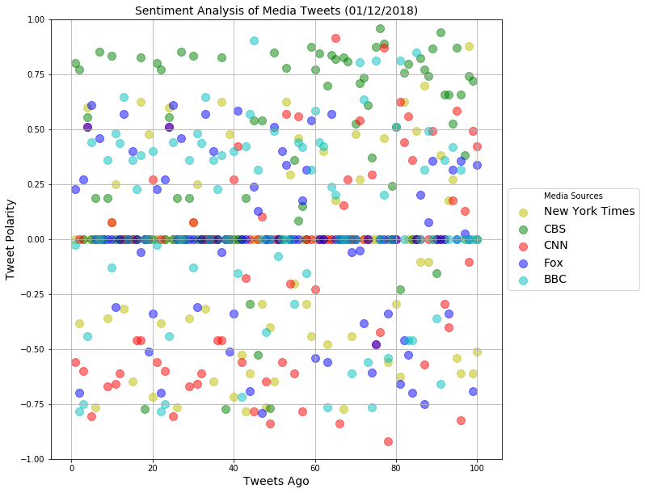
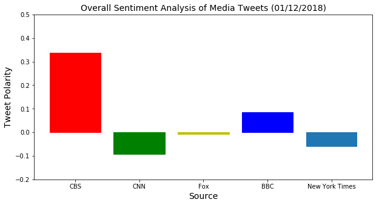
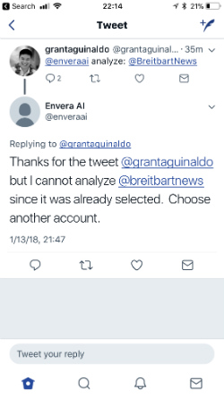
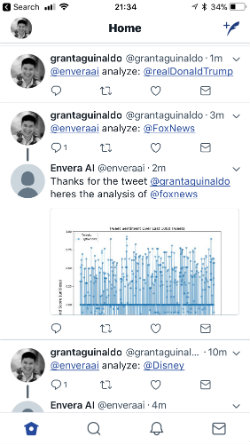
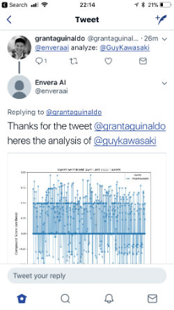

# Using Python To Analyze Sentiment Of Twitter Feeds 


For this project, **two** scripts were created that analyzes sentiment of various feeds on Twitter.

**Part 1** describes a script that looks at the past tweets from five news sources and then calculates and plots the senitment of the 100 past tweets from each news source.

**Part 2** describes a bot that when analyze the past 500 tweets of a twitter account when the bot is provided a twitter name via an 'at' reply.  

### Tech Stack
* Python
* Pandas
* Vader
* Tweepy


# Part 1:  Analyzing The Sentiment Of News Sources On Twitter

### Summary

1.  Most neutral news sources seem to be Fox based on overall. 

2.  From scatter plot, CNN and the New York Times seems to have a lot of tweets that are negative, but CBS seems to have a lot of tweets that are positive.

3.  Overall, if all of the media outlets are reporting on the same news topics, then the way that the 
    tweets are written seems to have a significant impact on the sentiment of each individual feed.


```python
import tweepy
import matplotlib.pyplot as plt
import numpy as np
import csv
import pandas as pd
from vaderSentiment.vaderSentiment import SentimentIntensityAnalyzer 
from twitter_keys import Access_Token, Access_Token_Secret, Consumer_Key, Consumer_API_Secret
```


```python
auth = tweepy.OAuthHandler(Consumer_Key, Consumer_API_Secret)
auth.set_access_token(Access_Token, Access_Token_Secret)
api = tweepy.API(auth, parser=tweepy.parsers.JSONParser())
```


```python
bbc_tweet_text = []
for x in range(5):
    public_tweets = api.user_timeline('@bbc', page = x)
    for tweet in public_tweets:
        bbc_tweet_text.append(tweet['text'])
        
analyzer = SentimentIntensityAnalyzer()

bbc_compound_score= []
for text_ in bbc_tweet_text:
    score = analyzer.polarity_scores(text_)['compound']
    bbc_compound_score.append(score)
```


```python
cnn_tweet_text = []
for x in range(5):
    public_tweets = api.user_timeline('@cnn', page = x)
    for tweet in public_tweets:
        cnn_tweet_text.append(tweet['text'])

cnn_compound_score= []
for text_ in cnn_tweet_text:
    score = analyzer.polarity_scores(text_)['compound']
    cnn_compound_score.append(score)
```


```python
nyt_tweet_text = []
for x in range(5):
    public_tweets = api.user_timeline('@nyt', page = x)
    for tweet in public_tweets:
        nyt_tweet_text.append(tweet['text'])
        
nyt_compound_score= []
for text_ in nyt_tweet_text:
    score = analyzer.polarity_scores(text_)['compound']
    nyt_compound_score.append(score)
```


```python
cbs_tweet_text = []
for x in range(5):
    public_tweets = api.user_timeline('@cbs', page = x)
    for tweet in public_tweets:
        cbs_tweet_text.append(tweet['text'])
        
cbs_compound_score = []
for text_ in cbs_tweet_text:
    score = analyzer.polarity_scores(text_)['compound']
    cbs_compound_score.append(score)
```


```python
fox_tweet_text = []
for x in range(5):
    public_tweets = api.user_timeline('@foxnews', page = x)
    for tweet in public_tweets:
        fox_tweet_text.append(tweet['text'])
        
fox_compound_score = []
for text_ in fox_tweet_text:
    score = analyzer.polarity_scores(text_)['compound']
    fox_compound_score.append(score)
```


```python
data_dict = {'cnn_text': cnn_tweet_text, 'cnn_score': cnn_compound_score, 
             'nyt_text': nyt_tweet_text, 'nyt_score': nyt_compound_score,
             'cbs_text': cbs_tweet_text,  'cbs_score': cbs_compound_score,
             'fox_text': fox_tweet_text, 'fox_score': fox_compound_score,
            'bbc_text': bbc_tweet_text, 'bbc_score': bbc_compound_score}
```


```python
df = pd.DataFrame(data_dict)
df.to_csv('data.csv')
df.head()
```


<div>

<table border="1" class="dataframe">
  <thead>
    <tr style="text-align: right;">
      <th></th>
      <th>bbc_score</th>
      <th>bbc_text</th>
      <th>cbs_score</th>
      <th>cbs_text</th>
      <th>cnn_score</th>
      <th>cnn_text</th>
      <th>fox_score</th>
      <th>fox_text</th>
      <th>nyt_score</th>
      <th>nyt_text</th>
    </tr>
  </thead>
  <tbody>
    <tr>
      <th>0</th>
      <td>-0.0258</td>
      <td>These adorable alpacas are helping people to r...</td>
      <td>0.8016</td>
      <td>Star power makes these commercials instant cla...</td>
      <td>-0.5574</td>
      <td>2017 was the most expensive year on record for...</td>
      <td>0.2263</td>
      <td>.@RandPaul: "If there were ever something wort...</td>
      <td>0.0000</td>
      <td>Getting a Roommate in Your Golden Years. https...</td>
    </tr>
    <tr>
      <th>1</th>
      <td>-0.7845</td>
      <td>The day I accidentally killed a little boy. ht...</td>
      <td>0.7717</td>
      <td>Four-time GRAMMY® winner @KeithUrban inspires ...</td>
      <td>0.0000</td>
      <td>The Trump administration is about to start let...</td>
      <td>-0.7003</td>
      <td>.@wikileaks founder @JulianAssange's poor hygi...</td>
      <td>-0.3818</td>
      <td>Timberwolves 118, Knicks 108: Knicks Falter on...</td>
    </tr>
    <tr>
      <th>2</th>
      <td>-0.7506</td>
      <td>In the endless winter night, terrifying monste...</td>
      <td>0.0000</td>
      <td>Here's why @startrekcbs needs to be your next ...</td>
      <td>-0.5994</td>
      <td>This year marks the 50th anniversary of the Re...</td>
      <td>0.2732</td>
      <td>California man cops to quarter-century-old sla...</td>
      <td>0.0000</td>
      <td>What’s on TV Saturday: Sam Rockwell Hosts ‘S.N...</td>
    </tr>
    <tr>
      <th>3</th>
      <td>-0.4404</td>
      <td>Tonight, @CharltonBrooker, @ScarlettMoffatt an...</td>
      <td>0.5550</td>
      <td>RT @Elementary_CBS: Your favorite detective du...</td>
      <td>0.5106</td>
      <td>North Korea is sending athletes, a cheering sq...</td>
      <td>0.5106</td>
      <td>Yesterday, at a @WhiteHouse event honoring Mar...</td>
      <td>0.5994</td>
      <td>To New Yorkers’ Delight, Coogan’s Says It Isn’...</td>
    </tr>
    <tr>
      <th>4</th>
      <td>0.4404</td>
      <td>'Kids are easy to manage... you just lie to th...</td>
      <td>0.0000</td>
      <td>RT @CodeBlackCBS: Return to Angels Memorial on...</td>
      <td>-0.8074</td>
      <td>Michael Wolff's book "Fire and Fury: Inside th...</td>
      <td>0.6115</td>
      <td>.@CortesSteve: "[@TheDemocrats] are very happy...</td>
      <td>0.0000</td>
      <td>John V. Tunney, Boxer’s Son Who Lasted One Ter...</td>
    </tr>
  </tbody>
</table>
</div>


```python
x1 = np.arange(1, len(nyt_compound_score)+1)
y1 = nyt_compound_score

x2 = np.arange(1, len(cbs_compound_score)+1)
y2 = cbs_compound_score

x3 = np.arange(1, len(cnn_compound_score) +1)
y3 = cnn_compound_score

x4 = np.arange(1, len(fox_compound_score) + 1)
y4 = fox_compound_score

x5 = np.arange(1, len(bbc_compound_score)+ 1)
y5 = bbc_compound_score

fig, ax1 = plt.subplots(figsize=(10,10))

ax1.scatter(x1, y1, marker = 'o', c='y', alpha = 0.5, s = 100, label = 'New York Times')
ax1.scatter(x2, y2, marker = 'o', c='g', alpha = 0.5, s = 100, label = 'CBS')
ax1.scatter(x3, y3, marker = 'o', c='r', alpha = 0.5, s = 100, label = 'CNN')
ax1.scatter(x4, y4, marker = 'o', c='b', alpha = 0.5, s = 100, label = 'Fox')
ax1.scatter(x5, y5, marker = 'o', c='c', alpha = 0.5, s = 100, label = 'BBC')

ax1.legend(loc='center left', bbox_to_anchor=(1, 0.5), title = 'Media Sources', fontsize = 14)
plt.grid(True)
plt.ylim(-1.0, 1.0, 0.25)
plt.title('Sentiment Analysis of Media Tweets (01/12/2018)', fontsize = 14)
plt.xlabel('Tweets Ago', fontsize = 14)
plt.ylabel('Tweet Polarity', fontsize = 14)
plt.show()
```





```python
cbs_mean = np.mean(cbs_compound_score)
cnn_mean = np.mean(cnn_compound_score)
fox_mean = np.mean(fox_compound_score)
bbc_mean = np.mean(bbc_compound_score)
nyt_mean = np.mean(nyt_compound_score)

x = np.arange(5)
scores = [cbs_mean, cnn_mean, fox_mean, bbc_mean, nyt_mean]
```


```python
plt.figure(figsize=(10, 5))
bar_plot = plt.bar(x, scores)
plt.xticks(x, ('CBS', 'CNN', 'Fox', 'BBC', 'New York Times'))
plt.title('Overall Sentiment Analysis of Media Tweets (01/12/2018)', fontsize = 14)
plt.xlabel('Source', fontsize = 14)
plt.ylabel('Tweet Polarity', fontsize = 14)
plt.ylim(-0.2, 0.5, 0.1)
bar_plot[0].set_color('r')
bar_plot[1].set_color('g')
bar_plot[2].set_color('y')
bar_plot[3].set_color('b')
plt.show()
```




***

# Part 2:  Analyzing The Sentiment Of The Past 500 Tweets Of a Given Twitter Account

This script describes an actual twitter bot that scans the feed of a given twitter account and seaches for a twitter account to search.

Once an account has been found, the bot then does an API call to return the past 500 tweets from the given account.  The bot then calculates and plots the senitment from each tweet and then 'at' replies back to the user to display the chart.

Sample images from the functional bot are found below.










``` python
import tweepy
import time
import matplotlib.pyplot as plt
import re
import numpy as np
from vaderSentiment.vaderSentiment import SentimentIntensityAnalyzer 
from twitter_keys import Access_Token, Access_Token_Secret, Consumer_Key, Consumer_API_Secret

auth = tweepy.OAuthHandler(Consumer_Key, Consumer_API_Secret)
auth.set_access_token(Access_Token, Access_Token_Secret)
api = tweepy.API(auth, parser=tweepy.parsers.JSONParser())
api_ = tweepy.API(auth)
main_account = '@enveraai'
last_tweet_accounts = []

def initial_search(main_account):

	last_tweet = api.search(main_account)

	last_tweet_text = last_tweet['statuses'][0]['text'].lower()
	last_tweet_id = last_tweet['statuses'][0]['id']
	last_tweet_screen_name = last_tweet['statuses'][0]['user']['screen_name']
	twitter_search_name = re.findall(r"(@[a-z0-9]+)", last_tweet_text)
	last_tweet_analysis = twitter_search_name[1]

	return last_tweet_text, last_tweet_id, last_tweet_screen_name, twitter_search_name, last_tweet_analysis

def extract_tweets(last_tweet_analysis):
	tweet_text_list = []
	for tweet in tweepy.Cursor(api_.user_timeline, id=last_tweet_analysis).items(1000):
		tweet_text_list.append(tweet.text)
	return tweet_text_list

def analyze_tweets(tweet_text_list):
	compound_score = []
	analyzer = SentimentIntensityAnalyzer()
	for text_ in tweet_text_list:
		score = analyzer.polarity_scores(text_)['compound']
		compound_score.append(score)
	return compound_score

def plotr(compound_score):
	fig = plt.figure(figsize = (10, 10))
	x = np.arange(1,len(compound_score) + 1)
	y = compound_score
	plt.plot(x, y, marker = 'o', alpha = 0.5, label = last_tweet_analysis)
	plt.xlabel('Tweets Ago', fontsize = 14)
	plt.ylabel('Compound Score (unitless)', fontsize = 14)
	plt.title('Tweet Sentiment Over Last 1000 Tweets', fontsize = 14)
	plt.ylim(-1, 1, 0.25)
	plt.legend(title="Tweets")
	plt.savefig('./images/tweet_sentiment.png')
	return fig

def reply_with_image(last_tweet_id, last_tweet_screen_name):
	status_text = 'Thanks for the tweet ' + '@' + last_tweet_screen_name + ' heres the analysis of ' + twitter_search_name[1]

	reply_tweet = api.update_with_media('./images/tweet_sentiment.png', status = status_text, in_reply_to_status_id = last_tweet_id)

	return reply_tweet

def reply_in_error(last_tweet_id, last_tweet_screen_name):
	status_text_error = 'Thanks for the tweet ' + '@' + last_tweet_screen_name + ' but I cannot analyze ' + twitter_search_name[1] + ' since it was already selected.  Choose another account.'

	reply_tweet_error = api.update_status(status = status_text_error, in_reply_to_status_id = last_tweet_id)

	return reply_tweet_error

def reply_in_rate_error(last_tweet_id, last_tweet_screen_name):
	status_text_rate_error = 'Thanks for the tweet ' + '@' + last_tweet_screen_name + ' but I cannot analyze ' + twitter_search_name[1] + ' since I hit the rate limit.  Please retry in 60 min.'

	reply_tweet_rate_error = api.update_status(status = status_text_rate_error, in_reply_to_status_id = last_tweet_id)

	return reply_tweet_rate_error

while(True):
	print('Howdy! We are going Live!')

	last_tweet_text, last_tweet_id, last_tweet_screen_name, twitter_search_name, last_tweet_analysis = initial_search(main_account)
	
	print('Okay I got that and am searching on Twitter.  BRB soon.')

	if last_tweet_analysis in last_tweet_accounts:
		try:
			print('If branch')
			print(last_tweet_analysis)
			print(last_tweet_accounts)
			reply_tweet_error = reply_in_error(last_tweet_id, last_tweet_screen_name)
		except:
			time.sleep(60)

	else:
		try:
			last_tweet_accounts.append(last_tweet_analysis)
			tweet_list = extract_tweets(last_tweet_analysis)
			compound_score = analyze_tweets(tweet_list)
			fig = plotr(compound_score)
			reply_tweet = reply_with_image(last_tweet_id, last_tweet_screen_name)
			print('Else branch')
			print(last_tweet_analysis)
			print(last_tweet_accounts)
		except:
			time.sleep(60)

	print('Getting ready to restart!')
	time.sleep(60)

```

