# Extracting Data From A SQL Database


In this project, I create queries to extract information from the Sakila database.


```SQL
/* 1a. Display the first and last names of all actors from the table actor. */

SELECT first_name, last_name
FROM actor;
```
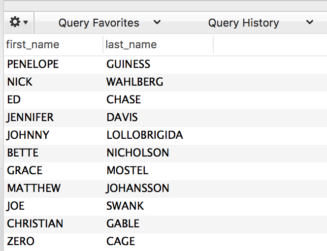


```
/* 1b. Display the first and last name of each actor in a single column in upper case letters. Name the column Actor Name. */

SELECT first_name, last_name, CONCAT(first_name , ' ' ,  last_name) as Actor_Name
FROM actor;
```


```
/*2a. You need to find the ID number, first name, and last name of an actor, of whom you know only the first name, "Joe." What is one query would you use to obtain this information?*/

SELECT actor_id, first_name, last_name
FROM actor
WHERE first_name = 'JOE';
```


```
/* 2b. Find all actors whose last name contain the letters GEN: */

SELECT actor_id, first_name, last_name
FROM actor
WHERE last_name LIKE '%GEN%';
```
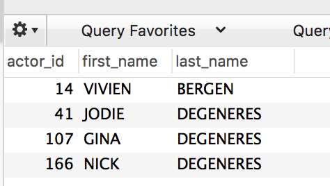


```
/*2c. Find all actors whose last names contain the letters LI. This time, order the rows by last name and first name, in that order: */

SELECT actor_id, first_name, last_name
FROM actor
WHERE last_name LIKE '%LI%'
ORDER BY last_name ASC;
```
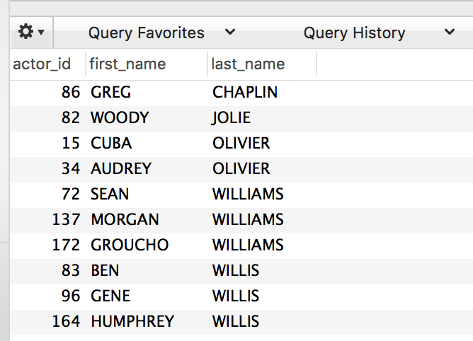


```
/* 2d. Using IN, display the country_id and country columns of the following countries: Afghanistan, Bangladesh, and China: */

SELECT country_id, country
FROM country
WHERE country IN ('Afghanistan', 'Bangladesh', 'China');
```
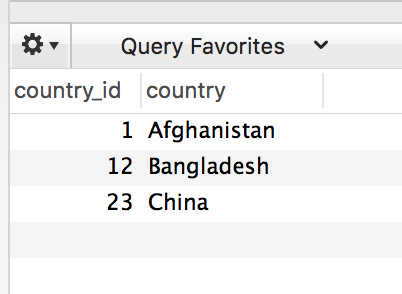


```
/* 3a. Add a middle_name column to the table actor. Position it between first_name and last_name. Hint: you will need to specify the data type. */

ALTER TABLE actor 
ADD middle VARCHAR(50);
DESCRIBE actor;
```


```
/* 3b. You realize that some of these actors have tremendously long last names. Change the data type of the middle_name column to blobs. */

ALTER TABLE actor
CHANGE middle blobs VARCHAR(50);
DESCRIBE actor;
```


```
/* 3c. Now delete the middle_name column.*/

ALTER TABLE actor
DROP blobs;
DESCRIBE actor;
```


```
/* 4a. List the last names of actors, as well as how many actors have that last name.*/

SELECT last_name, count(last_name) 
FROM actor
GROUP BY last_name;
```
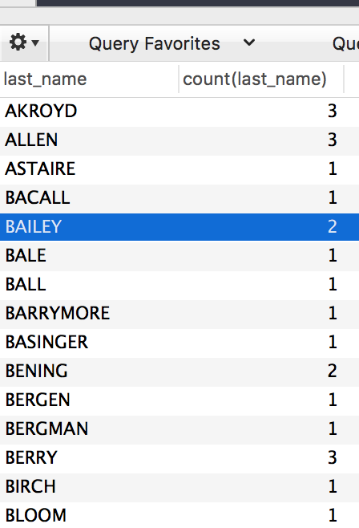


```
/* 4b. List last names of actors and the number of actors who have that last name, but only for names that are shared by at least two actors */

SELECT last_name, count(last_name) AS ct_last_name
FROM actor
GROUP BY last_name
HAVING ct_last_name > 2;
```
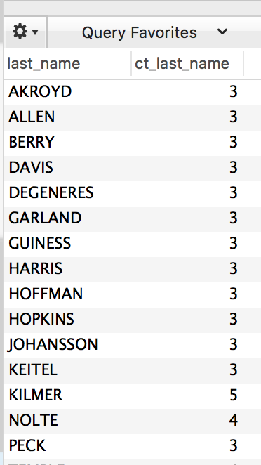


```
/* 4c. Oh, no! The actor HARPO WILLIAMS was accidentally entered in the actor table as GROUCHO WILLIAMS, the name of Harpo's second cousin's husband's yoga teacher. Write a query to fix the record. */

SELECT * 
FROM actor
WHERE actor_id = (	SELECT actor_id
					FROM actor
					WHERE first_name = 'GROUCHO' AND last_name = 'WILLIAMS'
					);

UPDATE actor
SET first_name = 'HARPO'
WHERE actor_id = 172;
```


```
/* 4d. Perhaps we were too hasty in changing GROUCHO to HARPO. It turns out that GROUCHO was the correct name after all! In a single query, if the first name of the actor is currently HARPO, change it to GROUCHO. Otherwise, change the first name to MUCHO GROUCHO, as that is exactly what the actor will be with the grievous error. BE CAREFUL NOT TO CHANGE THE FIRST NAME OF EVERY ACTOR TO MUCHO GROUCHO, HOWEVER! (Hint: update the record using a unique identifier.) */

SELECT *
FROM actor
WHERE first_name = 'GROUCHO';

SELECT * 
FROM actor
WHERE actor_id = (	SELECT actor_id
					FROM actor
					WHERE first_name = 'GROUCHO' AND last_name = 'WILLIAMS'
					);
										
UPDATE actor
SET first_name = 'HARPO'
WHERE actor_id = 172;

SELECT *
FROM actor
WHERE first_name = 'GROUCHO';

SELECT *
FROM actor
WHERE first_name = 'HARPO';

UPDATE actor
SET first_name = 'GROUCHO'
WHERE actor_id = 172;

SELECT *
FROM actor
WHERE first_name = 'GROUCHO';
```


```
/* 5a. You cannot locate the schema of the address table. Which query would you use to re-create it? */

CREATE SCHEMA `[INSERT NAME OF SCHEMA]` 
```

```
/* 6a. Use JOIN to display the first and last names, as well as the address, of each staff member. Use the tables staff and address.  CHANGED to customers instead of staff*/

SELECT first_name, last_name, address 
FROM customer a
INNER JOIN address b
USING (address_id); 
```
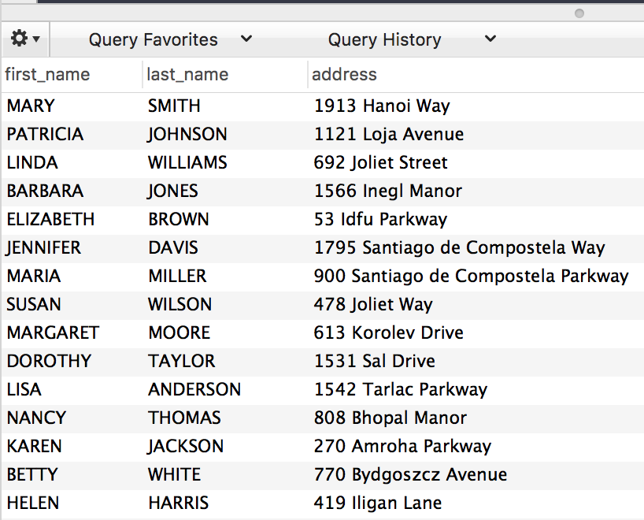


```
/* 6b. Use JOIN to display the total amount rung up by each staff member in August of 2005. Use tables staff and payment. */

/* Total sales by sales person.*/

SELECT first_name, last_name, sum(amount) AS sum_total_sales 
FROM payment a
INNER JOIN staff b
USING (staff_id)
GROUP BY first_name, last_name;

SELECT first_name, last_name, sum(amount) as total_aug_sales
FROM (
	SELECT (EXTRACT(month FROM payment_date) = 8) as aug_flag, payment_date, staff_id, amount
	FROM payment
	WHERE (EXTRACT(month FROM payment_date) = 8) = 1
	) as a
INNER JOIN staff b
USING (staff_id)
GROUP BY first_name, last_name;
```


```
/* 6c. List each film and the number of actors who are listed for that film. Use tables film_actor and film. Use inner join. */

SELECT title, COUNT(actor_id) as num_actors
FROM film_actor a
INNER JOIN film b
USING (film_id)
GROUP BY title
ORDER BY num_actors DESC;
```


```
/* 6d. How many copies of the film  exist in the inventory system? */

SELECT film_id 
FROM film
WHERE title = 'Hunchback Impossible';

SELECT store_id, count(store_id) AS num_copies_of_Hunchback_Impossible 
FROM inventory 
WHERE film_id = 439
GROUP BY store_id;
```
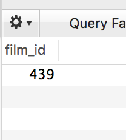
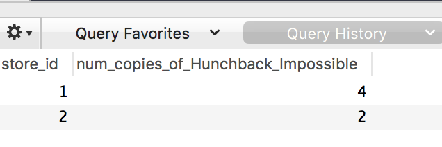


```
/* 6e. Using the tables payment and customer and the JOIN command, list the total paid by each customer. List the customers alphabetically by last name: */

SELECT customer_id, first_name, last_name, SUM(amount) 
FROM payment a
INNER JOIN customer b
USING (customer_id)
GROUP BY customer_id, first_name, last_name
ORDER BY last_name ASC;
```
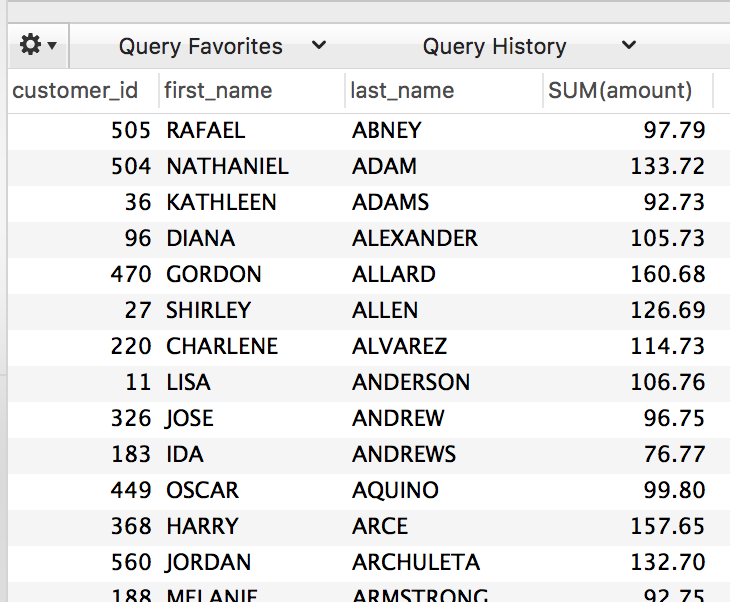


```
/* 7a. The music of Queen and Kris Kristofferson have seen an unlikely resurgence. As an unintended consequence, films starting with the letters K and Q have also soared in popularity. Use subqueries to display the titles of movies starting with the letters K and Q whose language is English. */

SELECT title
FROM film
WHERE (language_id = 1) AND (title LIKE 'K%' OR title LIKE 'Q%');
```


```
/* 7b. Use subqueries to display all actors who appear in the film Alone Trip.*/

SELECT film_id 
FROM film
WHERE title = 'Alone Trip';

SELECT first_name, last_name, title
FROM actor
INNER JOIN (
	SELECT title, actor_id
	FROM film_actor a
	INNER JOIN film b
	USING (film_id)) as sub
USING (actor_id)
WHERE title = 'Alone Trip';
```
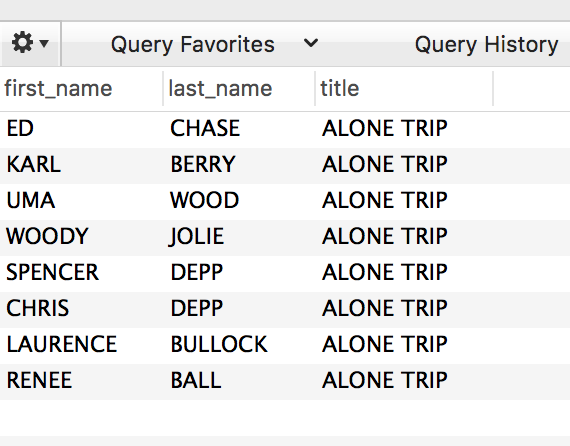


```
/* 7c. You want to run an email marketing campaign in Canada, for which you will need the names and email addresses of all Canadian customers. Use joins to retrieve this information. */

SELECT first_name, last_name, email 
FROM customer a
INNER JOIN address b
USING (address_id)
WHERE city_id IN 
	(
	SELECT city_id
	FROM city
	WHERE country_id = 20
	);	
```
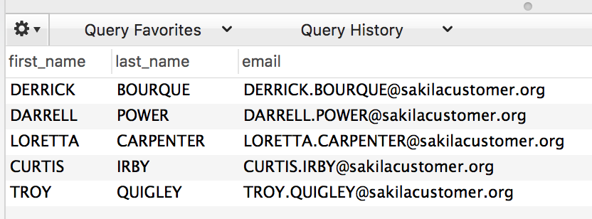


```
/* 7d. Sales have been lagging among young families, and you wish to target all family movies for a promotion. Identify all movies categorized as famiy films. */

SELECT title 
FROM film
WHERE film_id IN (
	SELECT film_id
	FROM film_category
	WHERE category_id IN (
			SELECT category_id 
			FROM category
			WHERE name = 'Family'));
```


```
/* 7e. Display the most frequently rented movies in descending order. */

SELECT title, count(film_id) as num_times_rented 
FROM inventory a
INNER JOIN film b
USING (film_id)
GROUP BY title, film_id
ORDER BY num_times_rented DESC;
```
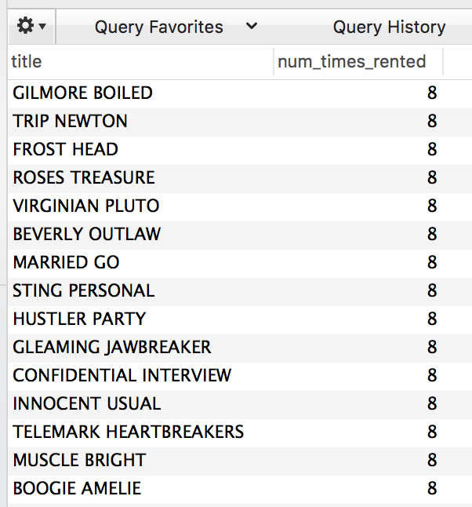


```
/* 7f. Write a query to display how much business, in dollars, each store brought in. */
 
/* Note:  Only two stores */

SELECT staff_id as store_num, SUM(amount)
FROM payment
GROUP BY staff_id;
```
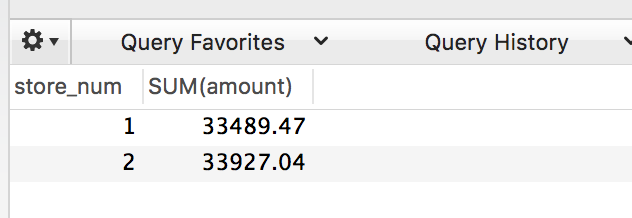


```
/* 7g. Write a query to display for each store its store ID, city, and country */

SELECT store_id, address, city, country 
FROM country e
INNER JOIN (
			SELECT store_id, address, city, country_id
			FROM city c
			INNER JOIN (
						SELECT store_id, city_id, address_id, address
						FROM store a
						INNER JOIN address b
						USING (address_id)) AS d
			USING (city_id)) AS f
USING (country_id);
```


```
/* 7h. List the top five genres in gross revenue in descending order. (Hint: you may need to use the following tables: category, film_category, inventory, payment, and rental.) */

SELECT inventory_id, film_id, category_id, name
FROM inventory c
INNER JOIN (
	SELECT category_id, film_id, name
	FROM film_category a
	INNER JOIN category b
	USING (category_id)
) as d
USING (film_id);

SELECT rental_id, amount, inventory_id 
FROM payment a
INNER JOIN rental b
USING (rental_id);

SELECT SUM(amount) as tot_sales_cat, name
FROM ( 
		SELECT inventory_id, film_id, category_id, name
		FROM inventory c
		INNER JOIN (
						SELECT category_id, film_id, name
						FROM film_category a
						INNER JOIN category b
						USING (category_id)
					) as d
		USING (film_id)) as z
INNER JOIN ( 

				SELECT rental_id, amount, inventory_id 
				FROM payment a
				INNER JOIN rental b
				USING (rental_id)
			) as y
USING (inventory_id)
GROUP BY name
ORDER BY tot_sales_cat DESC;
```
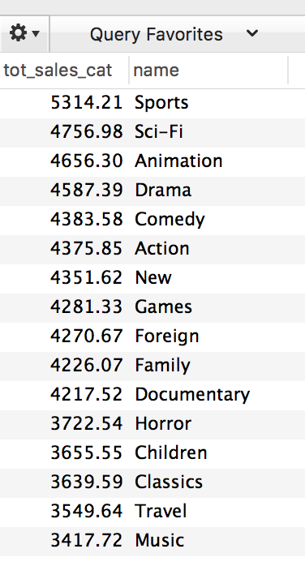


```
/* 8a. In your new role as an executive, you would like to have an easy way of viewing the Top five genres by gross revenue. Use the solution from the problem above to create a view. If you haven't solved 7h, you can substitute another query to create a view. */

SELECT * 
FROM cat_film_id;

CREATE VIEW cat_film_id AS;
SELECT inventory_id, film_id, category_id, name
FROM inventory c
INNER JOIN (
	SELECT category_id, film_id, name
	FROM film_category a
	INNER JOIN category b
	USING (category_id)
) as d
USING (film_id);

SELECT * 
FROM inv_id_amount;

CREATE VIEW inv_id_amount AS
SELECT rental_id, amount, inventory_id 
FROM payment a
INNER JOIN rental b
USING (rental_id);

CREATE VIEW top_sales_by_category AS
SELECT SUM(amount) AS tot_sales_category, name
FROM inv_id_amount a 
INNER JOIN cat_film_id b
USING (inventory_id)
GROUP BY name
ORDER BY tot_sales_category DESC;

SELECT * 
FROM top_sales_by_category;
```

```
/* 8b. How would you display the view that you created in 8a? */

SELECT * 
FROM top_sales_by_category;
```

```
/* 8c. You find that you no longer need the view top_five_genres. Write a query to delete it.*/
DROP VIEW top_sales_by_category;
```