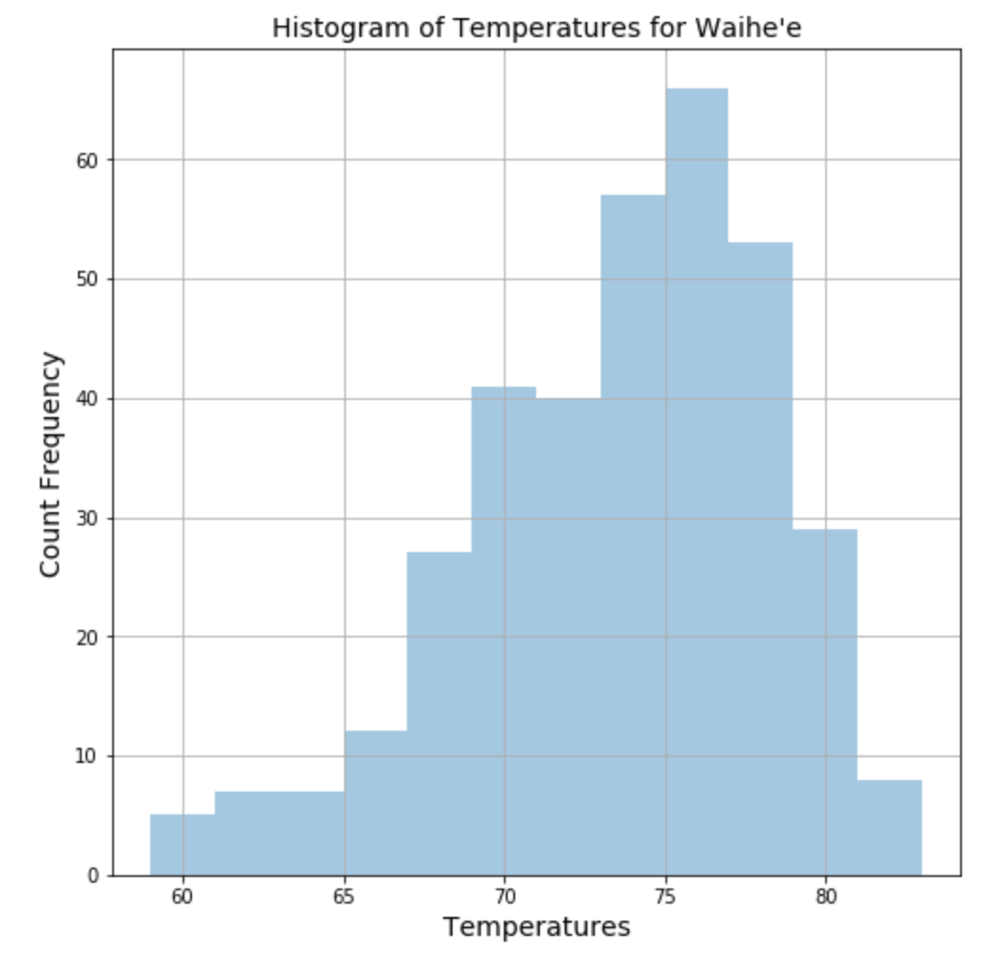
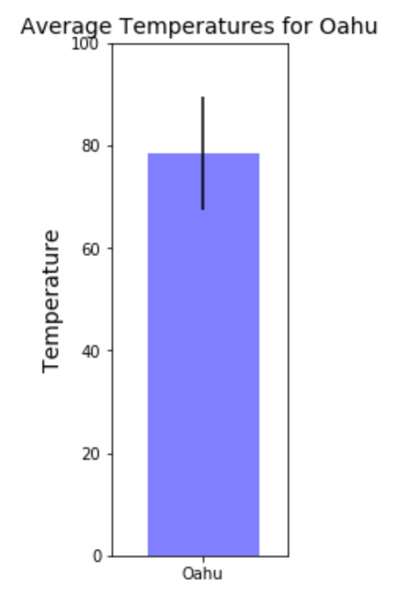

# SQL/Flask Data Integration Project


For this project, I conducted an analysis of weather data that was provided in a CSV file.  

The objective was to determine the historical weather patterns for a date range based on data that was collected at number of weather stations on the island of Oahu.

This project required the population of a SQL database from a CSV file, and the creation of a Flask RESTful API. The available routes included:

        /api/v1.0/precipitation
        /api/v1.0/stations
        /api/v1.0/tobs
        /api/v1.0/<start>/
        /api/v1.0/<start>/<end>

Once the API route were created, SQL queries were written to get the data needed to prepare the summary charts that are shown below.






***

```Python
from datetime import datetime, timedelta
import numpy as np
import sqlalchemy
import pandas as pd
from sqlalchemy.ext.automap import automap_base
from sqlalchemy.orm import Session
from sqlalchemy import create_engine, func
from flask import Flask, jsonify

app = Flask(__name__)

connection_string = 'sqlite:///hawaii.sqlite'
engine = create_engine(connection_string)
Base = automap_base()
Base.prepare(engine, reflect=True)
Hawaii = Base.classes.hawaii_data
session = Session(engine)


@app.route("/")
def index():
    return (
        "Available Routes:<br/>"
        "/api/v1.0/precipitation<br/>"
        "/api/v1.0/stations<br/>"
        "/api/v1.0/tobs<br/>"
        "/api/v1.0/&lt;start&gt;<br/>"
        "/api/v1.0/&lt;start&gt;/&lt;end&gt;<br/>"
    )


@app.route('/api/v1.0/stations')
def stations():

    results = list(np.ravel(session.query(Hawaii.name).distinct().all()))

    return jsonify(results)


@app.route('/api/v1.0/precipitation')
def precipitation():

    prcp_query = session.query(Hawaii.date_format, Hawaii.prcp).filter(Hawaii.date_format >= (dt.date.today() - dt.timedelta(days=365))).all()

    prcp_dict = {}

    for date, prcp in prcp_query:
        prcp_dict.update({str(date): prcp})

    return jsonify(prcp_dict)


@app.route('/api/v1.0/tobs')
def tobs():

    temp_query = session.query(Hawaii.date_format, Hawaii.tobs).filter(Hawaii.date_format >= '2016-08-23', Hawaii.date_format <= '2017-08-23').all()
    temp_df = pd.DataFrame(temp_query).rename(columns={'tobs': 'temperature_observations'})
    temp_df['temperature_observations'] = temp_df['temperature_observations'].astype(float)
    temp_df['date_format'] = temp_df['date_format'].astype(str)

    new_df = temp_df.set_index('date_format')

    temp_dic = new_df.to_dict()

    return jsonify(temp_dic)


@app.route("/api/v1.0/<start>")
@app.route("/api/v1.0/<start>/<end>")
def min_max_temperature(start, end='2017-08-23'):

    def get_temp_date(start_date, end_date):
        temp_query = session.query(Hawaii.tobs).filter(Hawaii.date_format >= start_date, Hawaii.date_format <= end_date).all()

        min_temp = np.min(temp_query)
        avg_temp = np.average(temp_query)
        max_temp = np.max(temp_query)

        return min_temp, max_temp, avg_temp

    min_temp, max_temp, avg_temp = get_temp_date(start, end)

    temp_dict = {"minimum_temperature": min_temp.astype(float), "average_temperature": avg_temp.astype(float), "maximum_temperature": max_temp.astype(float)}
    return jsonify(temp_dict)


if __name__ == "__main__":
    app.run(debug=True)
```