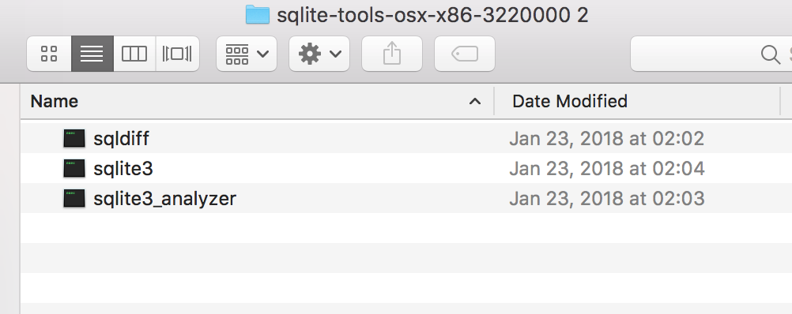
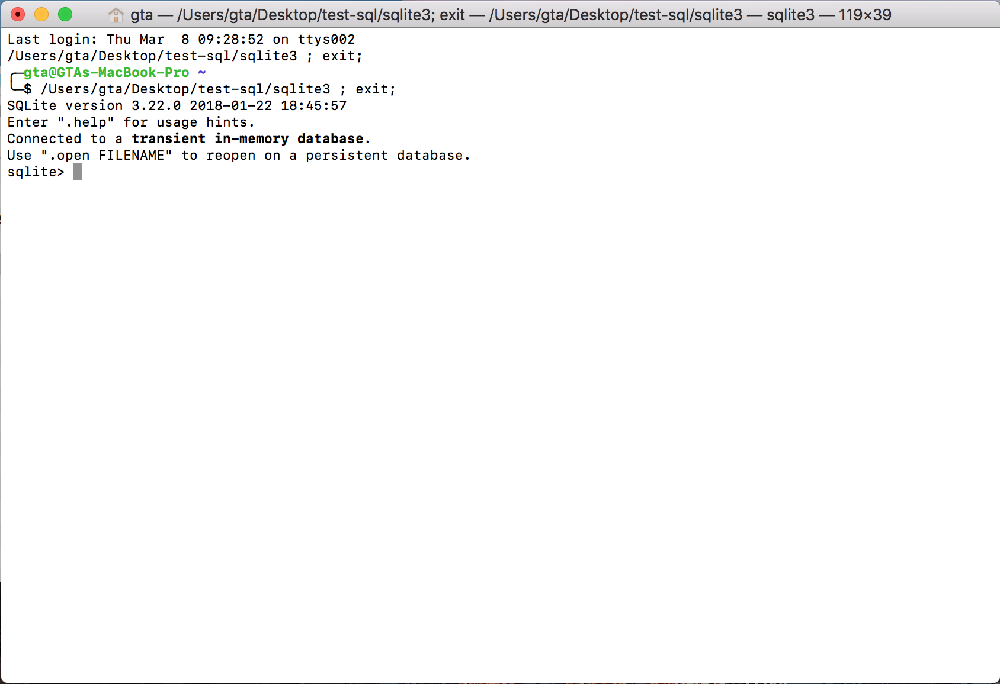
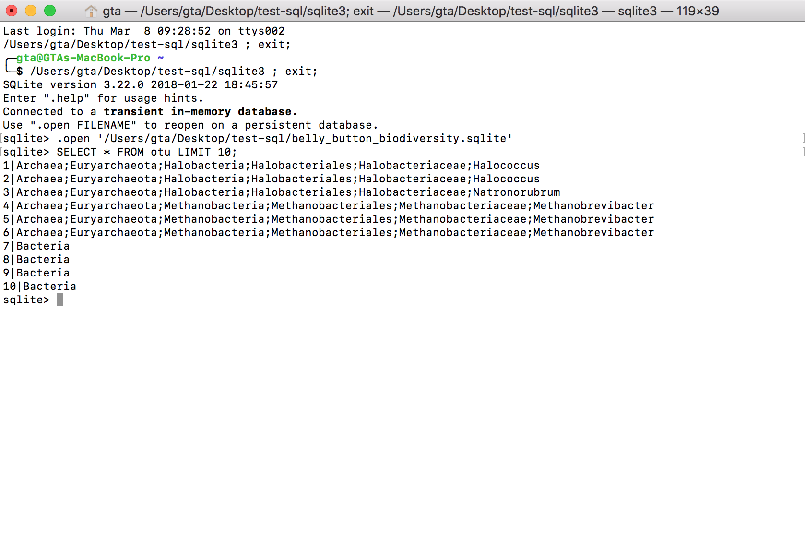
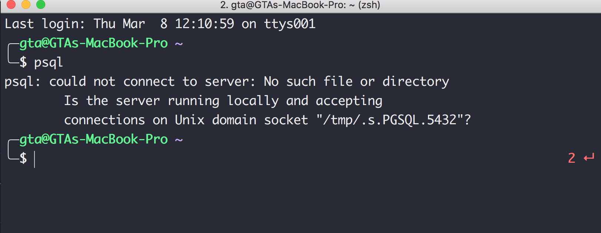
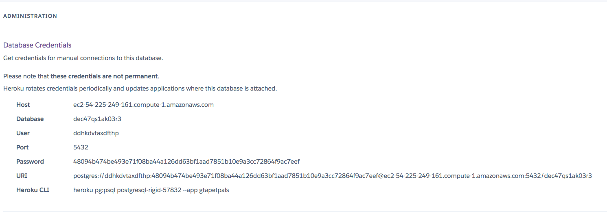
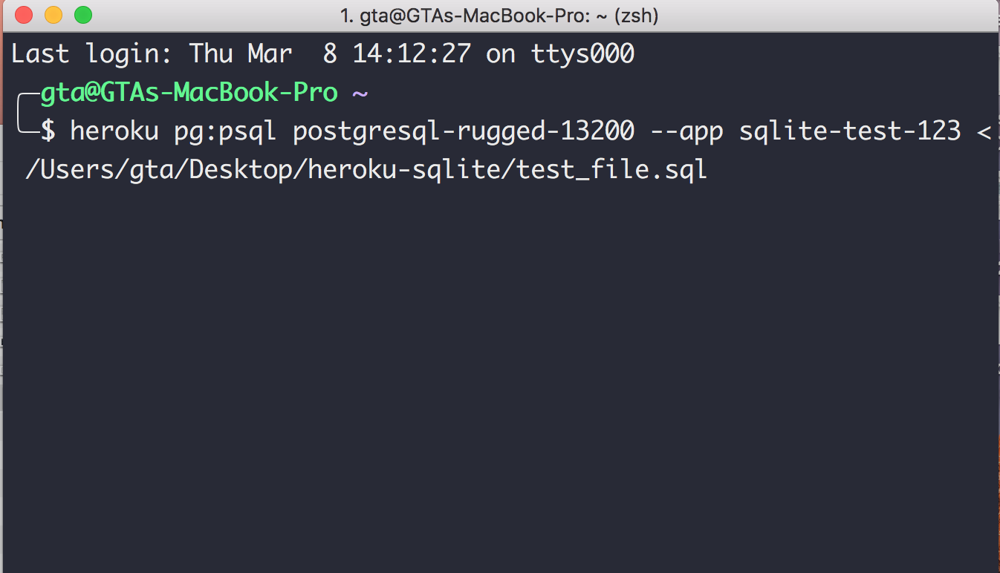
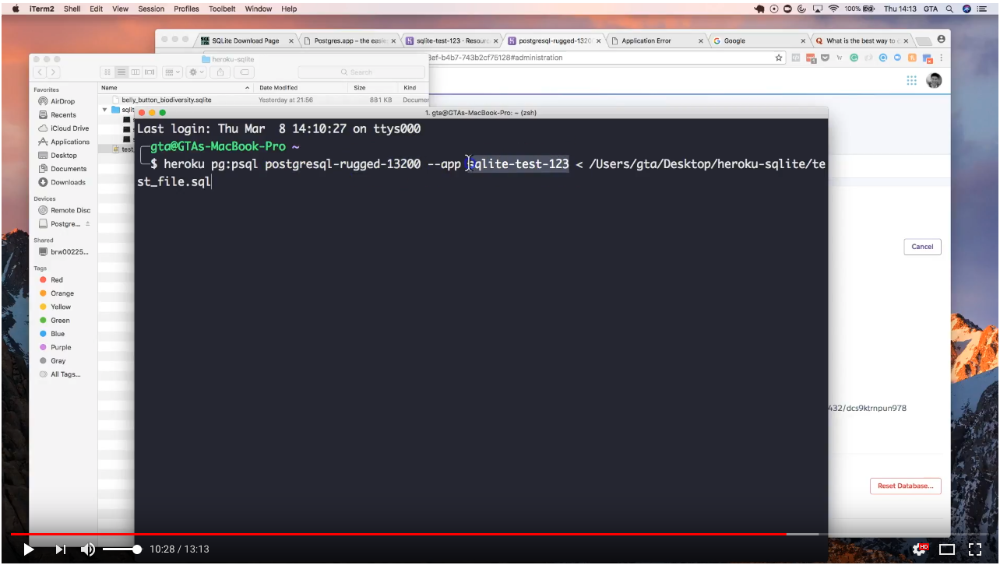

# How To Migrate Data from SQLite to PostgreSQL To Deploy Your App On Heroku

Often times, a webapp will need to use a databse to store and manage all of the data from the users or the service.

In additon, the use of a database in the rehlm of data analysis cause it allows you to create dashboards and other deliverables.

Depending on the usecase, a sitution exists where you develop using one technology that is not supported by the platform that the app will ultamately reside on.

And a specific example of this is using SQLite within an app that will be hosted on Heroku. Heroku is a platform that can host and deploy webapps.

When doing development, many people opt to using SQLite since it is, light, in the sence that it does not need a server. 

When using SQLite, all of the tables and data are housed in a single file that you can connect to using a brower or an ORM like SQLAlchemy.

However, while SQLite is great at being a good database solution during develpment, it can cause problbems in a production setting especially if Heroku will be used as the platform.

## Here is the problem.

Heroku does not support Sqlite and you can read more about it on their [site](https://devcenter.heroku.com/articles/sqlite3). 

Therefore, if you plan to deploy an app on Heroku that uses a SQLite database, you're going to need to work around the fact that SQLite is not supported on the Heroku platform.

At this point, you have a few options (I'm sure that there are many others).

You can use a platform that supports SQLite, like [Pythonanywhere](https://www.pythonanywhere.com).

You can take the CSV files that were used to create the SQLite file and recreate the database in PostgreSQL.

You can dump the data out of SQLite and upload to PostgreSQL.

In this article, I'll focus on the last option, dumping the data out of SQLite and uploading to the PostgreSQL instance on Heroku.

In addtion, my motivation for this article is to elaborate more on a post on Quora that is commonly linked to when doing this migration named ['What is the best way to copy my SQLite database to PostgreSQL so I can deploy it to Heroku?'
](https://www.quora.com/What-is-the-best-way-to-copy-my-SQLite-database-to-PostgreSQL-so-I-can-deploy-it-to-Heroku)

So here we go.

Before starting here are a list of tools that you'll need:

* Heroku command line tools.
* An app that has been deployed on Heroku.
* The additon of the `heroku-postgresql` service.
* [The Command Line Shell For SQLite](https://sqlite.org/cli.html)
* An installed version of [Postgres.app](http://postgresapp.com/)
* Access to the `.sqlite` file that contains your data.
* Google and a lot of paitence.

## Step 0:  Install Heroku Command Line Tools

You can install this using homebrew as noted on this [page](https://devcenter.heroku.com/articles/heroku-cli).

## Step 1: Load in your database to the SQLite Shell

To start, you'll first need to install the SQLite command line shell.  When you download the file and open it, you'll have three files.



The one that you need is the one called `sqlite3`.  

When you open `sqlite3` you'll get a window like this.



This is the command line that you'll use to do the dump.

Next you'll need to connect up your `.sqlite` file.  You can do this by entering the following after the `sqlite>` prompt.

`.open '/Users/gta/Desktop/test-sql/<file name>` where `<file name>` is the name of your `sqlite` database.  In my case, the file I was using was called `belly_button_biodiversity.sqlite'`.

Once you connect to your database, it is good to confirm that your database is connected and you can query the database.

To do this, you can write a vanilla SQL select statement at the prompt like this

`sqlite> SELECT * FROM otu LIMIT 10;`. 

In this case `otu` was one of the tables that was in my database.

Upon pressing enter, data should be returned to the screen.



Once you see data being returned, you know that your database is connected properlly and you can move on.

## Step 2: Export the data from SQLite into a .sql file using the `.dump` inthe SQLite CLI

Now you're ready to dump the conents of the entire database into a file using the `.dump` command.  More on that [here](http://www.sqlitetutorial.net/sqlite-dump/) and [here](http://www.sqlitetutorial.net/sqlite-commands/).

From the `sqlite` prompt, write

```
sqlite> .output <enter file path of where you want the dump to be sent>
sqlite> .dump
sqlite> .exit
```
In my case, my command looked like this:

```
sqlite> .output /Users/gta/Desktop/test-sql/belly_buton_export.sql
sqlite> .dump
sqlite> .exit

```

Once you run this command, the dump file will be placed in the file that you specified.  This is the file that you need to upload to PostgreSQL.

## Step 3:  Install PostgreSQL onto your local machine

To contine, you'll need to install PostgreSQL onto your local machine.  I have a mac and so I used `Postgre.app` which can be downloaded from their [site](http://postgresapp.com/).  To install PostgreSQL, follow the directions on their page.

Once you have sucessfully installed PostgreSQL, you'll also need to add in the commandline tools so that you can run the `psql` command from Terminal.  

You can do that by writing the following into Termainl.

```
sudo mkdir -p /etc/paths.d &&
echo /Applications/Postgres.app/Contents/Versions/latest/bin | sudo tee /etc/paths.d/postgresapp
```

At this point, you'll also need to be sure that you point Terminal in the right path to execute the `psql` command.  If you don't you'll get `zsh: command not found: psql` this error in Terminal.

More on this [here](https://stackoverflow.com/questions/20027374/why-cant-i-add-postgresql-to-my-path).

You can link up `psql` by adding the following to you're `.bash_profile:` or your `.zshrc` file.

I have zsh on my computer and so to make the change, you need to write the following into Terminal:

`open ~/.zshrc` 

This opens the `.zshrc` file.  Once you are in there, you need to add the follwing into the file.

`export PATH=$PATH:/Applications/Postgres.app/Contents/Versions/latest/bin`

I added mine this prompt.

```
# Set name of the theme to load. Optionally, if you set this to "random"
# it'll load a random theme each time that oh-my-zsh is loaded.
# See https://github.com/robbyrussell/oh-my-zsh/wiki/Themes
ZSH_THEME="bira"
export PATH=$PATH:/Applications/Postgres.app/Contents/Versions/latest/bin
```

Once you add that in, you'll need to save the file and then go back to Terminal and run `source ~/.zshrc` to reload zshrc file with the new modifications, once they have been saved.

At this point, you can run `psql` from your Terminal and not get the error `zsh: command not found: psql`.

This is what your Terminal should look like after calling `psql`



## Step 4:  Connect to your Heroku PostgreSQL instance

When you deploy an app on Heroku, you have the option of adding an `Add-on` and if you need it, this is when you would also request a database.  Again, since we're on Heroku, this database is going to be a PostgreSQL system.

To add in a database, you need click on Resounces and then search for the `Heroku Postgres` add on.  

Once the database is added, Heroku will create the database for you and provide. you with the credentials to access the database.

To access the database, you need to click on `Settings` and then on `View Credentials`

Once you do that, you'll be taken to a page with all of the credentials.  

**Note:** that you do not want to share any of these credentails to anyone or make it visialbe in any part of your code.  This databse has been deleted and is the reason that I am showing this in this article.



From this, all that you'll need is the Heroku CLI.  In this case it's `heroku pg:psql postgresql-rigid-57832 --app gtapetpals
`

With this information we need to go back into Termainl and load in the dump file into the Heroku instance that you just created.  

## Step 5:  Load in the SQL dumps file into your PostgreSQL instance

To load in the dumps file into the Heroku instance, you need to past the Heroku CLI from Step 4 into Termianl and add a few more things.  More on this [here](https://stackoverflow.com/questions/48180282/how-to-populate-a-heroku-postgressql-database-with-a-sql-file).

From Step 4, this is the Heroku CLI that we got from the Database Credentials Screen:

`heroku pg:psql postgresql-rigid-57832 --app gtapetpals
`
... but that is only part of it and so don't press enter yet.

To compelte the command, you need to add in the file path to the sql file thatyou created in Step 1 and so the complete command will look like this:


`heroku pg:psql postgresql-rigid-57832 --app gtapetpals < /Users/gta/Desktop/test-sql/belly_buton_export.sql`

And this is what it looks like in Terminal.



Again, the name of my export was `belly_buton_export.sql` and the name of my app on Heroku was `gtapetpals`.  `postgresql-rigid-57832` is the name of the database that Heroku give me when I installed the Add-On.

## Step 6:  Resolve any errors that you encounter with the data

When importing the data from the dumps file, it is very liklely that you will hit an error.  If you do, then you'll need to resolve the error(s) before the databse is sucesfully ported to the Heroku PostgreSQL instance that you created. 

Finally, once you have sucesfully imported the file into the Heroku PostgreSQL instance, you can query the database using the SQLalchemy ORM to see that it works.  More on that [here](https://stackoverflow.com/questions/31931550/how-to-connect-to-heroku-database-using-sqlalchemy-without-database-url).

This is work in progress and I welcome any comments, changes or updates based on what works and what doesn't. 

[Here is a YouTube video](https://youtu.be/QjsoiwVlFW0) summarizing some of the steps I outline in this article. This is a work in progress, and I'll be updating this article as things progress.




